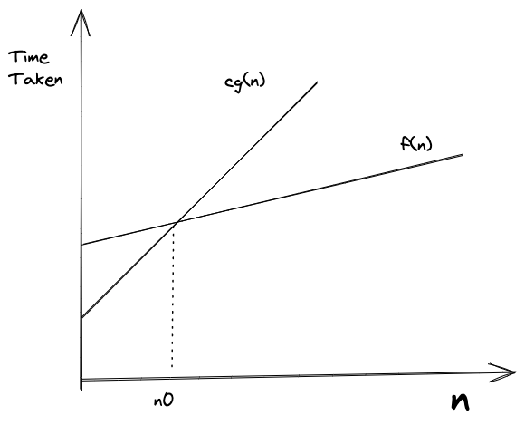

---
jupyter:
  jupytext:
    cell_metadata_filter: -all
    text_representation:
      extension: .md
      format_name: markdown
      format_version: '1.3'
      jupytext_version: 1.19.5
  kernelspec:
    display_name: Python 3 (ipykernel)
    language: python
    name: python3
---

<!-- #region -->
# Analysis of algorithms

Consider the example: Given number $n$, write a function to find sum of first $n$ natural numbers.

The constants $c_1, c_2, ...$ used below stand for the real machine-level cost of the operations involved - an addition, a comparison, a loop increment. We never learn their values, and that is deliberate: they depend on the CPU, the language and the compiler, so keeping them symbolic lets us compare algorithms without benchmarking them.

Some solutions (Python):

1. ```python
    def sum1(n):
      return n * (n + 1) / 2
   ```
   \
   Total work done: $c_{1}$ and it is not dependent on $n$. \
   One multiplication, one addition, one division - the same three operations whether $n$ is $10$ or $10^9$.

2. ```python
   def sum2(n):
       sum = 0
       for i in range(n + 1):
           sum += i
       return sum
   ```
   \
   Total work done: Some constant work and a loop that executes n times: $c_{2}n + c_{3}$. \
   Here $c_{2}$ is the cost of one iteration (the addition, the increment, the bounds check) and $c_{3}$ the one-time work outside the loop (initialising `sum`, returning it). The loop strictly runs $n + 1$ times, but that one extra iteration is itself constant work and disappears into $c_{3}$.

3. ```python
     def sum3(n):
         sum = 0
         for i in range(1, n + 1):
             for j in range(1, i + 1):
                 sum += 1
         return sum
   ```
   \
   The inner loop body is `sum += 1`, not `sum += j` - and `j` appears nowhere in it. So the inner loop is a tally counter rather than a summation: its only job is to repeat $i$ times, which means pass $i$ of the outer loop contributes exactly $i$ increments.

   The inner loop executes:

   - once for `i = 1`
   - twice for `i = 2`
   - thrice for `i = 3`
   - and so on, up to $n$ times for `i = n`

   Tracing `n = 4`:

   | `i` | inner loop runs for | increments added | `sum` after the pass |
   |-----|---------------------|------------------|----------------------|
   | 1 | `j = 1` | 1 | 1 |
   | 2 | `j = 1, 2` | 2 | 3 |
   | 3 | `j = 1, 2, 3` | 3 | 6 |
   | 4 | `j = 1, 2, 3, 4` | 4 | 10 |

   The final `sum` of $10$ matches $\frac{4 \cdot 5}{2}$, and the number of increments performed is that same $10$.

   Geometrically the loops walk a triangle of dots whose row $i$ holds $i$ dots - equivalently the pairs $(i, j)$ with $1 \leqslant j \leqslant i \leqslant n$, i.e. the lower triangular half of an $n \times n$ grid. `sum1` computes the size of that triangle in closed form; `sum3` visits every dot in it one at a time.

   So the total work done is:

   $1 + 2 + 3 + ... + n$

   $= n * (n + 1)/2$

   $= \frac{n^2}{2} + \frac{n}{2}$

   Multiplying by the per-iteration cost and adding the setup work gives:

   $= c_{4}{n^2} + c_{5}n + c_{6}$

   Worth noticing: all three functions return the same number. `sum3` arrives at it by counting up to the very quantity that `sum1` evaluates in one step. Identical output, three different orders of growth - which is what makes the growth rate, not the result, the thing to analyse.

   Notice also that $\frac{n(n+1)}{2}$ has turned up twice in this section wearing two different hats - as the *algorithm* in `sum1`, and as the *work count* in `sum3`. For `sum3` the two coincide: it performs about $\frac{n^2}{2}$ increments to produce a value of about $\frac{n^2}{2}$, so its running time is proportional to the number it returns.

## Asymptotic Analysis

> It's a measure of the order of growth of an algorithm in terms of its input size.

We measure growth instead of absolute time because absolute time isn't a property of the algorithm - it shifts with hardware, language and compiler. The order of growth survives all of those. A quadratic algorithm stays quadratic on a faster machine; it merely takes a larger input to become unusable.

Let's compare the growth of solutions 1 and 2.

Assuming $c_{1} = 10$, $c_{2} = 2$ and $c_{3} = 5$, let's find $n$ - the input size at which the two lines cross and `sum1()` takes the lead.

$2n + 5 \geqslant 10 \therefore n \geqslant 2.5 \approx 3$

So, for any $n >= 3$ the constant function `sum1()` will always be faster than `sum2()`.

Two observations from this:

- For $n < 3$, `sum2()` is the faster of the two. Constants decide small inputs; the order of growth decides large ones.
- Change the constants and the crossover point moves, but it never disappears. No values of $c_{1}, c_{2}, c_{3}$ can make $c_{2}n + c_{3}$ stay ahead of $c_{1}$ forever. That guarantee is what earns us the right to discard the constants.

## Order of growth

A function $f(n)$ is said to be growing faster than $g(n)$ if

$\text {for $n \geqslant 0, f(n), g(n) \geqslant 0 $}, \lim\limits_{n \to \infty} \frac{g(n)}{f(n)} = 0$

The ratio carries the intuition: if $g(n)$ becomes an ever-shrinking fraction of $f(n)$, then $f$ eventually dwarfs $g$ regardless of how the two compare at the start.

Example:

$f(n) = n^2 + n + 6 \hspace{20px} g(n) = 2n + 5$

$\lim\limits_{n \to \infty} \frac{2n + 5} {n^2 + n + 6}$

$\text{dividing by highest term i.e. } n^2 \hspace{10px}$

$\lim\limits_{n \to \infty} \frac{2/n + 5/n^2} {1 + 1/n + 6/n^2}$

$\text{with n tending to } \infty \hspace{10px}$

$\lim\limits_{n \to \infty} \frac{0 + 0}{1 + 0 + 0} = 0$

So, if $f(n)$ and $g(n)$ represent time complexity of algorithms i.e. order of growth, $g(n)$ is a better algorithm.

The same test identifies functions that grow at the *same* rate - there the limit settles on a non-zero constant rather than $0$. For instance $\lim\limits_{n \to \infty} \frac{2n + 5}{n} = 2$, which is precisely why $2n + 5$ and $n$ count as one order of growth.

> **Direct way to find out the order of growth**
> 
> 1. Ignore lower order terms.
> 2. Ignore leading constants.

Both shortcuts follow from the ratio test: lower-order terms vanish in the limit, and a leading constant leaves behind a non-zero constant, which by the rule above means the same order of growth.

**Faster growing function dominates a slower growing one.**

Common dominance relations:
$C < \text {loglog } n < \text {log } n < n^{1/3}< n^{1/2} < n < n^2 < n^3 < 2^n < n^n$

Three rules of thumb place almost any function in this chain:

- Any polynomial beats any power of a logarithm - $n^{1/100}$ eventually overtakes $(\log n)^{100}$.
- Any exponential beats any polynomial - $2^n$ eventually overtakes $n^{1000}$.
- $n \log n$ falls strictly between $n$ and $n^2$, which is where the good sorting algorithms live.

"Eventually" is doing real work in those statements: the crossover can occur at an $n$ far beyond anything you would run, which is why constants and lower-order terms still matter to a practitioner even though the analysis discards them.

## Asymptotic Notations and Best, Average and Worst Cases

### Best, Average and Worst Cases

Let's Consider some examples:

1. ```python
   def nsum(arr, n):
     sum = 0
     for i in range(n):
       sum += arr[i]
     return sum
   ```
   \
   This function is _linear_. The loop runs exactly $n$ times for every possible input, so best, average and worst case all coincide. Most straight-line code behaves this way, which makes the distinction moot.

2. ```python
    def nsum(arr, n):
      if n % 2 != 0:
        return 0
      sum = 0
      for i in range(n):
        sum += arr[i]
      return sum
   ```
    \
   _Best Case_: When _n_ is odd, it's going to take _constant_ time. \
   _Average Case_: Often it's impractical to calculate unless you know all the inputs that will be provided to the algorithm all the time. This example is tractable though - if odd and even $n$ are equally likely, the average is $\frac{1}{2}c + \frac{1}{2}(c_{1}n + c_{2})$, still linear. The catch is that averaging always requires assuming a probability distribution over inputs, and that assumption is usually the part you cannot justify. \
   _Worst Case_: When _n_ is even it will be _linear_.

**Worst Case** is considered the most important case for algorithm analysis. It is the only one that yields a guarantee - the algorithm will never be slower than this, whatever the input. Best case is easy to arrange and tells you little; average case needs an input distribution you rarely have.

> **Cases are not related to notations**. You can use the any notation for any case.

This trips people up regularly, so it's worth stating the other way around: Big O does not mean "worst case" and Ω does not mean "best case". A case is a choice of *input*; a notation is a choice of *how tightly to bound* the function that results. Saying the best case of example 2 is $\Theta(1)$ is fine, and so is saying its worst case is $O(n^2)$ - true, merely loose.

### Asymptotic Notations

_Big O_: Represents an **upper bound** on the order of growth. \
_Big Theta (𝛳)_: Represents a **tight bound** (both upper and lower). \
_Big Omega (Ω)_: Represents a **lower bound** on the order of growth.

**Big O** is the most common notation used.

#### Big O Notation

> $f(n) = O(g(n))$ if and only if there are positive constants $c$and $n_0$ such that $f(n) \leqslant cg(n)$ for all $n \geqslant n_0$.


In simple terms, _we want to find a function $g(n)$ that is always going to be equal to or greater than $f(n)$ when multiplied by a constant for large values of $n$_.



The figure shows the two allowances the definition grants us. $c$ scales $g(n)$ upward until it clears $f(n)$, and $n_0$ lets us disregard everything to the left of the crossing - where, as the plot shows, $f(n)$ may well be the larger of the two. Neither allowance is a loophole; both encode the same idea from the crossover discussion, that only large-$n$ behaviour is a property of the algorithm.

Example:

$f(n) = 2n + 3$can be written as $O(n)$ after ignoring co-efficient of highest-growing term and lower-order terms.

Since $f(n) \leqslant O(g(n)$, equating it to above gives us $g(n) = n$.

Let's prove it mathematically:

$f(n) \leqslant cg(n) \space \forall \space n \geqslant n_0$

$\text{i.e.}\space(2n + 3) \leqslant cg(n)$

$\text{i.e.}\space(2n + 3) \leqslant cn \space \because g(n) = n$

Quick way to find the value of c is _take leading constant of highest growing term and add 1_.

$\therefore c = 3$

$\text{Substituting} \space c \space \text{to find the value of } n_0$

$2n + 3 \leqslant 3n$

$3 \leqslant n \therefore n_0 = 3$

So for all values of $n \space \geqslant 3$, the equation $2n+3 \leqslant 3n$ holds true.

If we try putting some values, say $n = 4$ in above equation, we can observe it holds true. Hence proved.

> **Why the 'quick way' works:** For $f(n) = an + b$ with $g(n) = n$, choosing $c = a + 1$ gives $(a+1)n = an + n \geqslant an + b$ for all $n \geqslant b$. So $n_0 = b$ and $c = a + 1$ always works.

The pair $(c, n_0)$ is never unique - $c = 5, n_0 = 1$ works just as well here. The definition only asks that *some* pair exist, so any one witness settles the question.

Some more examples:

1. $\{\frac{n}{4}, 2n + 3, \frac{n}{100} + \log n, 100, \log n, ...\} \in O(n)$
   
2. $\{n^2 + n, 2n^2, \frac{n^2}{100}, ...\} \in O(n^2)$

Set 1 includes functions such as $100$ and $\log n$ that grow strictly *slower* than $n$. An upper bound need not be reached, only respected.

Since Big O is upper bound, all functions in 1 can be said to belong to 2, but it helps to use _tight bounds_. Formally the classes nest, $O(n) \subset O(n^2)$, so "$2n + 3$ is $O(n^2)$" is true but uninformative - like promising a task will take under a week when it takes an hour.

> Big O gives the **upper bound**. If we say an algorithm is linear, then the algorithm in question is $ \leqslant O(n)$. So, it's going to perform linearly in worst case scenario or better. Therefore Big O is the upper bound of the algorithm.

#### Big Ω Notation

> $f(n) = \Omega(g(n))$ iff there are positive constants $c$ and $n_0$ such that $0 \leqslant cg(n) \leqslant f(n)$ for all $n \geqslant n_0$.

- Big Omega is exact opposite of Big O.
- Big Omega gives the **lower bound** of an algorithm i.e. the algorithm will perform at least or better than it.
- Example - $f(n) = 2n + 3 = \Omega(n)$
  
  **Proof:** We need $c$ and $n_0$ such that $cn \leqslant 2n + 3$ for all $n \geqslant n_0$. Choose $c = 2, n_0 = 1$: $2n \leqslant 2n + 3$ holds for all $n \geqslant 1$. ✓

- $\{\frac{n}{4}, \frac{n}{2}, 2n, 2n+3, n^2 ...\} \in \Omega(n)$ i.e. all the functions having order of growth greater than or equal to linear.
  
- If $f(n) = \Omega(g(n)) \space \small{then} \space g(n) = O(f(n))$.
  
  This is the same inequality read from the other end: $cg(n) \leqslant f(n)$ is also the statement that $g(n)$ is bounded above by $\frac{1}{c}f(n)$. Convenient in practice - establish one direction and the other comes free.

- Lower bounds are most often stated about a *problem* rather than an implementation: comparison-based sorting is $\Omega(n \log n)$, meaning no algorithm of that kind can do better. Such a claim is what tells you when to stop optimising.

#### Big 𝛳 Notation

> $f(n) = \Theta(g(n))$ iff there are positive constants $c_1, c_2, n_0$ such that $0 \leqslant c_1g(n) \leqslant f(n) \leqslant c_2g(n) \space \small{for all} \space n \geqslant n_0$.

- Big Theta gives the **exact bound** on the order of growth of a function.
- Read literally, $f(n)$ is sandwiched between two constant multiples of $g(n)$ - same growth rate, differing only by a constant factor.
- Example - For $f(n) = 2n + 3 = \Theta(n)$
  
  **Proof:** We need $c_1, c_2, n_0$ such that $c_1 \cdot n \leqslant 2n + 3 \leqslant c_2 \cdot n$. From Big O: $c_2 = 3, n_0 = 3$. From Big Ω: $c_1 = 2$. Combined: $2n \leqslant 2n + 3 \leqslant 3n$ for all $n \geqslant 3$. ✓

- If $f(n) = \Theta(g(n))$ then
  
  $f(n) = O(g(n)) \text { and } f(n) = \Omega(g(n))$

  $g(n) = O(f(n)) \text { and } g(n) = \Omega(f(n))$

- $\{\frac{n^2}{4}, \frac{n^2}{2}, n^2, 4n^2, ...\} \in \Theta(n^2)$
  
- 𝛳 does not always exist. Take the whole running time of example 2 above: constant when $n$ is odd, linear when $n$ is even. It is $O(n)$ and $\Omega(1)$, but no single $g(n)$ can sandwich it, so it is $\Theta$ of nothing. Fix the case first - best case $\Theta(1)$, worst case $\Theta(n)$ - and the tight bound reappears.
- We should use big 𝛳 notation whenever possible. Big O nevertheless dominates the literature, partly by convention and partly because for many algorithms the tight bound is either unknown or harder to establish than the upper bound alone.
<!-- #endregion -->

## Beyond Common Growth Rates: The Inverse Ackermann Function

The common complexity hierarchy is:

O(1) < O(log n) < O(n) < O(n log n) < O(n²) < O(2ⁿ)

But there are growth rates *between* O(1) and O(log n) that appear in advanced data structures:

O(1) < **O(α(n))** < O(log\*n) < O(log log n) < O(log n)

### The Ackermann Function

In 1928, Wilhelm Ackermann defined a function A(m, n) that grows faster than any primitive recursive function - faster than exponential, faster than tower-of-powers:

> *Note: We use a simplified definition to build intuition. The precise Ackermann-Péter function has slightly different values but the same explosive growth behavior.*

| Level | A(m, n) behaves like | Example |
|-------|---------------------|----------|
| A(1, n) | 2n (linear) | A(1, 5) = 10 |
| A(2, n) | 2ⁿ (exponential) | A(2, 5) = 32 |
| A(3, n) | 2^2^...^2, n levels (tower) | A(3, 3) = 2^2^2 = 16 |
| A(4, n) | beyond comprehension | A(4, 4) has more digits than atoms in the universe |

### The Inverse: α(n)

The inverse Ackermann function α(n) asks: *what is the smallest m such that A(m, m) >= n?*

Since A grows so absurdly fast, its inverse grows absurdly slowly:

| n | α(n) |
|---|------|
| 1 | 0 |
| 4 | 2 |
| 65536 | 3 |
| 2^65536 | 4 |
| 10^80 (atoms in universe) | 4 |

For any input size you will ever encounter, α(n) <= 4.

### Why It Matters in Algorithm Analysis

α(n) appears in the analysis of [Union-Find](../graphs/union-find.md). In 1975, Robert Tarjan proved that Union-Find with path compression and union by rank takes O(m × α(n)) time for m operations on n elements. This was significant because:

1. **It's the tightest possible bound** - Tarjan also proved no Union-Find implementation can do better
2. **It's almost O(1) but not quite** - a rare example of a practical algorithm whose complexity lies between O(1) and O(log n)
3. **It demonstrated the power of [amortized analysis](05-amortized-analysis.md)** - individual operations may cost more, but averaged over a sequence, each costs O(α(n))

### Also: log\*n (Iterated Logarithm)

Another sub-logarithmic function that appears occasionally. log\*n = "how many times do you take log₂ before reaching <= 1":

- log\*(2) = 1
- log\*(4) = 2
- log\*(16) = 3
- log\*(65536) = 4
- log\*(2^65536) = 5

Also effectively constant for practical inputs, but α(n) grows even slower.

**Bottom line:** When you see O(α(n)) or O(log\*n), treat them as O(1) for practical purposes. The distinction only matters in theoretical computer science.
