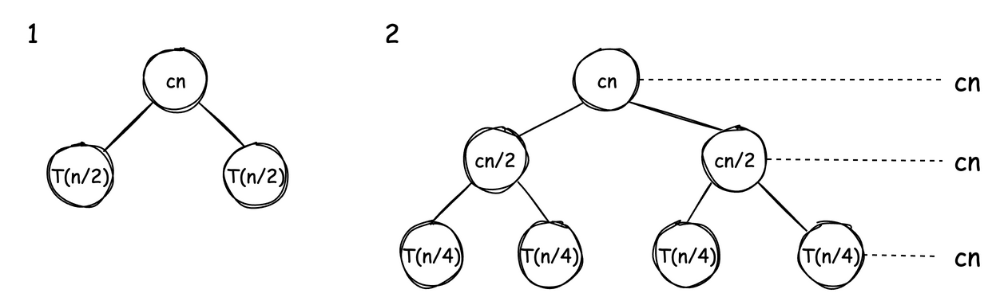
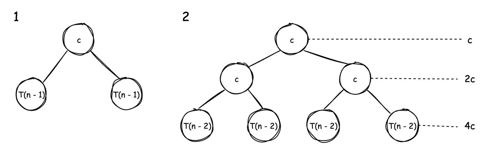
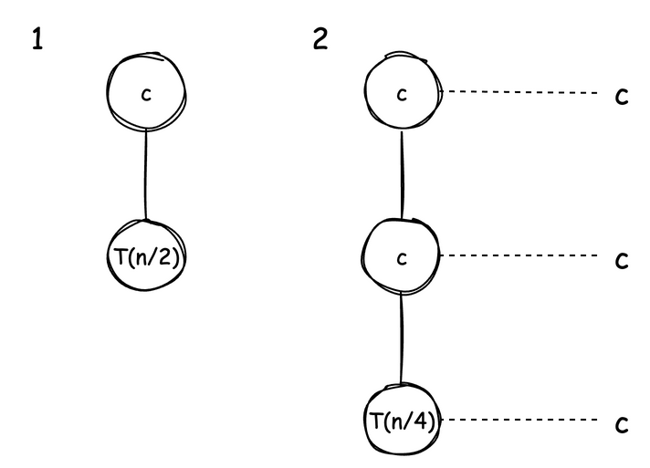
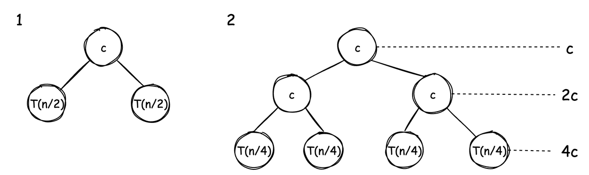
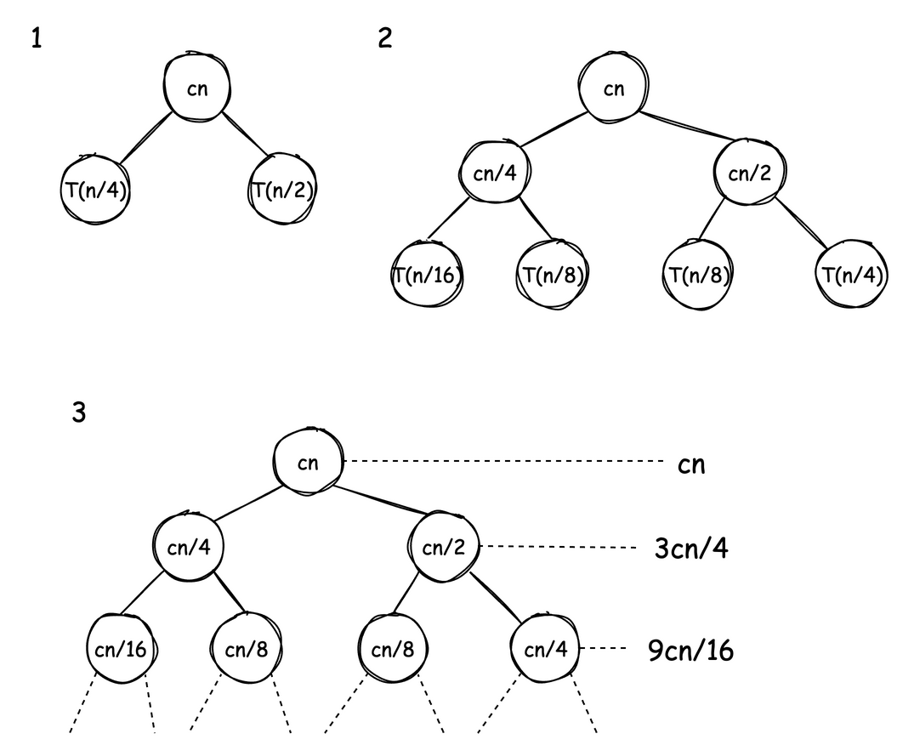
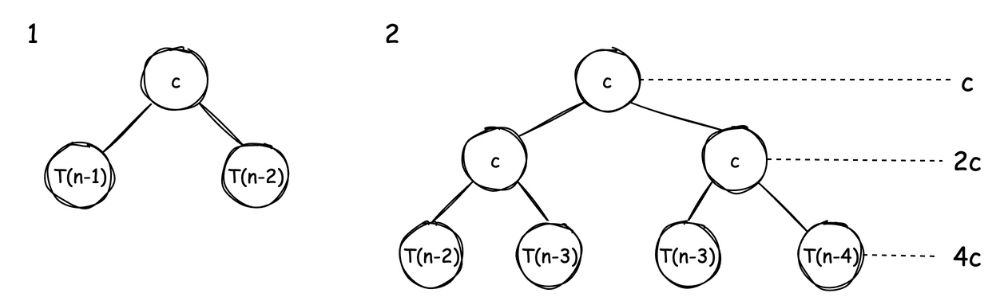

---
jupyter:
  jupytext:
    cell_metadata_filter: -all
    text_representation:
      extension: .md
      format_name: markdown
      format_version: '1.3'
      jupytext_version: 1.19.5
  kernelspec:
    display_name: Python 3 (ipykernel)
    language: python
    name: python3
---

<!-- #region -->
# Analysis of Recursion

> **Mental model.** Don't solve the recurrence algebraically - draw the tree and read two
> numbers off it. How many **levels**, which is set by how the argument shrinks ($n/2$ gives
> $\log n$ levels, $n - 1$ gives $n$), and how the work **changes from one level to the next**.
> The total is the sum down the levels, and which level dominates that sum decides the answer.
> Stay flat, $Cn$ at every level, and it is work × height: $\Theta(n \log n)$. Grow by a
> constant factor and the *bottom* level swamps everything above it, so $2T(n/2) + C$ is
> $\Theta(n)$ and $2T(n-1) + C$ is $\Theta(2^n)$. Shrink by a constant factor and the *root*
> dominates instead, so $T(n/4) + T(n/2) + Cn$ collapses to $n$ however many levels follow.
>
> **Load-bearing:** the geometric sum, not the height. $2T(n/2) + Cn$ and $2T(n/2) + C$ have
> the same shape and the same $\log n$ height, and differ only in the root's work, yet one is
> $\Theta(n \log n)$ and the other $\Theta(n)$. Reach for "height × work at the root" instead
> of summing the levels and you cannot tell them apart. The second load-bearing piece is what
> licenses the shortcut on a lopsided tree: you round it up to a full one, which prices work
> that is not actually there, and that is precisely why an incomplete tree yields $O$ and never
> $\Theta$.

Let's go through some examples to get a hang of how to derive time taken $T(n)$ for recursive functions.

## Examples

### Example 1

**Python**

```python
def fun(n):
    if n <= 1:
        return
    for i in range(n):      # 𝛳(n)
        print("something")
    fun(n//2)               # T(n/2)
    fun(n//2)               # T(n/2)
```

**JavaScript**

<details>
<summary>JavaScript equivalent</summary>

```javascript
function fun(n) {
  if(n <= 1) {
    return;
  }
  for(let i = 0; i < n; i++) {
    console.log('something');
  }
  fun(Math.floor(n/2));
  fun(Math.floor(n/2));
}
```
</details>

Time taken: $T(n) = 2T(n/2) + \Theta(n)$ \
Base case: $T(1) = C$

### Example 2

**Python**

```python
def fun(n):
    if n <= 1:
        return
    print("something")      # 𝛳(1)
    fun(n//2)               # T(n/2)
    fun(n//2)               # T(n/2)
```

**JavaScript**

<details>
<summary>JavaScript equivalent</summary>

```javascript
function fun(n) {
  if(n <= 1) {
    return;
  }
  console.log('something');
  fun(Math.floor(n/2));
  fun(Math.floor(n/2));
}
```
</details>

Time taken: $T(n) = 2T(n/2) + C$ \
Base case: $T(1) = C$

### Example 3

**Python**

```python
def fun(n):
    if n <= 0:
        return
    print(n)        # 𝛳(1)
    fun(n - 1)      # T(n - 1)
```

**JavaScript**

<details>
<summary>JavaScript equivalent</summary>

```javascript
function fun(n) {
  if(n <= 0) {
    return;
  }
  console.log(n);
  fun(n - 1);
}
```
</details>

Time taken: $T(n) = T(n - 1) + C$ \
Base case: $T(1) = C$

## Recursion Tree Method

Once the value of $T(n)$ is written recursively, we can use **Recursion Tree Method** to find the actual value of $T(n)$. Here are the steps for it:

  1. Write non-recursive part as root of tree and recursive parts as children.
  2. Keep expanding children until a pattern emerges.

### Example 1

$$
\begin{align}
T(n) = 2T(n/2) + Cn \\
T(1) = C
\end{align}
$$



$cn$ work is being done at every level.\
The work is getting reduced by half in each recursion. Therefore the height of tree is $\log_2 n$.\
Total work done: $cn + cn + cn + \dots \space \log n \space \text{times i.e.} \space cn \log n$.\
Therefore, the time complexity is $\Theta(n \log n)$.

### Example 2

$$
\begin{align}
T(n) = 2T(n-1) + C \\
T(1) = C
\end{align}
$$



We are reducing by 1 in each recursion, therefore the height of tree will be $n$.\
Total work done: $C + 2C + 4C + \dots \text{for} \space n$ times.\
It's a geometric progression: $C(1 + 2 + 4 + \dots + 2^{n-1})$.

> Formula for geometric progression:
> $$
\begin{align}
\frac{a *(r^k-1)}{r-1} \\
\text {\small where r = common ratio, a = first term, k = number of terms}
\end{align}
$$

Applying the formula with $a = 1, r = 2, k = n$:\
$C \cdot \frac{2^n - 1}{2 - 1} = C(2^n - 1)$.\
Therefore, the time complexity is $\Theta(2^n)$.

### Example 3

$$
\begin{align}
T(n) = T(n/2) + C \\
T(1) = C
\end{align}
$$



Total work done: $C + C + \dots \space \log n$ times.\
Therefore, the time complexity is $\Theta(\log n)$.

### Example 4

$$
\begin{align}
T(n) = 2T(n/2) + C \\
T(1) = C
\end{align}
$$



Total work done: $C + 2C + 4C + \dots$ for $\log_2 n$ terms (levels $0$ through $\log_2 n - 1$).\

$$
\begin{align}
C(1 + 2 + 4 + \dots + 2^{\log_2 n - 1}) \\
a = 1, r = 2, k = \log_2 n \\
\text {\small applying geometric progression formula } \frac{a(r^k - 1)}{r - 1} \\
\frac {2^{\log_2 n} - 1}{2-1} \\
2^{\log_2 n } = n
\end{align}
$$

Therefore, the time complexity is $\Theta(n)$.

## Incomplete trees

We can still use _Recursion Tree_ method for incomplete trees, but instead of exact bound we'll get upper bound.

### Example 1

$$
\begin{align}
T(n) = T(n/4) + T(n/2) + Cn \\
T(1) = C
\end{align}
$$



In this example, the left subtree will reduce faster than the right one.\
We'll assume this is a full tree and therefore will get upper bound $O$ instead of the exact bound $\Theta$.

At level 1, the left child contributes $Cn/4$ work and the right child contributes $Cn/2$ work, so total at level 1 is $3Cn/4$.\
Ratio between levels: $\frac{3Cn/4}{Cn} = 3/4$.

Total work done: $Cn + 3Cn/4 + 9Cn/16$ and height of tree is $\log n$.

It's a geometric progression with ratio less than 1.

> Formula for geometric progression with ratio < 1:
$$
\begin{align}
\frac{a}{1-r} \\
\text {\small where r = common ratio} \\
\text {\small a = first term}
\end{align}
$$


$a = Cn, r = 3/4$\
applying geometric progression formula
$\frac {Cn}{1-3/4}$\
ignoring constants, the complexity is $n$

The time complexity is $O(n)$.

### Example 2

$$
\begin{align}
T(n) = T(n-1) + T(n-2) + C \\
T(1) = C
\end{align}
$$



It's not a full tree with height $n$.
Total work done: $C + 2C + 4C + \dots \space \text{for} \space n \space \text{times}$.\
It's a geometric progression: $C(1 + 2 + 4 + \dots + 2^{n-1})$.\
Applying the formula with $a = 1, r = 2, k = n$: $C \cdot \frac{2^n - 1}{2 - 1} = C(2^n - 1)$.\
Therefore, the time complexity is $O(2^n)$.

<!-- #endregion -->
