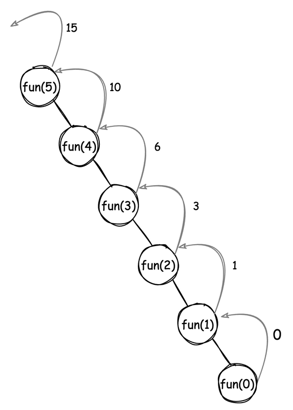
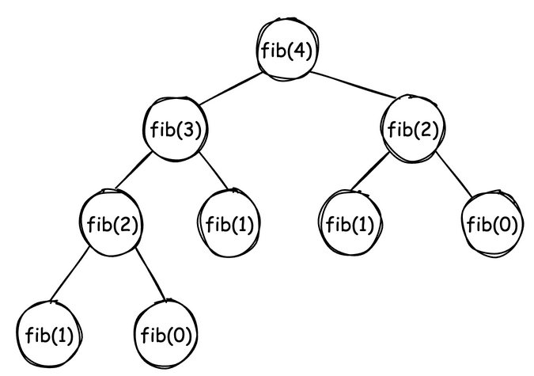
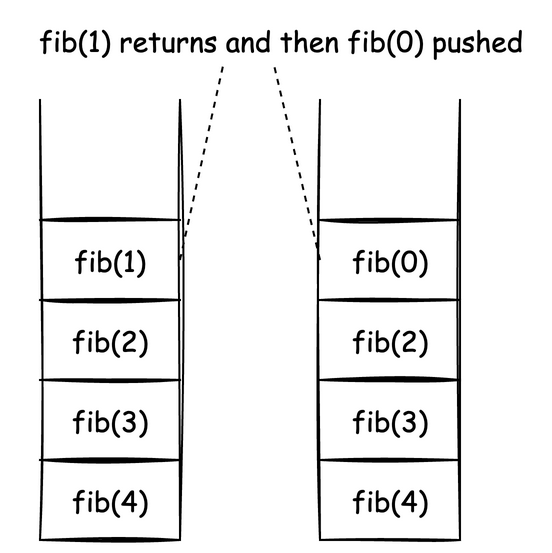

---
jupyter:
  jupytext:
    cell_metadata_filter: -all
    text_representation:
      extension: .md
      format_name: markdown
      format_version: '1.3'
      jupytext_version: 1.19.5
  kernelspec:
    display_name: Python 3 (ipykernel)
    language: python
    name: python3
---

<!-- #region -->
# Space Complexity

It can be defined as: Order of growth of memory space in terms of input size.

Let's consider some examples:

## Example 1

```python
    def sum(n):
        return n * (n + 1)//2
```

The space complexity is $\Theta(1)$ since only 1 variable is needed.

## Example 2

```python
def sum2(n):
    sum = 0
    for i in range(1, n+1):
        sum += i
    return sum
```

The space complexity is still $\Theta(1)$ since only 3 variables are needed.

## Example 3

```python
def arrSum(arr):
    sum = 0
    for i in arr:
        sum += i
    return sum
```

The space complexity is $\Theta(n)$ since we need array of size $n$.

> **Auxiliary Space**
> Order of growth of extra space (any space other than needed for input and output) in terms of input size.


For the earlier `arrSum` example, aux space is $\Theta(1)$ and space complexity is $\Theta(n)$.

For arrays and lists, the space complexity is anyways going to be $\Theta(n)$.

Therefore, _auxiliary space_ is an important criteria in analysis.

## Space Requirements for Recursive Programs

### Example 1

Consider the following function:

```python
def recSum(n):
    if n <= 0:
        return 0
    return n + recSum(n - 1)
```

The function call stack for the invocation `recSum(5)` can be visualized as follows:



The number of stack frames is $n + 1$.

The space complexity: $\Theta(n)$.

Aux space: $\Theta(n)$.

### Example 2

Consider the following fibonacci implementation:

```python
def fib(n):
    if n == 0 or n == 1:
        return n
    return fib(n - 1) + fib(n - 2)
```

Expected results for values of $n$:
n = 0 | n = 1 | n = 2 | n = 3 | n = 4 | n = 5 | n = 6
:---:|:---:|:---:|:---:|:---:|:---:|:---:
0|1|1|2|3|5|8

Here is how the recursion tree will look like for `fib(4)` execution:



Let's see how the call stack looks like for `fib(4)` execution:



As we can see, the maximum number of active stack frames is $4$ i.e. height of tree.

Therefore aux space = $\Theta(n)$.

> The simple rule to find out the aux space for recursion: **it's always equal to the height of the recursion tree**.

### Example 3

Consider the following non-recursive implementation for fibonacci:

> **Note:** This implementation assumes $n \geq 2$.

```python
def fib2(n):
    f = [None for _ in range(n)]
    f[0], f[1] = 0, 1
    for i in range(2, n):
        f[i] = f[i-1] + f[i-2]
    return f[n-1]
```

Space complexity: $\Theta(n)$.

Aux space: $\Theta(n)$.

Can we reduce the aux space needed?

### Example 4

Consider the following implementation:

```python
def fib3(n):
    if n == 0 or n == 1:
        return n
    a, b, c = 0, 1, 0
    for i in range(2, n + 1):
        c = a + b
        a, b = b, c
        print(f"i={i}; c={c}, a={a}, b={b}")
    return c
```

Here is variable tracing looks like for above implementation for $n = 4$:

> `a=0, b=1, c=0`\
  `i=2; c=1, a=1, b=1`\
  `i=3; c=2, a=1, b=2`\
  `i=4; c=3, a=2, b=3`

Space complexity: $\Theta(1)$.

Aux space : $\Theta(1)$.

<!-- #endregion -->
