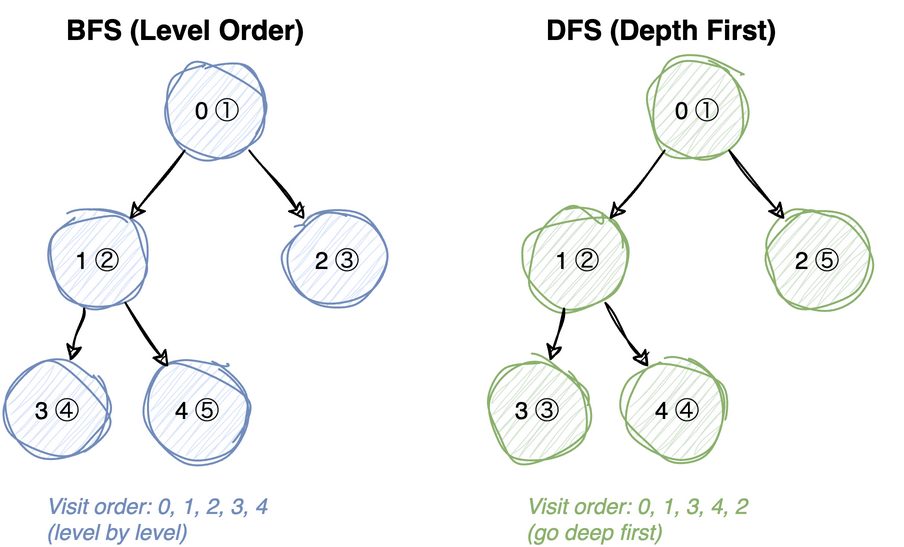
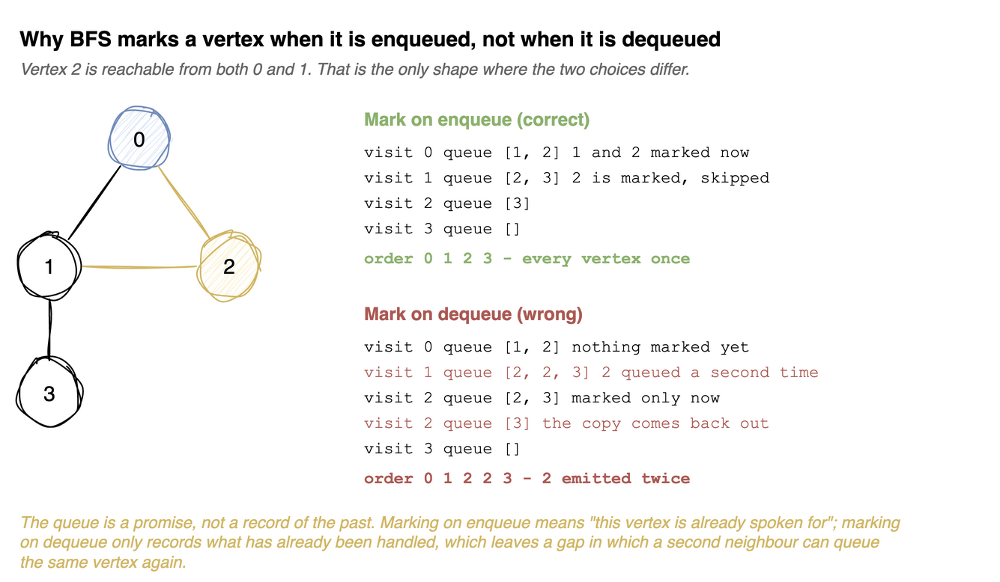

---
jupyter:
  jupytext:
    cell_metadata_filter: -all
    text_representation:
      extension: .md
      format_name: markdown
      format_version: '1.3'
      jupytext_version: 1.19.5
  kernelspec:
    display_name: Python 3 (ipykernel)
    language: python
    name: python3
---

# Graph Traversal

Reaching every vertex is the easy part. The real question is *which vertex to take
next* out of the ones you have found but not yet looked at. One thing decides it: the
container those waiting vertices sit in. That container is the **frontier**.

Change the container and a different algorithm falls out, with nothing else in the loop
touched:

| Frontier | What comes out next | Algorithm |
|---|---|---|
| queue (`deque`), first in first out | the vertex found earliest | **BFS**, ring by ring from the source |
| stack (or recursion), last in first out | the vertex found most recently | **DFS**, as deep as possible first |
| min-heap keyed by cost | the cheapest vertex found | [Dijkstra](dijkstra.md), shortest weighted path |

So BFS and DFS are not two algorithms to memorise. They are one algorithm making one
choice differently. Both visit every vertex and every edge once, so both are
**O(V + E)** on an adjacency list, with O(V) auxiliary space for the frontier and the
visited marks.

See [Graph Basics](graph-basics.md) for representations.





### Test graph helper

Each notebook is executed standalone by `make test`, so this rebuilds the adjacency
list locally rather than importing it from the basics notebook.

```python
from collections import deque


def build_adj(n, edges):
    """Adjacency list for an undirected graph on vertices 0..n-1."""
    adj = [[] for _ in range(n)]
    for u, v in edges:
        adj[u].append(v)
        adj[v].append(u)
    return adj


def test_build_adj():
    assert build_adj(3, [(0, 1), (1, 2)]) == [[1], [0, 2], [1]]


test_build_adj()
```

# Breadth-First Search (BFS)

> **Mental model.** The queue holds vertices you have found but not yet looked at, and
> because it is first in, first out, it stays sorted by distance from the source.
> Everything one edge away leaves the queue before anything two edges away. The order
> vertices come out *is* order of increasing distance, and that is the whole reason BFS
> gives shortest paths when every edge costs the same.
>
> **Load-bearing:** a vertex is marked visited when it is **enqueued**, not
> when it is dequeued. `visited` does not mean "already looked at", it means "already
> claimed". The diagram below shows what a late mark costs.

Why is it safe to claim a vertex the first time you see it and never look again? Because
the queue only ever holds vertices from one distance and the next, so the first route
that reaches a vertex is a shortest one. There is no better route still coming. Throwing
away every other way in loses nothing.

That whole argument rests on one thing: every edge costs the same. Give one edge a cost
of 10 and "fewest edges" stops meaning "cheapest", so the first arrival is no longer the
best one and the queue can no longer be trusted. Swapping the queue for a min-heap keyed
by total cost repairs exactly that, and the repair is [Dijkstra](dijkstra.md).



## Applications
- Find shortest path in unweighted graph
- Web crawlers in search engines
- Peer-to-peer networks
- Social network search
- Garbage collection (Cheney's algorithm)
- Cycle detection
- Ford-Fulkerson algorithm
- Broadcasting in networking

**Time:** O(V + E) &nbsp; **Space:** O(V) for the queue and the visited list

**Recipe**

1. `visited` defaults to `None` and is created if absent. **Accepting it as an
   argument is what lets the disconnected version below reuse this function
   across components instead of duplicating it.** Never default it to `[False] *
   n` directly in the signature; Python evaluates that once and every call would
   share it.
2. A `deque` seeded with `s`, and mark `s` visited immediately.
3. Loop: `popleft`, append to the order, then for each unvisited neighbour
   **mark it visited and enqueue it**.
4. **Mark on enqueue, not on dequeue.** Two vertices already in the queue can
   both list the same neighbour, so marking late lets it be queued twice and it
   comes out of the traversal twice. On the triangle `[[1,2],[0,2],[0,1]]` the
   late version returns `[0, 1, 2, 2]`.
5. `popleft` is O(1) on a deque; `list.pop(0)` is O(n) and makes this quadratic.

```python
def bfs(adj, s, visited=None):
    """
    BFS from source vertex s. Returns vertices in visit order.

    Pass an existing `visited` list to continue a traversal across components.

        0
      /   \
    1      2
          / \
         3   4

    From 0: [0, 1, 2, 3, 4]
    """
    if visited is None:
        visited = [False] * len(adj)
    q = deque([s])
    visited[s] = True
    order = []
    while q:
        u = q.popleft()
        order.append(u)
        for v in adj[u]:
            if not visited[v]:
                visited[v] = True  # mark on enqueue, not on dequeue
                q.append(v)
    return order


def test_bfs():
    adj = build_adj(4, [(0, 1), (0, 2), (1, 2), (1, 3)])
    assert bfs(adj, 0) == [0, 1, 2, 3]
    assert bfs(adj, 3) == [3, 1, 0, 2]
    # single vertex, no edges
    assert bfs([[]], 0) == [0]
    # only the source's component is reached
    adj = build_adj(5, [(0, 1), (2, 3)])
    assert bfs(adj, 0) == [0, 1]


test_bfs()
```

## Disconnected Graphs

One BFS only reaches what is reachable *from its source*. To touch every vertex, loop
over all of them and start a fresh BFS from each one not yet visited.

The `visited` list is threaded through the calls rather than recreated, so no vertex is
processed twice and the total work stays O(V + E) however many components there are.

**Time:** O(V + E) &nbsp; **Space:** O(V)

**Recipe**

1. Build **one** `visited` list up front and keep it across every call.
2. Loop over all vertices; for each still-unvisited one, run `bfs` from it and
   concatenate the result.
3. **The outer loop is the whole idea.** A single BFS only reaches what is
   reachable from its source, so an unvisited vertex after a run means a
   component that has not been touched yet.
4. **The shared `visited` is what stops the second run re-walking the first
   component.** Create it inside the loop instead and vertices repeat.

```python
def bfs_disconnected(adj):
    """BFS over every component. Returns all vertices in visit order."""
    visited = [False] * len(adj)
    order = []
    for u in range(len(adj)):
        if not visited[u]:
            order += bfs(adj, u, visited)
    return order


def test_bfs_disconnected():
    # two components: {0,1,2,3} and {4,5,6}
    adj = [[1, 2], [0, 3], [0, 3], [1, 2], [5, 6], [4, 6], [4, 5]]
    assert bfs_disconnected(adj) == [0, 1, 2, 3, 4, 5, 6]
    # every vertex appears exactly once
    order = bfs_disconnected([[], [], []])
    assert sorted(order) == [0, 1, 2]


test_bfs_disconnected()
```

## Counting Connected Components

Exactly the loop above with a counter. The insight: the outer loop can only find an
unvisited vertex when none of the earlier traversals could reach it - so every time it
does, that is one more component.

**Time:** O(V + E) &nbsp; **Space:** O(V)

**Recipe**

1. Identical loop to `bfs_disconnected`, but count instead of collecting.
2. `count += 1` **once per restart**, not once per vertex.
3. **The number of times the outer loop has to start a fresh traversal is the
   number of components.** That is the entire algorithm; the traversal itself is
   only there to mark off everything reachable so it is not counted again.

```python
def count_components_bfs(adj):
    """Count connected components in an undirected graph using BFS."""
    visited = [False] * len(adj)
    count = 0
    for u in range(len(adj)):
        if not visited[u]:
            count += 1
            bfs(adj, u, visited)
    return count


def test_count_components_bfs():
    # components: {0,1,2}, {3,4}, {5,6,7}
    adj = [[1, 2], [0, 2], [0, 1], [4], [3], [6, 7], [5], [5]]
    assert count_components_bfs(adj) == 3
    # fully connected
    assert count_components_bfs(build_adj(3, [(0, 1), (1, 2)])) == 1
    # no edges - every vertex is its own component
    assert count_components_bfs([[], [], []]) == 3
    assert count_components_bfs([]) == 0


test_count_components_bfs()
```

# Depth-First Search (DFS)

> **Mental model.** The same loop as BFS with one substitution: the frontier is a stack,
> so the vertex that comes out next is the one found most recently. That single change
> makes the walk dive. It always carries on from where it just was, and backs up only
> when there is nowhere new to go. Recursion hides the stack rather than removing it -
> the call stack *is* the frontier, and `dfs_rec` never mentions a stack because Python
> is keeping it.
>
> **Load-bearing:** DFS says nothing about distance. The first route it finds to
> a vertex can be the longest one in the graph, because it commits to a branch before
> looking at the alternatives. Only BFS earns the shortest-path guarantee.

Nothing about depth-first order requires recursion. Recursion is just the cheapest way to
get a last-in-first-out frontier, since the language already maintains one. The diagram at
the top of the notebook shows the two orders side by side.

What DFS gives up in distance it gets back in structure. Because a vertex is entered and
then finished only after everything below it is finished, the traversal knows when a
branch is complete. That "finished" moment is what
[cycle detection](cycle-detection.md) and [topological sort](topological-sort.md) are
built on, and it is not something BFS can offer.

## Applications
- Cycle detection
- Topological sorting
- Strongly connected components
- Solving maze puzzles
- Path finding

**Time:** O(V + E) &nbsp; **Space:** O(V) - the recursion can reach depth V on a path
graph

**Recipe**

1. Mark `u` and append it, then recurse into every unvisited neighbour.
2. **No explicit stack and no base case.** The call stack is the stack, and the
   `if not visited[v]` guard is what terminates it. A graph has cycles, so
   without that check the recursion never ends.
3. **BFS and DFS are the same traversal with a different container.** Queue means
   explore the nearest first; the call stack means follow one path to its end.
4. Depth is bounded by the number of vertices, so a long path can hit Python's
   recursion limit where the iterative version below would not.

```python
def dfs_rec(adj, u, visited, order):
    """Recursive DFS helper - appends vertices to order as they are visited."""
    visited[u] = True
    order.append(u)
    for v in adj[u]:
        if not visited[v]:
            dfs_rec(adj, v, visited, order)


def dfs(adj, s):
    """
    DFS from source vertex s. Returns vertices in visit order.

         0
      /     \
      1      4
      |    /   \
      2   5  -  6
      |
      3

    From 0: [0, 1, 2, 3, 4, 5, 6]
    """
    visited = [False] * len(adj)
    order = []
    dfs_rec(adj, s, visited, order)
    return order


def test_dfs():
    adj = [[1, 4], [0, 2], [1, 3], [2], [0, 5, 6], [4, 6], [4, 5]]
    assert dfs(adj, 0) == [0, 1, 2, 3, 4, 5, 6]
    # goes deep before wide - contrast with BFS on the same graph
    adj = build_adj(4, [(0, 1), (0, 2), (1, 3)])
    assert dfs(adj, 0) == [0, 1, 3, 2]
    assert bfs(adj, 0) == [0, 1, 2, 3]
    assert dfs([[]], 0) == [0]


test_dfs()
```

### DFS over components

The same outer loop as BFS: sweep all vertices, start a DFS from each unvisited one.
`count_components_dfs` just adds the counter, and the test asserts both traversals
agree on the count - the number of components is a property of the graph, not of how
you walk it.

**Time:** O(V + E) &nbsp; **Space:** O(V)

**Recipe**

1. The same shared-`visited` outer loop as the BFS pair.
2. `count_components_dfs` passes an unused `[]` for the order, since only the
   restart count matters.
3. **BFS or DFS makes no difference to the answer here.** Components are about
   reachability, and both traversals reach exactly the same set. Pick either.

```python
def dfs_disconnected(adj):
    """DFS over every component. Returns all vertices in visit order."""
    visited = [False] * len(adj)
    order = []
    for u in range(len(adj)):
        if not visited[u]:
            dfs_rec(adj, u, visited, order)
    return order


def count_components_dfs(adj):
    """Count connected components in an undirected graph using DFS."""
    visited = [False] * len(adj)
    count = 0
    for u in range(len(adj)):
        if not visited[u]:
            count += 1
            dfs_rec(adj, u, visited, [])
    return count


def test_dfs_disconnected():
    # components: {0,1,2} and {3,4}
    adj = [[1, 2], [0, 2], [0, 1], [4], [3]]
    assert dfs_disconnected(adj) == [0, 1, 2, 3, 4]
    assert count_components_dfs(adj) == 2
    # BFS and DFS must agree on the number of components
    assert count_components_dfs(adj) == count_components_bfs(adj)
    assert count_components_dfs([[], [], []]) == 3


test_dfs_disconnected()
```

## Iterative DFS

Taking the stack out of Python's hands changes nothing about the algorithm. It changes who
pays for it. Python allows only about 1000 nested calls, and recursive DFS needs one call
per vertex on the current path, so a long chain crashes it. The test walks a 2000-vertex
path graph for exactly that reason.

Two details look like fuss and are not.

Neighbours are pushed in **reverse** because a stack hands back the last thing pushed.
Push them in their listed order and the *last* neighbour gets explored first. Reversing
lines the iterative order up with the recursive one. It is not needed for correctness,
only for the two to agree - which is what lets the test compare them directly.

`visited` is checked again *after* popping. The recursive version marks a vertex when it
enters it, and "enters" here means pop, not push, so this version marks at pop too. The
price is that a vertex found from two branches can be sitting in the stack twice before
either copy is popped. The check after popping is what throws the stale copy away. Mark at
push instead and the duplicates disappear, but so does the match with the recursive order.

**Time:** O(V + E) &nbsp; **Space:** O(V)

**Recipe**

1. A list as a stack, seeded with `s`.
2. Pop, and **if the vertex is already visited, `continue`.**
3. **Mark on pop here, unlike BFS which marks on enqueue.** A vertex can be
   pushed several times before it is ever popped, so the same vertex arrives at
   the top more than once and the guard is what discards the repeats. Drop it
   and vertex 6 in the notebook's test graph is emitted twice.
4. Mark, append to the order, then push all unvisited neighbours.
5. Push `reversed(adj[u])`. **A stack reverses whatever it is given, so pushing
   the neighbours backwards makes the first one pop first and matches
   `dfs_rec`'s order.** Without it the traversal is still a valid DFS, just a
   different one, which makes the bug invisible to any test that only checks the
   set of vertices.

```python
def dfs_iterative(adj, s):
    """DFS from s using an explicit stack. Returns vertices in visit order."""
    visited = [False] * len(adj)
    stack = [s]
    order = []
    while stack:
        u = stack.pop()
        if visited[u]:  # may have been queued twice before being popped
            continue
        visited[u] = True
        order.append(u)
        # reversed so the first neighbour is popped first, matching dfs_rec
        for v in reversed(adj[u]):
            if not visited[v]:
                stack.append(v)
    return order


def test_dfs_iterative():
    adj = [[1, 4], [0, 2], [1, 3], [2], [0, 5, 6], [4, 6], [4, 5]]
    assert dfs_iterative(adj, 0) == dfs(adj, 0)
    adj = build_adj(4, [(0, 1), (0, 2), (1, 3)])
    assert dfs_iterative(adj, 0) == [0, 1, 3, 2]
    # deep path graph would blow the recursion limit at scale; iterative is fine
    path = build_adj(2000, [(i, i + 1) for i in range(1999)])
    assert dfs_iterative(path, 0) == list(range(2000))


test_dfs_iterative()
```

# Python Built-in: BFS on a `dict` Graph

There is no graph type in the standard library, but `deque` gives an O(1) `popleft` for
the BFS frontier and `defaultdict(list)` holds the adjacency list. Vertices can be any
hashable value.

The algorithm itself is unchanged apart from two substitutions: a `set` replaces the
boolean visited list (vertices are no longer indices `0..n-1`), and a missing key yields
`[]` instead of raising.

Worth knowing that the `defaultdict` convenience cuts both ways - reading
`graph[missing]` silently *creates* an empty entry, so the graph can grow just by being
traversed.

**Time:** O(V + E) &nbsp; **Space:** O(V)

```python
from collections import defaultdict


def bfs_dict(graph, start):
    """BFS over a dict-of-lists graph with arbitrary hashable vertices."""
    visited = {start}
    q = deque([start])
    order = []
    while q:
        node = q.popleft()
        order.append(node)
        for neighbor in graph[node]:
            if neighbor not in visited:
                visited.add(neighbor)
                q.append(neighbor)
    return order


def test_bfs_dict():
    graph = defaultdict(list)
    for u, v in [("A", "B"), ("A", "C"), ("B", "D"), ("C", "D")]:
        graph[u].append(v)
        graph[v].append(u)  # undirected
    assert bfs_dict(graph, "A") == ["A", "B", "C", "D"]
    assert bfs_dict(graph, "D") == ["D", "B", "C", "A"]


test_bfs_dict()
```
