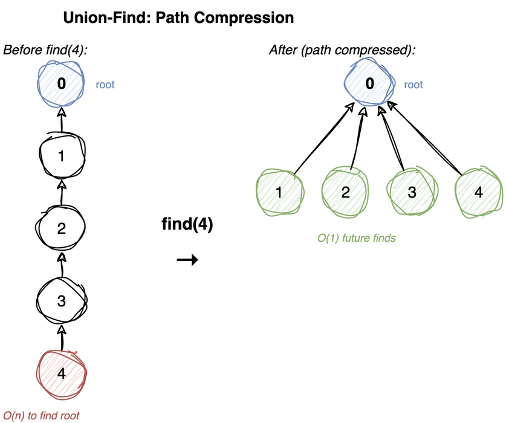

---
jupyter:
  jupytext:
    cell_metadata_filter: -all
    text_representation:
      extension: .md
      format_name: markdown
      format_version: '1.3'
      jupytext_version: 1.19.5
  kernelspec:
    display_name: Python 3 (ipykernel)
    language: python
    name: python3
---

# Union-Find (Disjoint Set Union)

Tracks a collection of non-overlapping sets. Supports two operations:

| Operation | Description | Time (optimized) |
|-----------|-------------|------------------|
| find(x) | Which set does x belong to? | O(α(n)) ≈ O(1) |
| union(x, y) | Merge the sets containing x and y | O(α(n)) ≈ O(1) |

α(n) grows so slowly that it is a small constant for any input you will ever have - never
more than 4 for any n you could store. That function has a name, the inverse Ackermann
function, but the number it returns is the only part that matters. See
[Analysis of Algorithms](../analysis/01-notation.md) for a detailed explanation.

**Applications:** Kruskal's MST, cycle detection in undirected graphs, connected components, network connectivity.

> **Mental model.** Each set is represented by one of its own members - the root of a tree
> of parent pointers. Nothing anywhere stores which set an element belongs to. You find out
> by walking up the parent pointers until you reach a node that is its own parent, so "are x
> and y in the same set?" becomes "do they climb to the same root?".
>
> **Load-bearing:** which member ends up being the root is arbitrary and carries no meaning.
> The only question ever asked of a root is whether it equals another root. That is exactly
> why both optimizations are free to rearrange the tree however they like - re-pointing a
> node at the root, or hanging one root under another, changes the shape and changes nothing
> about the answers.

**Procedural style:** the data structure is just two arrays (`parent` and `rank`). Functions
operate on them directly - no wrapper class needed.

## Key Optimizations

The card fixes the representation, and leaves two things unsaid: which root goes under which
when two sets merge, and what `find` does with the path it just walked. All of the cost lives
in those two gaps, and each has one fix. Both fixes work by rearranging the tree, which is
free for exactly the reason the card gives - only root *identity* is ever read, never shape,
depth, or which parent got you there.

1. **Union by rank** - attach the shorter tree under the taller one → keeps trees flat
2. **Path compression** - during `find`, point every node directly to the root → flattens on access

Without optimizations: O(n) per operation. With both: O(α(n)) amortized.


## Naive Union-Find

Each set is a tree of parent pointers. The root is the node that is its own parent, and it
stands in for the whole set. `find` climbs to the root. `union` finds both roots and points
one of them at the other.

That last choice is where it falls apart. Nothing says which root goes under which, so an
unlucky order of unions builds one long chain instead of a bushy tree:

```
union(0,1)   union(1,2)   union(2,3)   union(3,4)

1            2            3            4
|            |            |            |
0            1            2            3
             |            |            |
             0            1            2
                          |            |
                          0            1
                                       |
                                       0
```

Every union here hangs the whole existing tree under a single brand new node, so the depth
grows by one each time. The tree *is* a list now, and `find(0)` walks all of it. Every
query costs O(n), which is no better than storing a plain array of set labels and scanning
it.

Two separate things went wrong here. The chain got deep because `union` chose blindly, and
it stays deep because `find` throws away what it learned - it will walk the same path
again on the very next call. Union by rank repairs the first. Path compression repairs the
second.

**Time:** O(n) worst case per operation, O(log n) once union by rank is added &nbsp;
**Space:** O(n)

**Recipe**

1. `parent = list(range(n))`: every element starts as its own root, so `parent[x]
   == x` is the test for "this is a root".
2. `find`: walk `parent` until it points at itself.
3. `union`: find both roots, and if they differ point one at the other. **Compare
   roots, never the elements themselves** - two members of one set usually have
   different parents, and only the root names the set.

```python
def make_set_naive(n):
    """Each element is its own parent."""
    return list(range(n))

def find_naive(parent, x):
    """Follow parent pointers to root. O(n) worst case."""
    while parent[x] != x:
        x = parent[x]
    return x

def union_naive(parent, x, y):
    """Make root of x point to root of y."""
    rx, ry = find_naive(parent, x), find_naive(parent, y)
    if rx != ry:
        parent[rx] = ry

def test_naive():
    p = make_set_naive(5)  # {0}, {1}, {2}, {3}, {4}
    union_naive(p, 0, 1)
    union_naive(p, 2, 3)
    assert find_naive(p, 0) == find_naive(p, 1)
    assert find_naive(p, 0) != find_naive(p, 2)
    union_naive(p, 1, 3)  # merge {0,1} and {2,3}
    assert find_naive(p, 0) == find_naive(p, 3)

test_naive()
```

## Optimized: Union by Rank + Path Compression

One repair for each of the two problems above.

**Union by rank** stops the chain from ever forming. `rank` is a guess at a tree's height,
and the shorter tree is the one that goes under the taller one. Attaching a short tree
under a tall one costs the tall tree nothing - its height is set by its own deepest node,
which did not move. So height can only grow when the two trees have equal rank, and that
case is rare: a tree of rank k holds at least 2^k nodes, because rank k is only ever
reached by joining two rank k-1 trees that each already held 2^(k-1). Since 2^k ≤ n, the
rank cannot pass log₂n, and neither can the height. The chain above is now impossible.

**Path compression** makes `find` pay for itself. The climb already touched every node on
the path, and by the time it returns it knows the root, so on the way back out of the
recursion it points each of those nodes straight at the root. The path it just walked no
longer exists, and removing it cost nothing beyond work `find` had to do anyway.



This is only safe because a root's identity is meaningless. A node that used to reach the
root through two hops now reaches it in one - a different parent, the same root, so every
answer stays the same.

Together they give O(α(n)) amortized per operation - effectively O(1).

Compression means ranks stop being exact heights, which is harmless: they are only used
as a merge heuristic, never as a measurement.

A `union` whose two arguments already climb to the same root has nothing left to do. It
writes neither array and returns `False`, so repeating an edge is free and changes no
answer. That is what lets callers push a stream of edges through without de-duplicating it
first, and it is why the return value is worth having: `True` means "these were two sets a
moment ago".

**Time:** O(α(n)) amortized &nbsp; **Space:** O(n)

**Recipe**

1. `make_set` returns two arrays now: `parent = list(range(n))` as before and a
   `rank` array of zeros.
2. `find`: if `parent[x] != x`, set `parent[x] = find(parent, parent[x])`, then
   return `parent[x]`. **That one line both returns the answer and flattens the
   path behind it** - assign the recursive call, don't just return it.
3. `union`: resolve both roots first, and return `False` if they match. Nothing
   to merge, and the caller may want to know.
4. Otherwise point the lower-rank root at the higher-rank one. **The other
   direction is the bug** - both orderings answer correctly, only this one keeps
   `find` fast.
5. Equal ranks are the free case: point either root at the other, then add one to
   the survivor's rank. That branch is the only place `rank` is written. Return
   `True`.
6. `connected(x, y)` is `find(x) == find(y)`, and needs no `rank`.

```python
def make_set(n):
    parent = list(range(n))
    rank = [0] * n
    return parent, rank

def find(parent, x):
    """Find with path compression. O(α(n)) amortized."""
    if parent[x] != x:
        parent[x] = find(parent, parent[x])  # path compression
    return parent[x]

def union(parent, rank, x, y):
    """Union by rank. O(α(n)) amortized."""
    rx, ry = find(parent, x), find(parent, y)
    if rx == ry:
        return False  # already in same set
    # attach shorter tree under taller
    if rank[rx] < rank[ry]:
        parent[rx] = ry
    elif rank[rx] > rank[ry]:
        parent[ry] = rx
    else:
        parent[ry] = rx
        rank[rx] += 1
    return True

def connected(parent, x, y):
    """Check if x and y are in the same set."""
    return find(parent, x) == find(parent, y)

def test_optimized():
    p, r = make_set(6)
    union(p, r, 0, 1)
    union(p, r, 2, 3)
    union(p, r, 4, 5)
    assert connected(p, 0, 1)
    assert not (connected(p, 0, 2))
    union(p, r, 1, 3)  # merge {0,1} and {2,3}
    assert connected(p, 0, 3)
    assert not (connected(p, 0, 5))


def test_union_by_rank():
    p, r = make_set(6)
    for value in range(1, 6):
        assert union(p, r, 0, value)

    # The first equal-rank merge raises root 0 to rank 1. Every singleton
    # after that hangs directly under the taller tree instead of making a chain.
    assert p == [0, 0, 0, 0, 0, 0]
    assert r == [1, 0, 0, 0, 0, 0]


def test_path_compression():
    # Build the chain by hand because union by rank deliberately prevents it.
    p = [1, 2, 3, 4, 4]
    assert find(p, 0) == 4
    assert p == [4, 4, 4, 4, 4]


def test_repeated_union():
    p, r = make_set(4)
    assert union(p, r, 0, 1)  # a real merge
    settled = (p[:], r[:])
    assert not union(p, r, 0, 1)  # the same pair again
    assert not union(p, r, 1, 0)  # and in the other direction
    assert (p, r) == settled  # neither repeat wrote to either array


test_optimized()
test_union_by_rank()
test_path_compression()
test_repeated_union()
```

## Application: Cycle Detection in Undirected Graph

Process edges one at a time. If both endpoints already `find` to the same root, an
earlier chain of edges already connected them, so this edge closes a cycle. Otherwise
merge the two sets and move on.

No recursion over the graph and no adjacency list - which makes this the natural choice
when edges arrive as a stream, and the basis of Kruskal's MST algorithm (take each edge
unless it would form a cycle). It is undirected-only: union-find tracks connectivity, which
has no notion of which way an edge points.

**Time:** O(V + E · α(V)) &nbsp; **Space:** O(V)

**Recipe**

1. `make_set(n)`, then walk the edges one at a time.
2. Endpoints that are already `connected` mean this edge closes a cycle: return
   `True`. **Test before uniting** - do it the other way round and every edge
   looks like a cycle, since `union` has just made the endpoints connected.
3. Otherwise `union` them and carry on. Reaching the end of the edges means no
   cycle: return `False`.

```python
def has_cycle(n, edges):
    """Detect cycle in undirected graph using Union-Find. Time: O(V + E × α(V))"""
    parent, rank = make_set(n)
    for u, v in edges:
        if connected(parent, u, v):
            return True
        union(parent, rank, u, v)
    return False

def test_cycle():
    # 0-1-2-0 → cycle
    assert has_cycle(3, [(0, 1), (1, 2), (2, 0)])
    # 0-1, 0-2 → no cycle (tree)
    assert not (has_cycle(3, [(0, 1), (0, 2)]))

test_cycle()
```

## Application: Count Connected Components

Union every edge, then count the **distinct roots** - one per surviving set. Calling
`find` inside the count also compresses the last paths, so the roots come back cheaply.

The alternative is the BFS/DFS sweep in the [traversal notebook](graph-traversal.md).
Same answer, different trade-off: traversal needs the adjacency list up front, union-find
only needs the edges, one at a time.

There is also a way to avoid the final pass: start a counter at `n` and drop it by one every
time `union` returns `True`. It agrees with the root count because a successful merge turns
two sets into one, lowering the number of sets by exactly one, and that is the whole reason
`union` reports whether it merged anything. **Decrement once per edge instead of once per
successful merge and the count runs low**, since a repeated edge between two vertices already
in one set merges nothing. The version below counts roots instead, which cannot get that
wrong: it asks the structure rather than tracking it.

**Time:** O((V + E) · α(V)) &nbsp; **Space:** O(V)

**Recipe**

1. `make_set(n)`, then `union` every edge, ignoring the return value.
2. Return `len(set(find(parent, i) for i in range(n)))`: one root per surviving
   set. **Call `find(parent, i)`, never read `parent[i]`** - `union` only ever
   re-points roots, so an interior node keeps a parent that has since stopped
   being one, and counting raw parents over-counts.

```python
def count_components(n, edges):
    """Count connected components. Time: O((V + E) × α(V))"""
    parent, rank = make_set(n)
    for u, v in edges:
        union(parent, rank, u, v)
    # count distinct roots
    return len(set(find(parent, i) for i in range(n)))

def test_components():
    # 0-1-2, 3-4 → 2 components
    assert count_components(5, [(0, 1), (1, 2), (3, 4)]) == 2
    # all connected
    assert count_components(3, [(0, 1), (1, 2)]) == 1
    # no edges
    assert count_components(4, []) == 4
    # a repeated edge merges nothing, so it must not change the count
    assert count_components(5, [(0, 1), (0, 1), (1, 2), (3, 4)]) == 2
    # a self-loop is the degenerate case of the same thing
    assert count_components(3, [(0, 0)]) == 3


def test_components_needs_find():
    # Merging two two-element sets leaves one node pointing at a former root.
    parent, rank = make_set(4)
    union(parent, rank, 0, 1)  # root 0
    union(parent, rank, 2, 3)  # root 2
    union(parent, rank, 0, 2)  # root 2 hangs under root 0
    assert parent == [0, 0, 0, 2]
    assert parent[3] == 2 and parent[2] != 2  # 3's parent is no longer a root
    assert len(set(parent)) == 2  # counting raw parents: wrong
    assert count_components(4, [(0, 1), (2, 3), (0, 2)]) == 1  # via find: right


test_components()
test_components_needs_find()
```
