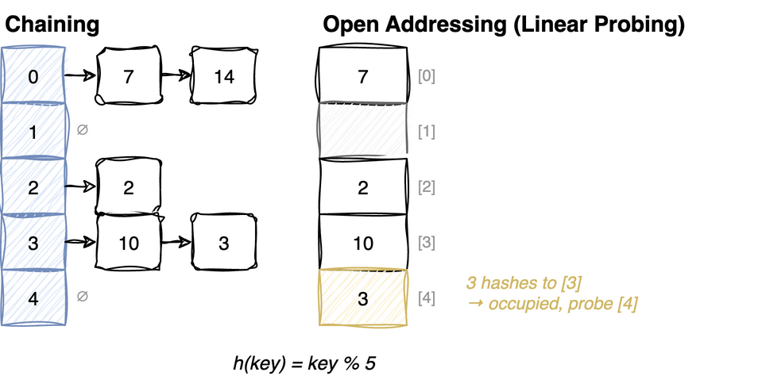

---
jupyter:
  jupytext:
    cell_metadata_filter: -all
    text_representation:
      extension: .md
      format_name: markdown
      format_version: '1.3'
      jupytext_version: 1.19.5
  kernelspec:
    display_name: Python 3 (ipykernel)
    language: python
    name: python3
---

# Hash Tables

A structure that maps keys to values - an *associative array*. It computes an array
index straight from the key, so finding a key is arithmetic instead of searching.

| Operation | Average | Worst case |
|---|---|---|
| Insert | O(1) | O(n) |
| Lookup | O(1) | O(n) |
| Delete | O(1) | O(n) |
| Min, max, sorted order | O(n) | O(n) |

**Use it when** the only questions are "is this key here?" and "what is stored under
this key?". Anything about order - smallest, next largest, everything between a and b -
belongs in a tree instead.

> **Mental model.** A hash table trades away order to buy a shortcut. The hash turns a
> key into an array index, so you jump straight to the right slot rather than looking
> for it. Giving up order is not a side effect, it is the price: the hash deliberately
> scatters keys, so keys that are near each other in value end up nowhere near each
> other in the array.
>
> **Load-bearing:** the O(1) is an *average*, and only two things hold it up - the load
> factor (how full the table is) and a hash that spreads keys evenly. Two keys landing
> on the same index is not a rare accident, it is the normal state, and it has a name:
> a *collision*. Every design decision below is about absorbing collisions, and every
> one of them decays to O(n) once the table gets too full or the hash stops spreading.

## The hash function

The hash has one job: turn a key into a slot number. Two properties make it useful,
and both are easiest to see through what breaks without them.

**Same key, same slot, every time.** The slot number is recomputed on every lookup and
never stored. If the answer could change, you could put a key in and never find it
again. That is what *deterministic* buys.

**Different keys, different slots, as often as possible.** Keys that clump onto a few
slots turn the array into a handful of long lists, and lookup becomes a scan. Spreading
is not a nicety, it is the entire source of the speed.

Two more requirements are practical. The result must land in `0` to `m-1` so it can
index the array. And it must be cheap to compute - O(1) for an integer, O(len) for a
string - or the hash costs more than the search it replaced.

**Common hash functions:**
- **Integers:** `h(key) = key % m` - m should be a prime (fewer common factors → better distribution)
- **Strings:** Weighted sum `(str[0] × x⁰ + str[1] × x¹ + ...) % m` where x is a constant (e.g., 33)
- **Universal hashing:** Pick a hash function randomly from a family of functions

Why a prime `m`: `% m` only sees the remainder, so any pattern the keys share with `m`
survives the hash. With `m = 100` and keys that are all round hundreds, every key lands
on slot 0. A prime shares a factor with far fewer key patterns, so patterned keys still
spread. And why pick the function at random: any fixed hash can be beaten by a set of
keys chosen to collide, but if the function is drawn from a family at random, no key set
is bad in advance - that is *universal hashing*.

> **Birthday Paradox:** With 23 people in a room, the chance two share a birthday is
> already 50%; with 70 it is 99.9%. It is the same counting problem as keys into slots -
> 23 keys in 365 slots is a table 6% full, and a collision is already a coin flip. So
> collisions are not what happens when a table gets crowded. They start immediately.

## Collision handling

Two keys hash to the same slot, and the second value still has to be stored. There are
only two places it can go: in with the first value, or in a different slot. Those two
answers are the two families of hash table.



### 1. Chaining

Every slot holds a list, so colliding keys pile up together and nothing has to move.
The table can never fill up, because a list has no fixed size, and deleting is just
removing an item from a list.

The cost is where the records live. Each one sits in its own list node somewhere else
in memory, so walking a chain means jumping to addresses the CPU has not already
loaded - that is what "not cache friendly" means, and it is why a chain of 3 can be
slower than 3 slots read side by side.

- **Time complexity:** O(l) where l is length of chain
- **Space:** Extra space for pointers/references

### 2. Open Addressing

One flat array, values stored directly in it, and a colliding key gets sent to a
different slot. Nothing is scattered, so reading a few neighbouring slots is nearly
free - the CPU loads them together anyway.

Two things get harder in exchange. The table has a real capacity, so it needs at least
as many slots as keys and must be rebuilt bigger when it runs out. And deleting stops
being simple, for the reason worked out in the tombstone section further down.

## Probing: three rules, each repairing the last

Open addressing needs a rule for "where next?". The three below are not alternatives
picked from a menu; each one exists because of the specific damage the previous one
does.

### 1. Linear Probing

- **Formula:** `hash(key, i) = (h(key) + i) % m`
- **Problem:** Primary clustering near occupied slots
- **Delete:** Mark slot as "DELETED" instead of empty

Try the next slot, then the next. It is the simplest rule, and the fastest to walk,
because the slots it visits sit next to each other in memory.

Its flaw feeds itself. A run of occupied slots captures every key that hashes anywhere
inside it, and each captured key is placed at the far end - so the run grows by one.
Longer runs capture more keys, so they grow faster than short ones. These runs are
*primary clusters*, and once one forms, a lookup that should have touched a single slot
walks the whole thing.

### 2. Quadratic Probing

- **Formula:** `h(key, i) = (h(key) + i²) % m`
- **Problem:** Secondary clustering
- **Requirements:** α < 0.5 and m is prime

Jump further on each attempt instead of stepping by one. The point is to stop keys from
being deposited right next to the cluster that deflected them, which is how a cluster
absorbs its neighbours and grows.

What it does not fix: the jump distance depends only on the attempt number `i`, so two
keys with the *same* home slot follow the exact same path and collide again at every
step. That is *secondary clustering*.

The jumps also do not reach every slot. With `m` prime and the table under half full,
a free slot is guaranteed to be found. Outside that, probing can cycle over a subset of
slots forever while empty ones sit unvisited - which is why the load factor is a
requirement here, not just a performance tip.

### 3. Double Hashing

- **Formula:** `h(key, i) = (h1(key) + i*h2(key)) % m`
- **Second hash:** `h2(key) = PRIME - (key % PRIME)`
- **Requirement:** h2(key) must be relatively prime to m and ≠ 0

Make the step size depend on the key. Now two keys sharing a home slot part company on
the very first jump, because they step by different amounts - secondary clustering gone,
the one repair quadratic probing could not make.

Both conditions on the step size are about not getting trapped. A step of 0 never moves,
so the probe spins on one slot. And a step that shares a factor with `m` walks a cycle
that covers only part of the table, so it can miss the free slots entirely - sharing no
factor is what *relatively prime* means. `PRIME - (key % PRIME)` is a standard choice
because it can never come out as 0.

## Why the load factor decides everything

The load factor is how full the table is: α = n/m, for n keys in m slots. It, not the
number of keys, is what sets the cost of an operation. A table with a million keys in
two million slots is fast. A table with ten keys in ten slots is not.

A failed search is the honest measure, because it is the one that cannot stop early on
a match.

**Chaining is 1 + α.** One hash to reach the bucket, then a walk of the whole chain.
Chains are n/m = α long on average, so the walk costs α.

**Open addressing is 1/(1 - α).** A probe has an α chance of landing on an occupied slot
and needing another one, so the expected count is 1 + α + α² + ... , and that sum is
1/(1 - α).

| α | Chaining | Open addressing |
|---|---|---|
| 0.5 | 1.5 | 2 |
| 0.9 | 1.9 | 10 |
| 0.99 | 1.99 | 100 |

Chaining gets worse in a straight line. Open addressing has `1 - α` on the bottom, so
its cost climbs without limit as the table approaches full. This is the exact spot where
"O(1)" stops being true - it was always an average taken over a table kept loosely
packed, and nothing keeps it that way by itself. So a real implementation watches α and
rebuilds into a larger array before it gets near 1, which is the one piece of upkeep
neither collision strategy can skip.

## Chaining vs Open Addressing

1. **Capacity:** Chaining never fills up; OA requires resizing when full
2. **Hash sensitivity:** Chaining less sensitive; OA has clustering issues
3. **Cache performance:** Chaining not cache-friendly; OA is cache-friendly
4. **Space:** Chaining needs extra space for pointers; OA may need larger table for same performance

That list is one trade stated four ways. Open addressing is faster when the table is
kept loose and the hash is good, which is why CPython's `dict` uses it. Chaining is the
safer default when neither can be promised, because it gets worse gradually instead of
falling off a cliff.


### Chaining: the table

Each bucket holds a **list** of `(key, value)` records, so collisions simply pile up
in the same list instead of needing anywhere else to go.

`hash(key) % size` maps a key to a bucket. Two different keys can land in the same
bucket - that is expected, not an error - so every operation below has the same
shape: find the bucket in O(1), then scan that one short list.

A prime `size` (7 here) spreads keys more evenly when hash values share factors with
the table size.

```python
class ChainHash:
    def __init__(self, size=7):
        self.size = size
        self.buckets = [[] for _ in range(size)]
```

### Chaining: get

Hash to the bucket, then linearly scan that bucket comparing keys. The hash narrows
n keys down to one short list; the scan resolves which record in the list is the one
asked for.

Cost is `1 + α` where α = n/size is the load factor - one hash plus the average
chain length. Keep α around 1 and this is O(1) on average; a table that is never
resized degrades to O(n) as chains grow.

Missing keys return `None` rather than raising.

**Time:** O(1) average, O(n) worst case (every key in one bucket)

```python
def get_val(self, key):
    bucket = self.buckets[hash(key) % self.size]
    for rec_key, rec_val in bucket:
        if rec_key == key:
            return rec_val
    return None

ChainHash.get_val = get_val

def test_chainhash_get():
    chain_hash = ChainHash()
    assert chain_hash.get_val(2) is None

test_chainhash_get()
```

### Chaining: put

Same scan as `get`, with two outcomes: if the key is already in the bucket, replace
its record in place (a dict assigns, it does not accumulate duplicates); otherwise
append a new record.

Skipping the scan and always appending would be faster but would leave two records
for one key, and `get` would return whichever it met first.

**Time:** O(1) average &nbsp; **Space:** O(n) across all buckets

```python
def put_val(self, key, val):
    bucket = self.buckets[hash(key) % self.size]
    for i, (rec_key, _) in enumerate(bucket):
        if rec_key == key:
            bucket[i] = (key, val)
            return
    bucket.append((key, val))

ChainHash.put_val = put_val

def test_chainhash_put():
    chain_hash = ChainHash()
    chain_hash.put_val("name", "frodo")
    assert chain_hash.get_val("name") == "frodo"
    chain_hash.put_val("name", "gandalf")
    assert chain_hash.get_val("name") == "gandalf"

test_chainhash_put()
```

### Chaining: delete

Find the record in the bucket and pop it out of the list. Nothing else has to
move - this is where chaining is genuinely simpler than open addressing, which
cannot just remove an entry (see the tombstone note below).

Deleting a key that isn't present is a silent no-op.

**Time:** O(1) average

```python
def delete_val(self, key):
    bucket = self.buckets[hash(key) % self.size]
    for i, (rec_key, _) in enumerate(bucket):
        if rec_key == key:
            bucket.pop(i)
            break

ChainHash.delete_val = delete_val

def test_chainhash_delete():
    chain_hash = ChainHash()
    chain_hash.put_val("name", "frodo")
    chain_hash.delete_val("name")
    assert chain_hash.get_val("name") is None

test_chainhash_delete()
```

### Open addressing: the table

No lists this time - every value lives directly in the array, so a collision has to
be resolved by finding a **different slot**. This implementation uses linear probing:
on collision, try `i + 1`, then `i + 2`, wrapping around with `% cap`.

Two sentinels share the array with real values:

| Marker | Meaning |
|---|---|
| `-1` | never used - a probe may stop here |
| `-2` | deleted (tombstone) - a probe must keep going |

`insert` walks forward until it finds a slot holding `-1` or `-2`, so deleted slots
get reused. It refuses to insert into a full table (which would loop forever) and
refuses duplicates.

**Time:** O(1) average, degrading as the load factor approaches 1

```python
class OpenAddressHash:
    def __init__(self, cap):
        self.cap = cap
        self.buckets = [-1] * cap  # -1 = empty, -2 = deleted
        self.size = 0

    def hash(self, x):
        return x % self.cap

    def insert(self, x):
        if self.size == self.cap:
            return False
        if self.search(x):
            return False
        i = self.hash(x)
        t = self.buckets
        while t[i] not in (-1, -2):
            i = (i + 1) % self.cap
        t[i] = x
        self.size += 1
        return True
```

### Open addressing: search

Probe forward from the home slot until one of three things happens: the value turns
up, an **empty** (`-1`) slot appears, or the probe wraps back to where it started.

Stopping on an empty slot is the part that needs justifying, because it is the step
that gives up. It is safe because `insert` fills slots in probe order: if `x` were
in the table, insertion would have put it in this slot or an earlier one on the same
path. A slot that was never touched is proof that `x` was never inserted.

A tombstone (`-2`) proves nothing of the kind. It says only "something was here and
left", and a key that insertion pushed past it is still further along the path. So
the probe has to walk through tombstones. Treat one as empty and the search declares
keys missing that are sitting one slot away.

The `i == h` check is what stops a full table from spinning forever.

**Time:** O(1) average, O(n) worst case

```python
def search(self, x):
    h = self.hash(x)
    t = self.buckets
    i = h
    while t[i] != -1:
        if t[i] == x:
            return True
        i = (i + 1) % self.cap
        if i == h:
            return False
    return False

OpenAddressHash.search = search

def test_open_address_search():
    oa_hash = OpenAddressHash(7)
    assert not (oa_hash.search(10))
    oa_hash.insert(10)
    assert oa_hash.search(10)

test_open_address_search()
```

### Open addressing: remove

Same probe as `search`, but on a match the slot is set to `-2` rather than `-1`.

Writing `-1` would be a bug: it would cut every probe chain that runs through this
slot, hiding keys that are still in the table. The tombstone keeps the chain intact
while marking the slot as reusable by `insert`.

The cost is that tombstones accumulate and lengthen probes over time, so a real
implementation rehashes the table periodically to clear them out.

**Time:** O(1) average

```python
def remove(self, x):
    h = self.hash(x)
    t = self.buckets
    i = h
    while t[i] != -1:
        if t[i] == x:
            t[i] = -2  # mark as deleted
            return True
        i = (i + 1) % self.cap
        if i == h:
            return False
    return False

OpenAddressHash.remove = remove

def test_open_address_remove():
    oa_hash = OpenAddressHash(7)
    oa_hash.insert(10)
    assert oa_hash.remove(10)
    assert not (oa_hash.search(10))

test_open_address_remove()
```

# Python Built-in Hash Structures

Python's `dict` uses open addressing. Average O(1) for get/set/delete. Since 3.7 iteration
follows insertion order, which comes from records being kept in a separate compact array
that the table stores indexes into - it is a property of that layout, not something a hash
can promise.

| Built-in | Use case |
|----------|----------|
| `dict` | General key-value mapping |
| `set` | Membership testing, deduplication |
| `defaultdict` | Dict with auto-initialized default values |
| `Counter` | Frequency counting |

```python
from collections import defaultdict, Counter

# dict - O(1) average for get, set, delete, 'in'
d = {'a': 1, 'b': 2}
d['c'] = 3
print('a' in d)          # True - O(1) membership test
print(d.get('z', 0))     # 0 - safe access with default

# set - O(1) average for add, remove, 'in'
s = {1, 2, 3}
s.add(4)
print(s & {2, 3, 5})     # {2, 3} - intersection
print(s | {5, 6})        # {1, 2, 3, 4, 5, 6} - union

# defaultdict - auto-creates missing keys with a factory
graph = defaultdict(list)
graph['a'].append('b')   # no KeyError, creates [] first
graph['a'].append('c')
print(dict(graph))       # {'a': ['b', 'c']}

# Counter - frequency counting in one line
freq = Counter('abracadabra')
print(freq)              # Counter({'a': 5, 'b': 2, 'r': 2, 'c': 1, 'd': 1})
print(freq.most_common(2))  # [('a', 5), ('b', 2)]
```

# Sets

A set is a hash table that stores only keys (no values). Same O(1) average for add, remove, and membership test.

## Hash Set (`set`)

| Operation | Time | Notes |
|-----------|------|-------|
| `add(x)` | O(1) avg | |
| `remove(x)` | O(1) avg | raises `KeyError` if missing |
| `discard(x)` | O(1) avg | no error if missing |
| `x in s` | O(1) avg | |
| `s \| t` (union) | O(len(s) + len(t)) | |
| `s & t` (intersection) | O(min(len(s), len(t))) | |
| `s - t` (difference) | O(len(s)) | |
| `s ^ t` (symmetric diff) | O(len(s) + len(t)) | elements in either but not both |

```python
a = {1, 2, 3, 4}
b = {3, 4, 5, 6}

print(a | b)   # {1, 2, 3, 4, 5, 6} - union
print(a & b)   # {3, 4}             - intersection
print(a - b)   # {1, 2}             - difference
print(a ^ b)   # {1, 2, 5, 6}       - symmetric difference
print(a <= b)  # False              - subset check

# frozenset - immutable, can be used as dict key or set element
fs = frozenset([1, 2, 3])
d = {fs: 'value'}  # works because frozenset is hashable
```

## Sorted Set

Python has no built-in sorted set. Java has `TreeSet` (Red-Black tree) and C++ has `std::set` (also RB tree).

| Operation | Hash Set | Sorted Set (BST) |
|-----------|----------|-------------------|
| Add/Remove/Search | O(1) avg | O(log n) |
| Min/Max | O(n) | O(log n) |
| Ordered iteration | O(n log n) sort | O(n) inorder |
| Range query (a..b) | O(n) | O(log n + k) |
| Floor/Ceiling | O(n) | O(log n) |

**When to use sorted set:** When you need ordered operations (min, max, floor, ceiling, range queries) alongside fast insert/delete.

**Python options:**
- `sortedcontainers.SortedSet` - third-party, B-tree based, excellent performance
- BST (see [Binary Search Tree notebook](../trees/binary-search-tree.md)) - the underlying data structure
- `bisect` + `list` - works for small sets, but insert/delete is O(n) due to shifting
