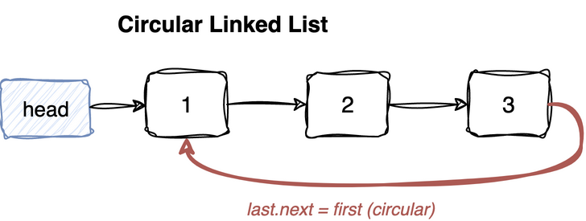

---
jupyter:
  jupytext:
    cell_metadata_filter: -all
    text_representation:
      extension: .md
      format_name: markdown
      format_version: '1.3'
      jupytext_version: 1.19.5
  kernelspec:
    display_name: Python 3 (ipykernel)
    language: python
    name: python3
---

# Circular Linked List

Take a [singly linked list](singly-linked-list.md) and delete the `None` at the
end: the last node points back at the first instead. That single change is the
whole topic. Every difference below follows from it.

The list now has no end to fall off, so every node can reach every other node.
That is what makes it fit round-robin scheduling and ring buffers, where "next"
should never run out. It also means one pointer reaches both ends at once: stand
on the last node and the first node is one hop away. That is why the O(1)
inserts below are possible, and why adding to the front and adding to the back
turn out to be the same operation.

Each insert appears twice: the obvious O(n) version that walks to the last node,
and an O(1) version that swaps values instead of walking.

> **Mental model.** A ring with a label on it. `head.next` is the label, and all it
> says is which node counts as first - which also fixes the last node, since the
> last node is whichever one points at the first. Nothing in the pointers marks
> either end, so moving the label is enough to turn an insert at the front into an
> insert at the back.
>
> **Load-bearing:** the stopping rule of every loop. `while curr` never becomes
> false here, because `next` is never `None`. A walk has to stop when it arrives
> back where it started, so the *first* node is the boundary instead of a `None` at
> the end. The empty list is the case that needs care, because there is no node to
> come back to - that is what every `if not first` guard is for.


We'll use a dummy head for all functions. It sits *outside* the ring: the last
node points back at the first real node, never at the dummy. So `head` is not
part of the structure, it only holds the label.





## Node and traversal helper

The node is unchanged - one value, one `next`. Nothing inside a node says the
list is circular. Only the shape of the links does.

That is enough to break the loop every singly linked walk uses. `while curr:`
waits for a `None` that never comes, so it spins forever. A walk needs some other
way to know it is finished, and the only landmark a ring offers is the node the
walk started from. Stop when you get back to it: `while curr is not first`.

Making the first node the boundary has a side effect. Start the loop on `first`
and the test is false immediately, so the walk ends before reading anything. The
first value therefore has to be collected before the loop, and the loop starts
one node later.

An empty list has no starting node, so there is nothing to come back to and the
wrap-around test has nothing to compare against. Hence the early return.

**Recipe**

1. `first = head.next`. Empty list, return early.
2. Append `first.val`, then start `curr` at `first.next`.
3. Loop while **`curr is not first`**, appending as you go.

```python
class ListNode:
    def __init__(self, val=0):
        self.val = val
        self.next = None

def to_list(head):
    ls = []
    first = head.next
    if not first: # empty list
        return ls
    ls.append(first.val)
    curr = first.next
    while curr is not first: # continue till list wraps around
        ls.append(curr.val)
        curr = curr.next
    return ls
```

## Insert at beginning, the direct way

Reaching the first node is free - it is `head.next` - but inserting in front of it
edits the node *before* it, its **predecessor**, and in a ring that is the last node.
The links run one way, so reaching it costs a full traversal. The splice is O(1); the
search for the predecessor is the O(n).

`head.next = new` is what makes the node first. The pointers never marked a front, so
the label is the only place that fact lives.

**Time:** O(n) for the traversal, O(1) for the splice &nbsp; **Space:** O(1)

**Recipe**

1. `first = head.next`. Empty list: `new.next = new`, a one-node ring pointing at
   itself, and `head.next = new`.
2. Otherwise walk from `first.next` while `curr.next is not first`, stopping on
   the **last** node.
3. `new.next = curr.next` (which is `first`), then `curr.next = new` - **the same
   order trap as `insert_at` in the [singly linked
   list](singly-linked-list.md)**, since the new node has to point into the ring
   before the last node's pointer is overwritten.
4. `head.next = new`, since the new node is now the first.

```python
def insert_begin_linear(head, val):
    new = ListNode(val)
    first = head.next # keep reference to first node for wraparound check
    if not first: # empty list, new node becomes the head
        new.next = new # make circular
    else:
        curr = first.next
        while curr.next is not first: # find the last node
            curr = curr.next
        # insert new node
        new.next = curr.next # link new node to the last node
        curr.next = new
    head.next = new # update head to new node


def test_insert_begin_linear():
    head = ListNode(-1)
    insert_begin_linear(head, 1)
    assert to_list(head) == [1]
    insert_begin_linear(head, 2)
    assert to_list(head) == [2, 1]
    insert_begin_linear(head, 3)
    assert to_list(head) == [3, 2, 1]

test_insert_begin_linear()
```

## Insert at beginning in O(1)

The walk exists only to make the new *node* first. But the list's contract is over the
sequence of *values*; which node holds which is an implementation detail. So leave the
nodes where they are and move the values instead.

```
D is the dummy, [n] a node holding value n, ... the rest of the ring

insert 9 into      D → [1] → [2] → ...
link after first   D → [1] → [9] → [2] → ...
swap the values    D → [9] → [1] → [2] → ...
```

What this spends is node identity: a caller holding a reference to the old first node
now reads a different value. Fine for a list of values, wrong when the node itself is
what is tracked - the LRU cache in the [doubly linked
list](doubly-linked-list.md) notebook, for instance.

**Time:** O(1) &nbsp; **Space:** O(1)

**Recipe**

1. Empty list, same as before: self-loop and point the dummy at it.
2. Otherwise splice `new` in as the **second** node: `new.next = first.next`,
   `first.next = new`. Both links are one hop away, so this is O(1).
3. Swap the two values: `new.val, first.val = first.val, new.val`.
4. **`head.next` is deliberately not touched.** The first *node* never changed,
   only what it contains.

```python
def insert_begin_constant(head, val):
    # neat trick, insert new node at second place and swap data with first node
    new = ListNode(val)
    first = head.next # keep reference to first node for wraparound check
    if not first: #empty list
        new.next = new # make circular
        head.next = new # update head to new node
    else:
        # add new node after first node
        new.next = first.next
        first.next = new
        new.val, first.val = first.val, new.val # swap data
        # no need to update head as first node is still the first node


def test_insert_begin_constant():
    head = ListNode(-1)
    insert_begin_constant(head, 1)
    assert to_list(head) == [1]
    insert_begin_constant(head, 2)
    assert to_list(head) == [2, 1]
    insert_begin_constant(head, 3)
    assert to_list(head) == [3, 2, 1]

test_insert_begin_constant()
```

## Insert at end, the direct way

The same walk as the linear insert-at-beginning, with one difference: `head` is left
alone. The new node is spliced in after the last node, so it becomes the new last
node rather than the new first.

Insert-at-beginning and insert-at-end differ *only* in whether `head` moves - in a
ring there is no other distinction between the two ends.

**Time:** O(n) &nbsp; **Space:** O(1)

**Recipe**

1. Identical to `insert_begin_linear` except for the last line.
2. Empty list, self-loop, point the dummy at it.
3. Walk to the last node, splice `new` in after it.
4. **Do not touch `head.next`** - that omission is the only thing making this an
   append rather than a prepend.

```python
def insert_end_linear(head, val):
    new = ListNode(val)
    first = head.next # keep reference to first node for wraparound check
    if not first: # empty list
        new.next = new # make circular
        head.next = new # update head to new node
    else:
        curr = first.next
        while curr.next is not first: # find the last node
            curr = curr.next
        # insert new node after the last
        new.next = curr.next # link new node to the last node
        curr.next = new


def test_insert_end_linear():
    head = ListNode(-1)
    insert_end_linear(head, 1)
    assert to_list(head) == [1]
    insert_end_linear(head, 2)
    assert to_list(head) == [1, 2]
    insert_end_linear(head, 3)
    assert to_list(head) == [1, 2, 3]

test_insert_end_linear()
```

## Insert at end in O(1)

The O(1) insert at the beginning leaves the label where it is, so the new value reads
first. Move the label forward one node and the same ring reads it last - in a ring,
*last* only means immediately before wherever reading starts.

```
[n] is a node holding value n; the ring is the same in both rows below,
only the label moves

the ring, after link and swap    [9] → [1] → [2] → [3] → back to [9]

head.next names [9]              reads 9, 1, 2, 3    9 is first
head.next names [1]              reads 1, 2, 3, 9    9 is last
```

Not one pointer between nodes differs between those two rows; only `head`
changed. This is the card in its sharpest form - a ring has no ends of its
own, so which node is last is a decision rather than a fact, and both O(1)
variants are just that decision being made differently.

**Time:** O(1) &nbsp; **Space:** O(1)

**Recipe**

1. Character for character the same as `insert_begin_constant`, plus one line.
2. Splice `new` in second, swap the values.
3. `head.next = new`. After the swap `new` holds the *old* first value and sits
   second, so **naming it the first node rotates the ring** and the new value
   lands at the end.

```python
def insert_end_constant(head, val):
    # neat trick, insert new node at second place, swap data with head and new node becomes head
    new = ListNode(val)
    first = head.next # keep reference to first node for wraparound check
    if not first: # empty list
        new.next = new # make circular
        head.next = new # update head to new node
    else:
        # add new node after first node
        new.next = first.next
        first.next = new
        new.val, first.val = first.val, new.val # swap data
        head.next = new # update head to new node


def test_insert_end_constant():
    head = ListNode(-1)
    insert_end_constant(head, 1)
    assert to_list(head) == [1]
    insert_end_constant(head, 2)
    assert to_list(head) == [1, 2]
    insert_end_constant(head, 3)
    assert to_list(head) == [1, 2, 3]

test_insert_end_constant()
```
