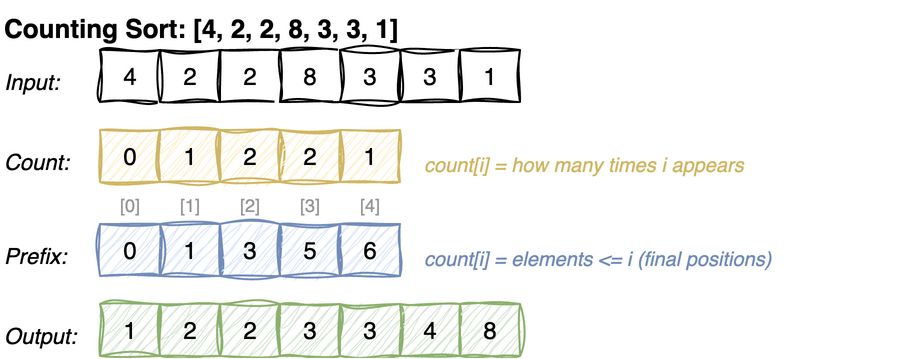

---
jupyter:
  jupytext:
    cell_metadata_filter: -all
    text_representation:
      extension: .md
      format_name: markdown
      format_version: '1.3'
      jupytext_version: 1.19.5
  kernelspec:
    display_name: Python 3 (ipykernel)
    language: python
    name: python3
---

# Non-Comparison Sorts

Comparison-based sorts (merge, quick, heap) have a lower bound of **O(n log n)**.

Non-comparison sorts break this barrier by exploiting properties of the data (e.g., integer range).

| Algorithm | Time | Space | Stable | Constraint |
|-----------|------|-------|--------|------------|
| Counting Sort | O(n + k) | O(n + k) | Yes | k = range of values |
| Radix Sort | O(d × (n + b)) | O(n + b) | Yes | d = digits, b = base |

> **Mental model.** Neither of these sorts ever compares two elements. They use the value
> itself as an index - the value 3 goes to slot 3 of a counting array - so the order falls out
> of arithmetic instead of out of comparisons. That is how they get under the O(n log n) floor.
> The floor was never a law about sorting; it only ever applied to algorithms that decide
> everything by asking "is a bigger than b?".
>
> **Load-bearing:** the values have to be integers in a known and small range. The cost
> carries a k term, the size of that range, because a slot is reserved and walked for every
> possible value whether or not anything lands in it. Sort three numbers near a million and
> counting sort allocates a million slots, which is far worse than just comparing the three.
> Radix sort is the repair for exactly that: chop each number into digits so the range one
> pass has to cover is always 10.


# Counting Sort

A comparison answers one yes-or-no question, which is why comparison sorts cannot get below
O(n log n). Counting sort asks none. It counts how many times each value appears, then adds
each count to the one before it. Those running totals are the useful part: once `count[x]`
says "how many elements are <= x", it is also saying where the last x belongs in the output.
Adding up counts like this is called a *prefix sum*.

**Time:** O(n + k) where k = max value &nbsp; **Space:** O(n + k) &nbsp; **Stable:** yes



## Why is it Stable?

Because the input is walked **backwards**. After the prefix sums, `count[x] - 1` is the
*last* position available to value x, so the last occurrence in the input is placed
rightmost, the second-to-last just before it, and so on - relative order survives.

```
arr = [4, 2, 2, 8, 3, 3, 1]

after the prefix sums, count[3] = 5, which reads as "5 elements are <= 3",
so the last 3 belongs at index 4 - one before 5

walking backwards:
  see 3    count[3]: 5 -> 4    output[4] = 3    the *later* 3 takes the higher slot
  see 3    count[3]: 4 -> 3    output[3] = 3    the earlier 3 lands just before it
```

Iterating forwards instead would reverse equal elements - and radix sort, which leans on
this subroutine being stable, would silently produce wrong answers.

```python
def counting_sort(arr):
    """
    Stable counting sort for non-negative integers.
    Time: O(n + k), Space: O(n + k) where k = max(arr)
    """
    if not arr:
        return arr
    k = max(arr)
    count = [0] * (k + 1)
    for x in arr:
        count[x] += 1

    # prefix sum - count[i] = number of elements <= i
    for i in range(1, k + 1):
        count[i] += count[i - 1]

    # build output in reverse for stability
    output = [0] * len(arr)
    for x in reversed(arr):
        count[x] -= 1
        output[count[x]] = x
    return output

def test_counting_sort():
    assert counting_sort([4, 2, 2, 8, 3, 3, 1]) == [1, 2, 2, 3, 3, 4, 8]
    assert counting_sort([1, 1, 1]) == [1, 1, 1]
    assert counting_sort([]) == []
    assert counting_sort([5]) == [5]

test_counting_sort()
```

# Radix Sort

Counting sort needs a small value range, which fails for something like `[170, 45, 802]` -
k would be 802. Radix sort fixes that by sorting one **digit** at a time: each pass only
ever deals with 10 possible values, no matter how large the numbers are.

**Why least significant digit first?** Because each pass is stable, the order established
by earlier (less significant) passes survives whenever the current digits tie. That is
what makes the digit passes compose into a full sort - and it is why the subroutine
*must* be a stable sort.

```
[170, 45, 75, 90, 802, 24, 2, 66]

by 1s     [170, 90, 802, 2, 24, 45, 75, 66]
by 10s    [802, 2, 24, 45, 66, 170, 75, 90]
by 100s   [2, 24, 45, 66, 75, 90, 170, 802]
```

Watch 45 and 75. The 10s pass puts 45 first, because 4 comes before 7. On the 100s pass both
have digit 0, so they tie, and a stable sort leaves a tie exactly as it found it - the order
the 10s pass established is still there at the end.

`_counting_sort_by_digit` is the counting sort above with `(x // exp) % 10` extracting the
digit, and a fixed count array of size 10.

**Time:** O(d × (n + 10)) for d digits &nbsp; **Space:** O(n) &nbsp; **Stable:** yes

```python
def _counting_sort_by_digit(arr, exp):
    """Stable counting sort on a specific digit position (exp = 1, 10, 100, ...)."""
    n = len(arr)
    output = [0] * n
    count = [0] * 10  # base 10 digits

    for x in arr:
        digit = (x // exp) % 10
        count[digit] += 1

    for i in range(1, 10):
        count[i] += count[i - 1]

    for x in reversed(arr):
        digit = (x // exp) % 10
        count[digit] -= 1
        output[count[digit]] = x

    arr[:] = output

def radix_sort(arr):
    """
    LSD radix sort for non-negative integers.
    Time: O(d × (n + 10)), Space: O(n)
    """
    if not arr:
        return arr
    max_val = max(arr)
    exp = 1
    while max_val // exp > 0:
        _counting_sort_by_digit(arr, exp)
        exp *= 10
    return arr

def test_radix_sort():
    assert radix_sort([170, 45, 75, 90, 802, 24, 2, 66]) == [2, 24, 45, 66, 75, 90, 170, 802]
    assert radix_sort([3, 1, 4, 1, 5, 9]) == [1, 1, 3, 4, 5, 9]
    assert radix_sort([]) == []

test_radix_sort()
```
