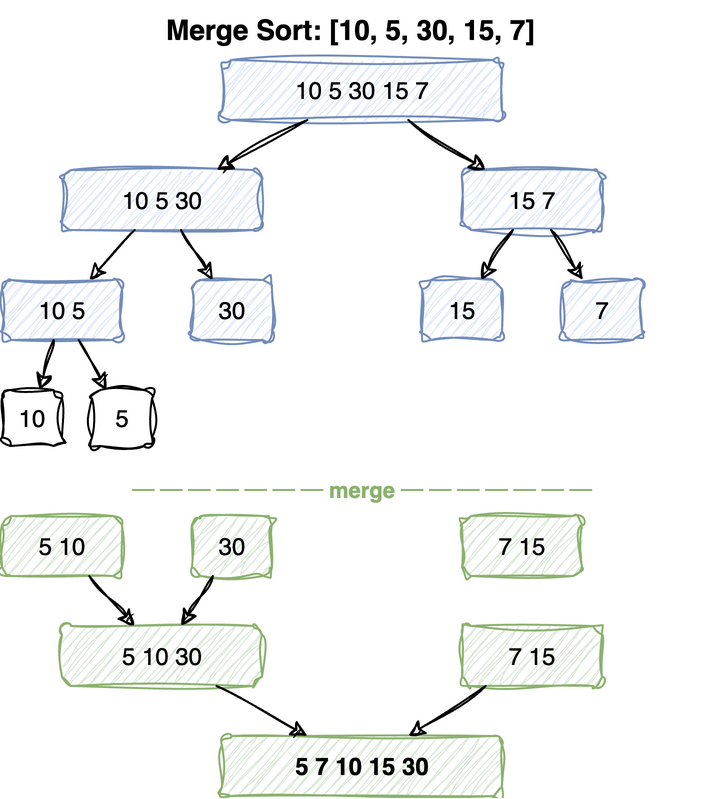

---
jupyter:
  jupytext:
    cell_metadata_filter: -all
    text_representation:
      extension: .md
      format_name: markdown
      format_version: '1.3'
      jupytext_version: 1.19.5
  kernelspec:
    display_name: Python 3 (ipykernel)
    language: python
    name: python3
---

# Merge Sort

Merge sort cuts the array in half, sorts each half, and merges the two sorted halves back
together. Cutting costs one division to find the middle. All of the real work is in the
merge.

## Algorithm Properties

- **Time Complexity:** O(n log n) in all cases
- **Space Complexity:** O(n) auxiliary space
- **Stable:** Yes (maintains relative order of equal elements)
- **In-place:** No (requires additional space)

> **Mental model.** Splitting is free and the merge is the whole algorithm. Two sorted runs
> can be combined in a single pass, because the smallest element left has to be at the front
> of one of them. The recursion exists only to guarantee you are never asked to do anything
> harder than that: keep halving until a run holds one element, which is sorted by
> definition, and from then on every merge is handed two runs that are already sorted.
>
> **Load-bearing:** the merge needs somewhere to write. It cannot write into the same slots
> it is still reading from, so it copies the two runs out first. That copy is the O(n) extra
> space, and the reason merge sort is not in place. The second piece is the tie rule: when
> two elements are equal, taking the one from the left run is the only thing keeping the sort
> stable. Change `<=` to `<` and equal elements come out in the wrong order.

## Time Complexity Analysis

Every level of the recursion merges each element exactly once, so a level costs Θ(n) however
deep it sits. Halving n reaches 1 after log₂n steps, so there are that many levels.

**Recurrence:** T(n) = 2T(n/2) + Θ(n), T(1) = Θ(1)

**Recursion tree solution:**
- Level 0: n work
- Level 1: 2 × n/2 = n work
- Level k: 2^k × n/2^k = n work
- Height: n/2^k = 1 → k = log₂n
- **Total: n × log₂n = Θ(n log n)**





# Merge Two Sorted Lists

The primitive the whole algorithm is built on. Because both inputs are sorted, the next
smallest element overall can only be at the front of one of them - so compare the two
heads, take the smaller, advance that pointer.

One of the two lists always runs out first, so the two `extend` calls at the end flush
whatever remains. Skipping them silently drops elements - a common bug.

`merge_naive` in the cell below shows what this buys: concatenating and re-sorting throws
away the sortedness and pays O((m+n) log(m+n)) for information it already had.

**Time:** Θ(m + n) &nbsp; **Space:** Θ(m + n) for the result

**Recipe**

1. One output list and one cursor per input, `i` and `j`.
2. While both cursors are in range, append the smaller head and advance only
   that cursor.
3. **The test is `a[i] <= b[j]`, not `<`.** On a tie it takes from the left,
   which is what keeps the merge stable. Merge sort inherits its stability
   entirely from this one character.
4. Extend with the remainder of both lists. At most one of the two does
   anything, and writing only the one you expect to fire is the bug the prose
   above warns about.

```python
def merge_naive(a, b):
    """
    Naive approach: concatenate and sort
    Time complexity: O((m+n) * log(m+n))
    Doesn't use the fact that both lists are sorted
    """
    res = a + b
    res.sort()
    return res

def merge_lists(a, b):
    """
    Efficient approach using two pointers
    Time Complexity: Θ(m+n)
    """
    res = []
    m, n = len(a), len(b)
    i = j = 0
    while i < m and j < n:
        if a[i] <= b[j]:  # <= not <, so equal elements keep their order
            res.append(a[i])
            i += 1
        else:
            res.append(b[j])
            j += 1
    res.extend(a[i:])
    res.extend(b[j:])
    return res

def test_merge_lists():
    result = merge_lists([10, 15, 20], [5, 6, 6, 30])
    assert result == [5, 6, 6, 10, 15, 20, 30]
    
    # Test empty lists
    assert merge_lists([], [1, 2, 3]) == [1, 2, 3]
    assert merge_lists([1, 2, 3], []) == [1, 2, 3]

test_merge_lists()
```

# Merge Subarrays

The same merge, adapted to work on *one* array. Instead of two lists there are two sorted
ranges sitting side by side - `a[low..mid]` and `a[mid+1..high]` - and the result has to
land back in `a[low..high]`.

The complication: writing into `a` would overwrite elements not yet read. So the two
halves are **copied out** first, then merged back in over the original range with the
write cursor `k`.

`left[i] <= right[j]` (rather than `<`) is what keeps the merge stable: on a tie the
element from the left half goes first, preserving the original order.

Only the *left* run strictly needs copying. The right run is consumed from `mid + 1` onwards,
and the write position never overtakes it: each step advances the write by one and the right
index by at most one, starting a full left-run's length behind. So the right half is always
read before it could be overwritten. Copying both runs is the version worth remembering
because it is obviously correct; copying only the left halves the extra space, and real
implementations often do exactly that.

**Time:** Θ(high - low) &nbsp; **Space:** Θ(high - low)

**Recipe**

The same merge, but writing back into the array it is reading from.

1. Copy both halves out first: `left = a[low:mid + 1]`, `right = a[mid + 1:high
   + 1]`. **This copy is not laziness. The output overwrites `a[low...]` while
   the right half is still unread, so merging in place would destroy its own
   input. That copy is where merge sort's O(n) space goes.**
2. Watch the slice bounds: `mid + 1` and `high + 1`, because Python slices
   exclude the end and both `mid` and `high` are meant to be included.
3. Three cursors: `i` into `left`, `j` into `right`, and `k` into `a` starting at
   **`low`, not `0`** since this call owns only a window of the array.
4. Main loop while both copies have elements, `left[i] <= right[j]` again for
   stability.
5. Drain whichever copy still has elements. Both drains must be written, and at
   most one will run.

```python
def merge(a, low, mid, high):
    """
    Merge two sorted subarrays of `a` back into `a[low...high]`,
    working from copies because it cannot write where it is still reading.
    Left subarray: a[low...mid]
    Right subarray: a[mid+1...high]
    """
    left = a[low:mid + 1]
    right = a[mid + 1:high + 1]
    
    i = j = 0
    k = low
    
    while i < len(left) and j < len(right):
        if left[i] <= right[j]:  # <= ensures stable merge
            a[k] = left[i]
            i += 1
        else:
            a[k] = right[j]
            j += 1
        k += 1
    
    # Copy remaining elements
    while i < len(left):
        a[k] = left[i]
        i += 1
        k += 1
    
    while j < len(right):
        a[k] = right[j]
        j += 1
        k += 1

def test_merge():
    a = [10, 15, 20, 11, 13]
    merge(a, 0, 2, 4)
    assert a == [10, 11, 13, 15, 20]
    
    a = [5, 8, 12, 14, 7]
    merge(a, 0, 3, 4)
    assert a == [5, 7, 8, 12, 14]

test_merge()
```

# Merge Sort Algorithm

Divide and conquer in its purest form: a one-element array is already sorted, so split until
you reach that base case, then merge on the way back up. The diagram at the top of the
notebook traces both halves of that process.

Note where the work actually happens - the split is trivial arithmetic
(`m = (l + r) // 2`), and everything is accomplished by the merges during the unwind. The
`if r > l` guard is the base case: a range of one element or none needs no work.

Each level of recursion merges Θ(n) elements in total and there are log n levels. Unlike
quick sort, no input can unbalance the split, so that O(n log n) holds in *every* case.

**Time:** Θ(n log n) always &nbsp; **Space:** O(n) auxiliary + O(log n) stack

**Recipe**

1. Base case is implicit: do nothing unless `r > l`. A range of one element, or
   an empty one, is already sorted.
2. `m = (r + l) // 2`.
3. Recurse on `(l, m)` and `(m + 1, r)`. **The halves must not overlap and must
   not leave a gap, so `m` belongs to the left and `m + 1` starts the right.**
4. Call `merge(a, l, m, r)` after both return. Sorting happens on the way back
   up, which is the mirror of quicksort.

```python
def merge_sort(a, l, r):
    """
    Recursive merge sort
    a: array to sort
    l: left index
    r: right index
    """
    if r > l:  # At least 2 elements needed
        m = (r + l) // 2
        merge_sort(a, l, m)      # Sort left half
        merge_sort(a, m + 1, r)  # Sort right half
        merge(a, l, m, r)        # Merge sorted halves

def test_merge_sort():
    a = [10, 5, 30, 15, 7]
    merge_sort(a, 0, len(a) - 1)
    assert a == [5, 7, 10, 15, 30]
    
    # Test edge cases
    a = [1]
    merge_sort(a, 0, 0)
    assert a == [1]
    
    a = [3, 1, 4, 1, 5, 9, 2, 6]
    merge_sort(a, 0, len(a) - 1)
    assert a == [1, 1, 2, 3, 4, 5, 6, 9]

test_merge_sort()
```
