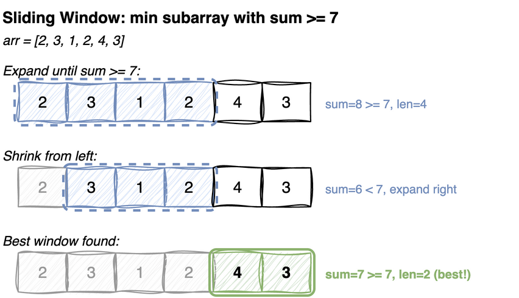

---
jupyter:
  jupytext:
    cell_metadata_filter: -all
    text_representation:
      extension: .md
      format_name: markdown
      format_version: '1.3'
      jupytext_version: 1.19.5
  kernelspec:
    display_name: Python 3 (ipykernel)
    language: python
    name: python3
---

# Two Pointers & Sliding Window

Techniques for solving array/string problems in O(n) by avoiding nested loops.

## Two Pointers

Use two indices that move towards each other or in the same direction.

**Common patterns:**
- Opposite ends: start from both ends, move inward (pair sum, palindrome)
- Same direction: slow/fast pointers (remove duplicates, linked list cycle)

## Sliding Window

Maintain a window (subarray/substring) that expands or shrinks.

**Common patterns:**
- Fixed-size window: max sum of k consecutive elements
- Variable-size window: smallest subarray with sum ≥ target

> **Mental model.** Both patterns are the same trick: never move a pointer backwards. Two
> indices sweep the array, each one only ever going forward, so the total work is linear even
> though the two ends move independently of each other. That is what replaces the nested loop.
> A step does not just test one candidate, it retires a whole family of candidates for good.
>
> **Load-bearing:** the condition you test has to move in one direction only. Growing the
> window can push it one way but never back, so once you shrink you never have to reconsider.
> The word for that is *monotonic*. Positive values make a sum monotonic in the window size;
> allow one negative value and shrinking could raise the sum, and the argument collapses.




# Two Sum (Sorted Array)

Checking every pair is O(n²). Sortedness lets each comparison eliminate a whole *family* of
pairs instead of one.

Start at the widest pair. If the sum is too small, `arr[lo]` cannot work with anything: `hi`
is already its largest possible partner, so every pair using `lo` is too small - discard it
by moving `lo` right. Too large is the mirror argument for `hi`. Each step retires one index,
so the scan ends after at most n steps.

```
[2, 7, 11, 15]  target 9

lo=0 hi=3   2 + 15 = 17 > 9  → 15 is too big for anything → hi=2
lo=0 hi=2   2 + 11 = 13 > 9  → hi=1
lo=0 hi=1   2 +  7 =  9      → found (0, 1)
```

Sortedness is the whole prerequisite. On unsorted input, use a hash set instead - also
O(n), but O(n) space rather than O(1).

**Time:** O(n) &nbsp; **Space:** O(1)

**Recipe**

1. `lo, hi = 0, len(arr) - 1`, at the two ends.
2. Loop while `lo < hi`, **strictly**, since an element may not pair with itself.
3. Sum too small: `lo += 1`. Too large: `hi -= 1`.
4. **Why discarding is safe, which is the only hard part.** If the sum is too
   small, `arr[lo]` paired with the largest remaining value is still too small,
   so `arr[lo]` cannot pair with *anything* left and every pair using it can be
   discarded. That argument needs the array sorted; on unsorted input this is
   wrong, not just slow.
5. The pointers met without a match, so return `(-1, -1)`.

```python
def two_sum_sorted(arr, target):
    """Returns indices (0-based) of two elements that sum to target, or (-1, -1)."""
    lo, hi = 0, len(arr) - 1
    while lo < hi:
        s = arr[lo] + arr[hi]
        if s == target:
            return (lo, hi)
        elif s < target:
            lo += 1
        else:
            hi -= 1
    return (-1, -1)

def test_two_sum():
    assert two_sum_sorted([2, 7, 11, 15], 9) == (0, 1)
    assert two_sum_sorted([1, 2, 3, 4, 5], 8) == (2, 4)
    assert two_sum_sorted([1, 2, 3], 10) == (-1, -1)

test_two_sum()
```

# Remove Duplicates In-Place

Two pointers moving in the *same* direction with different jobs: `fast` reads every element,
`slow` marks the last position written. Because the input is sorted, duplicates are adjacent,
so an element is new exactly when it differs from `arr[slow]`.

```
[1, 1, 2, 2, 3, 4, 4]      before
[1, 2, 3, 4, 3, 4, 4]      after, return 4
 ^^^^^^^^^^  ^^^^^^^
 the answer  stale, ignored
```

Nothing is ever moved out of the way. Each new value is written over a slot the scan has
already read, so `slow` can never overtake `fast`. Everything past the returned length is
leftover junk and the caller is expected to ignore it. That is the standard in-place-array
convention (it is how the C++ `std::unique` idiom works too), since a list cannot be
shortened without moving memory.

**Time:** O(n) &nbsp; **Space:** O(1)

**Recipe**

1. Empty input, return `0`.
2. `slow = 0`. Read it as **"the index of the last value already kept"**, which
   is what makes the rest fall out.
3. `fast` runs from `1` to the end, reading every element once.
4. `arr[fast] != arr[slow]`: a new value. Advance `slow` first, then write
   `arr[slow] = arr[fast]`.
5. **Advance before writing.** `slow` points at a value being kept, so writing at
   `slow` would overwrite it.
6. Return `slow + 1`, converting a last-used index into a count.
7. Works only on sorted input, where duplicates are adjacent.

```python
def remove_duplicates(arr):
    """Returns new length. arr[:length] contains unique elements."""
    if not arr:
        return 0
    slow = 0
    for fast in range(1, len(arr)):
        if arr[fast] != arr[slow]:
            slow += 1
            arr[slow] = arr[fast]
    return slow + 1

def test_remove_dups():
    arr = [1, 1, 2, 2, 3, 4, 4]
    length = remove_duplicates(arr)
    assert length == 4
    assert arr[:length] == [1, 2, 3, 4]

    arr = [1]
    assert remove_duplicates(arr) == 1

test_remove_dups()
```

# Container With Most Water

**Problem:** each number is the height of a vertical line standing on the x-axis. Pick two
lines; together with the axis they hold water. The amount is limited by the *shorter* of the
two, so it is `min(left, right) × distance between them`. Find the maximum.

`[1, 8, 6, 2, 5, 4, 8, 3, 7]` → `49` (the 8 at index 1 and the 7 at index 8: `min(8,7) × 7`)

Area is `min(left, right) × width`, and starting at the two ends maximizes the width. Every
move inward *loses* width, so a move is only worth making if it can raise the `min`.

That settles which pointer to move: the shorter line caps the height, so moving the taller
one leaves `min` unchanged (or lower) while the width shrinks - strictly worse. Moving the
shorter line is the only choice that can improve anything, which is why one pass suffices
instead of comparing all pairs.

Note what is *not* claimed: the best pair is not found by walking towards it. The scan only
ever discards pairs it has proved cannot beat what it has seen, and the running maximum keeps
whatever survived.

**Time:** O(n) &nbsp; **Space:** O(1)

**Recipe**

1. Two pointers at the ends, `best = 0`.
2. Area is `min(heights[lo], heights[hi]) * (hi - lo)`. The shorter wall sets the
   depth; the gap sets the width.
3. **Always move the shorter side in.** That is the entire algorithm.
4. **Why discarding the shorter wall is safe:** any pair using it must have a
   width smaller than the current one, and a depth still capped by that same
   short wall. So every remaining pair involving it is strictly worse than the
   one just measured, and all of them can be discarded.
5. Moving the taller side instead would discard pairs that might beat the current
   best, which is why the comparison decides the move.

```python
def max_water(heights):
    lo, hi = 0, len(heights) - 1
    best = 0
    while lo < hi:
        area = min(heights[lo], heights[hi]) * (hi - lo)
        best = max(best, area)
        if heights[lo] < heights[hi]:
            lo += 1
        else:
            hi -= 1
    return best

def test_max_water():
    assert max_water([1, 8, 6, 2, 5, 4, 8, 3, 7]) == 49
    assert max_water([1, 1]) == 1

test_max_water()
```

# Fixed-Size Sliding Window: Max Sum of k Elements

Recomputing each window from scratch re-adds the k-1 elements the previous window already
counted - O(n × k) for information you already had.

Consecutive windows differ by exactly two elements, so maintain a running sum: add the
element entering on the right, subtract the one leaving on the left. Each element is added
once and subtracted once.

```
[1, 4, 2, 10, 2, 3, 1, 0, 20]   k = 4

window [1, 4, 2, 10]      sum 17
+2  -1     [4, 2, 10, 2]  sum 18
+3  -4     [2, 10, 2, 3]  sum 17
+1  -2     [10, 2, 3, 1]  sum 16
+0  -10    [2, 3, 1, 0]   sum 6
+20 -2     [3, 1, 0, 20]  sum 24   ← best
```

**Time:** O(n) &nbsp; **Space:** O(1)

**Recipe**

1. Guard `n < k`, return `-1`.
2. Compute the first window directly with `sum(arr[:k])`. **This is the only full
   sum in the whole function.**
3. For each `i` from `k` to `n - 1`, slide: `window_sum += arr[i] - arr[i - k]`.
4. **Add the entering element and subtract the leaving one in one step.** Every
   window shares all but two elements with the previous one, so recomputing the
   sum redoes k-1 additions you already have. That is the difference between O(n)
   and O(n*k).
5. `arr[i - k]` is the element falling out of the back. An off-by-one here
   returns plausible wrong numbers rather than crashing.

```python
def max_sum_k(arr, k):
    """Maximum sum of k consecutive elements."""
    n = len(arr)
    if n < k:
        return -1
    window_sum = sum(arr[:k])
    best = window_sum
    for i in range(k, n):
        window_sum += arr[i] - arr[i - k]  # slide: add new, remove old
        best = max(best, window_sum)
    return best


def test_max_sum_k():
    # windows of 4: 17, 18, 17, 16, 6, 24 - best is [3, 1, 0, 20]
    assert max_sum_k([1, 4, 2, 10, 2, 3, 1, 0, 20], 4) == 24
    assert max_sum_k([100, 200, 300, 400], 2) == 700
    # k larger than the array
    assert max_sum_k([1, 2], 5) == -1
    # k equal to the whole array
    assert max_sum_k([1, 2, 3], 3) == 6


test_max_sum_k()
```

# Variable-Size Sliding Window: Smallest Subarray with Sum ≥ Target

The window no longer has a fixed size, so it breathes: `right` expands it until the sum
qualifies, then `left` contracts it as far as it can while still qualifying. Every time the
window is valid, its length is a candidate answer. The diagram at the top of the notebook
traces this on `[2, 3, 1, 2, 4, 3]` with target 7.

The nested `while` is not a second pass: `left` only ever moves forward, so across the whole
run each element is added once and removed once - O(n) total, the same amortized argument as
the monotonic stack.

It works because all values are positive, which is what makes the sum monotonic in the
window size. With negatives, shrinking might *raise* the sum and the argument breaks -
prefix sums are the tool there.

**Time:** O(n) &nbsp; **Space:** O(1)

**Recipe**

1. `best = math.inf`, `window_sum = 0`, `left = 0`.
2. `right` sweeps forward, adding `arr[right]` each step. This only ever grows
   the window.
3. Then a **`while`**, not an `if`: while the window is still valid
   (`window_sum >= target`), record `right - left + 1` and shrink from the left.
4. **Record before shrinking.** The window is valid now; after `left` moves it
   may not be.
5. **The `while` is load-bearing.** One large element can leave several
   successive shrinks all still valid, and an `if` would stop after the first,
   returning a window longer than the smallest.
6. `best` untouched means nothing qualified, so return `0`.

```python
import math

def min_subarray_sum(arr, target):
    """Returns length of smallest subarray with sum >= target, or 0 if none."""
    n = len(arr)
    best = math.inf
    window_sum = 0
    left = 0
    for right in range(n):
        window_sum += arr[right]
        while window_sum >= target:
            best = min(best, right - left + 1)
            window_sum -= arr[left]
            left += 1
    return best if best != math.inf else 0

def test_min_subarray():
    assert min_subarray_sum([2, 3, 1, 2, 4, 3], 7) == 2  # [4, 3]
    assert min_subarray_sum([1, 1, 1, 1], 10) == 0       # impossible
    assert min_subarray_sum([1, 4, 4], 4) == 1            # [4]

test_min_subarray()
```

# Longest Substring Without Repeating Characters

Same breathing window, with "valid" redefined: the window must hold no duplicates. A `set`
tracks its contents so the check is O(1).

When the incoming character is already inside, shrinking by one is not necessarily enough -
`left` has to advance until the *offending* copy is gone, which is what the `while` does.

```
'pwwkew'

right=0 'p'   window 'p'      best 1
right=1 'w'   window 'pw'     best 2
right=2 'w'   duplicate → drop 'p' (left=1), drop 'w' (left=2)
              window 'w'      best 2
right=3 'k'   window 'wk'     best 2
right=4 'e'   window 'wke'    best 3   ← best
right=5 'w'   duplicate → drop 'w' (left=3)
              window 'kew'    best 3
```

**Time:** O(n) - `left` and `right` each traverse the string once &nbsp;
**Space:** O(min(n, alphabet size))

**Recipe**

1. A `set` of the characters currently inside the window, `left = 0`, `best = 0`.
2. `right` sweeps forward. Before adding `s[right]`, **while it is already in the
   set**, drop `s[left]` and advance `left`.
3. **Shrink first, then add.** Adding the duplicate before shrinking makes the
   loop condition true forever, since the set would already hold the character
   being searched for.
4. The shrink stops exactly when the old copy is gone, because the only way
   `s[right]` leaves the set is `left` passing it.
5. Add `s[right]`, then `best = max(best, right - left + 1)`.
6. Same skeleton as `min_subarray_sum` with the validity test inverted: there the
   window shrinks while it *is* valid, to find a minimum; here it shrinks while
   it is *not* valid, to find a maximum.

```python
def longest_unique_substr(s):
    """Returns length of longest substring without repeating characters."""
    seen = set()
    best = 0
    left = 0
    for right in range(len(s)):
        while s[right] in seen:
            seen.remove(s[left])
            left += 1
        seen.add(s[right])
        best = max(best, right - left + 1)
    return best

def test_longest_unique():
    assert longest_unique_substr('abcabcbb') == 3  # 'abc'
    assert longest_unique_substr('bbbbb') == 1     # 'b'
    assert longest_unique_substr('pwwkew') == 3    # 'wke'
    assert longest_unique_substr('') == 0

test_longest_unique()
```
