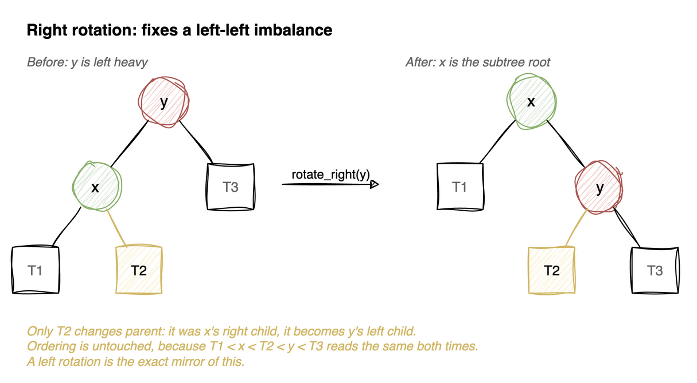
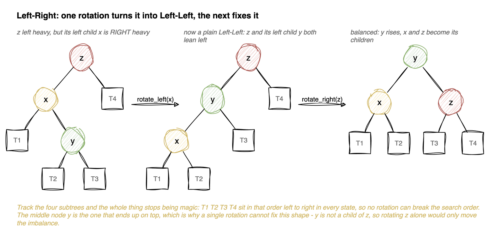

---
jupyter:
  jupytext:
    cell_metadata_filter: -all
    text_representation:
      extension: .md
      format_name: markdown
      format_version: '1.3'
      jupytext_version: 1.19.5
  kernelspec:
    display_name: Python 3 (ipykernel)
    language: python
    name: python3
---

# AVL Tree (Self-Balancing BST)

A plain [binary search tree](../trees/binary-search-tree.md) gives `O(h)` operations, but `h` can degrade to `O(n)` when keys arrive in sorted order - the tree becomes a linked list. An **AVL tree** (Adelson-Velsky and Landis, 1962) is a BST that **rebalances itself after every insert and delete** so that `h` stays `O(log n)`.

## The balance invariant

For **every** node, the heights of its left and right subtrees differ by at most 1:

```
balance_factor(node) = height(left subtree) - height(right subtree)
```

A node is *balanced* when its balance factor is `-1`, `0`, or `+1`. If an insert or delete pushes any node's balance factor to `+2` or `-2`, we restore the invariant with **rotations**.

### Why "differ by at most 1" forces `O(log n)`

The rule is local - it talks about one node at a time - so it is not obvious that it says
anything about the height of the whole tree. Turn the question around: instead of asking how
tall a tree with `n` nodes can be, ask **how few nodes a tree of height `h` can have.** If even
the skinniest legal tree needs a lot of nodes, then a tree with `n` nodes cannot be tall.

Call that minimum `N(h)`. To make a tree of height `h` as sparse as possible, give the root the
shortest legal pair of subtrees: one of height `h-1` (something has to reach the full height)
and one of height `h-2` (the smallest the rule permits alongside it). Each of those is itself as
sparse as possible, so

```
N(h) = 1 + N(h-1) + N(h-2)          N(1) = 1, N(2) = 2
```

which is the Fibonacci recurrence wearing a different hat - in fact `N(h) = F(h+2) - 1`:

| h | 1 | 2 | 3 | 4 | 5 | 6 | 7 | 8 | 9 | 10 |
|---|---|---|---|---|---|---|---|---|---|----|
| N(h) | 1 | 2 | 4 | 7 | 12 | 20 | 33 | 54 | 88 | 143 |

The point is the *rate*: each row is roughly 1.6 times the one before it, because Fibonacci
numbers grow like $\varphi^h$ where $\varphi \approx 1.618$. So the minimum node count grows
exponentially in the height, and reading that backwards, the height can only grow
logarithmically in the node count:

$$h \leqslant \log_{\varphi}(n+1) \approx 1.44 \log_2 (n+1)$$

An AVL tree is therefore never worse than about 44% taller than a perfectly balanced one. That
is the whole promise: `O(h)` becomes `O(log n)` not by keeping the tree perfect, but by making
lopsidedness expensive in nodes.

**What the "1" is load-bearing for.** Allow a difference of 2 and the recurrence becomes
`N(h) = 1 + N(h-1) + N(h-3)`, which grows more slowly, so the same node count permits a taller
tree - still logarithmic, but with a worse constant. Allow *any* difference and there is no
recurrence left: `N(h) = h` is legal, a chain, and the height is `O(n)`. The bound comes from
the number being finite, and the constant comes from it being small.

| Operation | Time | Aux space |
|-----------|------|-----------|
| Search | `O(log n)` | `O(log n)` recursion / `O(1)` iterative |
| Insert | `O(log n)` | `O(log n)` |
| Delete | `O(log n)` | `O(log n)` |

Search is identical to a normal BST (the ordering invariant is unchanged), so this notebook focuses on **height tracking, rotations, and rebalancing**.

> **Mental model.** A BST's `O(h)` is only useful while `h` stays small, and nothing in a plain
> BST enforces that. AVL adds exactly one rule - no node's two sides may differ in height by
> more than 1 - and rotations are how that rule is restored after an insert or delete.
> Everything else behaves like an ordinary BST, because a rotation never changes the ordering.
>
> **Load-bearing:** heights are *cached* on the node, so any change of shape must recompute
> them from the bottom up. Skip that and every balance factor above the change is reading a
> stale number. And fixing the *lowest* unbalanced node is enough: that rotation gives the
> subtree back the height it had before, so nothing further up ever sees a difference.


### Height bookkeeping

Every node **stores** its height rather than computing it on demand. That is what keeps
rebalancing cheap: a balance factor is then two O(1) lookups instead of two subtree walks,
which would make every check O(n).

The cost of caching is that the cache must be maintained - `update_height` has to be called
after *any* structural change, and always bottom-up, since a parent's height is defined in
terms of its children's.

Conventions used here:

- `height(None) = 0`, a leaf has height 1 (counting nodes, matching the binary tree notebook)
- `balance_factor = height(left) - height(right)`, so **positive means left-heavy**
- `balance_factor(None) = 0` - a missing subtree is perfectly balanced, which keeps the
  callers free of null checks

**Time:** O(1) for all three helpers

**Recipe**

1. A `Node` is the BST node plus a stored **`height`**, starting at `1` for a new
   leaf.
2. `height(node)` is a free function that returns `0` for `None`. **Wrap it
   rather than reading `node.height` directly, because half the calls are on
   children that may not exist and the `None` case has to answer `0` rather than
   raise.**
3. `update_height(node)` is `1 + max(height(left), height(right))`, the same
   formula as the plain binary tree, read from the children's stored values
   instead of recomputing.
4. `balance_factor(node)` is `height(left) - height(right)`, and `0` for `None`.
5. **Left minus right, and keep that direction fixed everywhere.** A positive
   factor means left-heavy for the rest of the notebook; flipping it in one place
   makes the rotation cases pick the wrong fix.
6. **Height is stored, not computed on demand.** Recomputing would make every
   check O(n) and destroy the O(log n) the structure exists for.

```python
class Node:
    def __init__(self, data):
        self.data = data
        self.left = None
        self.right = None
        self.height = 1  # height of a new leaf is 1

def height(node):
    """Height of None is 0; height is stored on the node and kept up to date."""
    return node.height if node else 0

def update_height(node):
    """Recompute a node's height from its children. Call after any structural change."""
    node.height = 1 + max(height(node.left), height(node.right))

def balance_factor(node):
    """left height - right height. Positive => left heavy, negative => right heavy."""
    if node is None:
        return 0
    return height(node.left) - height(node.right)
```

# Rotations

A rotation is a local, `O(1)` rearrangement of a few pointers that changes the shape of the tree **without breaking the BST ordering**. There are two primitives - left and right - and they are mirror images of each other.

### Right rotation (fixes a left-heavy node)



`x` moves up, `y` becomes its right child, and `x`'s old right subtree `T2` is reattached as `y`'s left child. `T2` is the only subtree that changes parent, and that is the whole operation. Ordering is preserved: `T1 < x < T2 < y < T3` before and after.

### Left rotation (fixes a right-heavy node)

```
    x                  y
   / \                / \
  T1  y     --->     x   T3
     / \            / \
    T2  T3         T1  T2
```

The exact mirror. After either rotation we recompute the heights of the two nodes that moved, **bottom-up** (the lower node first).

**Recipe**

1. `rotate_right(y)`: name `x = y.left`, the child that is about to move up, and
   `t2 = x.right`, the only subtree that has to change parents.
2. Rewire: `x.right = y`, then `y.left = t2`.
3. **`t2` is the entire subtlety.** It sits between `x` and `y` in sorted order,
   so when `x` rises above `y` it has to be re-hung on `y`'s left. Every other
   subtree keeps its parent.
4. **Update heights `y` first, then `x`.** `y` is now the lower node, and `x`'s
   new height is computed from `y`'s, so the wrong order leaves `x` with a stale
   value.
5. Return `x`, the new subtree root, for the caller to assign back.
6. `rotate_left` is the mirror image: swap every `left` for `right`. Write one and
   flip it rather than deriving both.

```python
def rotate_right(y):
    """
    Right-rotate around y. Returns the new subtree root (x).
    Time: O(1). Used to fix a left-heavy node.
    """
    x = y.left
    t2 = x.right
    # rotate
    x.right = y
    y.left = t2
    # update heights bottom-up: y first (now lower), then x
    update_height(y)
    update_height(x)
    return x

def rotate_left(x):
    """
    Left-rotate around x. Returns the new subtree root (y).
    Time: O(1). Used to fix a right-heavy node.
    """
    y = x.right
    t2 = y.left
    # rotate
    y.left = x
    x.right = t2
    # update heights bottom-up: x first (now lower), then y
    update_height(x)
    update_height(y)
    return y
```

# The four imbalance cases

When a node becomes unbalanced (`|balance_factor| > 1`), exactly one of four cases applies. They are named by the path from the unbalanced node to the newly-inserted node.

| Case | Condition | Fix |
|------|-----------|-----|
| **Left-Left (LL)** | node is left-heavy, left child is left-heavy/balanced | `rotate_right(node)` |
| **Left-Right (LR)** | node is left-heavy, left child is right-heavy | `rotate_left(left)` then `rotate_right(node)` |
| **Right-Right (RR)** | node is right-heavy, right child is right-heavy/balanced | `rotate_left(node)` |
| **Right-Left (RL)** | node is right-heavy, right child is left-heavy | `rotate_right(right)` then `rotate_left(node)` |

The LR and RL cases are "double rotations": a first rotation on the child reduces them to the LL/RR case, which the second rotation then fixes.



Why one rotation cannot do it: the node that has to end up on top is `y`, the *grandchild*, and a single rotation around `z` can only lift `z`'s own child. Rotating `z` alone would move the imbalance to the other side rather than remove it. The first rotation exists purely to make `y` a child of `z`, and then the familiar single rotation applies.

`T1 < T2 < T3 < T4` left to right in all three states, which is why neither step can break the search order.

**Recipe**

1. `update_height(node)` first, then read `bf = balance_factor(node)`. **Height
   before balance factor, or the factor is computed from stale numbers.**
2. `bf > 1` is left-heavy. Look at **the left child's** balance factor: negative
   means the child leans right, so this is Left-Right.
3. Left-Right: `rotate_left(node.left)` first, which turns it into Left-Left, then
   `rotate_right(node)`.
4. `bf < -1` mirrors it: check the right child, `rotate_right(node.right)` for
   Right-Left, then `rotate_left(node)`.
5. **There are only two real cases, not four.** LR and RL are converted into LL
   and RR by one rotation on the child, so the second rotation is shared. That is
   why the code has two `if`s rather than four branches.
6. Otherwise return `node` untouched.
7. **A balance factor never exceeds 2 in magnitude here**, because the tree was
   valid before the single insert or delete that disturbed it.

```python
def rebalance(node):
    """
    Restore the AVL invariant at `node` after a child changed.
    Updates height, then applies the LL / LR / RR / RL fix if needed.
    Returns the (possibly new) subtree root. Time: O(1).
    """
    update_height(node)
    bf = balance_factor(node)

    # Left heavy (bf == +2)
    if bf > 1:
        if balance_factor(node.left) < 0:     # Left-Right: reduce to Left-Left
            node.left = rotate_left(node.left)
        return rotate_right(node)             # Left-Left

    # Right heavy (bf == -2)
    if bf < -1:
        if balance_factor(node.right) > 0:    # Right-Left: reduce to Right-Right
            node.right = rotate_right(node.right)
        return rotate_left(node)              # Right-Right

    return node  # already balanced
```

# Insert

Identical to BST insertion, with one addition: as the recursion **unwinds**, every ancestor
of the inserted node calls `rebalance`.

That ordering is the whole trick. The recursive call returns before `rebalance(root)` runs,
so nodes are checked bottom-up - heights below are already correct by the time a node looks
at its own balance factor. A single insert can unbalance several ancestors, but fixing the
lowest one restores the subtree's original height, which leaves everything above it balanced
too. One rotation (single or double) per insert is always enough.

```
insert 10, 20, 30 into an empty tree

after 10        10                    balanced
after 20        10                    bf(10) = 0 - 1 = -1, still fine
                  \
                   20
after 30        10                    bf(10) = 0 - 2 = -2 → right heavy,
                  \                   right child is right heavy → RR case
                   20
                     \                rotate_left(10):
                      30
                                          20
                                         /  \
                                       10    30      height 2, balanced
```

`rebalance` returns the new subtree root, which is why the caller must assign it back:
`root.left = insert(root.left, data)`. Dropping that assignment silently discards rotations.

**Time:** O(log n) &nbsp; **Space:** O(log n) recursion stack

**Recipe**

1. An ordinary BST insert: `None` returns a new node, duplicates return `root`,
   otherwise recurse into a side and **assign the result back**.
2. Then `return rebalance(root)` instead of `return root`.
3. **That one substitution is the whole difference from the BST.** The recursion
   already unwinds through every ancestor of the new leaf, so rebalancing on the
   way out visits exactly the nodes whose heights could have changed.
4. **`rebalance` returns a possibly different node**, which is why the caller's
   `root.left = insert(...)` matters even more here than in a plain BST: a
   rotation genuinely swaps which node sits at the top of the subtree.
5. One insert needs at most one rotation, so the total is still O(log n).

```python
def insert(root, data):
    """
    Insert into the AVL tree, rebalancing on the way up.
    Time: O(log n). Aux space: O(log n) recursion stack.
    """
    # 1. standard BST insert
    if root is None:
        return Node(data)
    if data < root.data:
        root.left = insert(root.left, data)
    elif data > root.data:
        root.right = insert(root.right, data)
    else:
        return root  # duplicates not allowed

    # 2. rebalance this ancestor
    return rebalance(root)

def inorder(root, acc):
    if root:
        inorder(root.left, acc)
        acc.append(root.data)
        inorder(root.right, acc)
```

```python
def test_rotation_ll():
    # 30, 20, 10 arrive sorted-descending -> would skew left.
    # A single right rotation at the root fixes it.
    root = None
    for v in [30, 20, 10]:
        root = insert(root, v)
    assert root.data == 20
    assert root.left.data == 10
    assert root.right.data == 30
    assert root.height == 2

test_rotation_ll()
```

```python
def test_rotation_rr():
    # 10, 20, 30 ascending -> right-skewed -> single left rotation.
    root = None
    for v in [10, 20, 30]:
        root = insert(root, v)
    assert root.data == 20
    assert root.left.data == 10
    assert root.right.data == 30

test_rotation_rr()
```

```python
def test_rotation_lr():
    # 30, 10, 20 -> Left-Right: rotate_left(left) then rotate_right(root).
    root = None
    for v in [30, 10, 20]:
        root = insert(root, v)
    assert root.data == 20
    assert root.left.data == 10
    assert root.right.data == 30

test_rotation_lr()
```

```python
def test_rotation_rl():
    # 10, 30, 20 -> Right-Left: rotate_right(right) then rotate_left(root).
    root = None
    for v in [10, 30, 20]:
        root = insert(root, v)
    assert root.data == 20
    assert root.left.data == 10
    assert root.right.data == 30

test_rotation_rl()
```

# Checking the invariant

A small helper that recursively verifies every node satisfies `|balance_factor| <= 1`. We use it in the tests below to assert the tree stays balanced no matter the insertion order.

**Recipe**

1. Empty subtree is balanced.
2. `abs(balance_factor(node)) > 1`, return `False`.
3. Otherwise recurse into both children and require both.
4. **Check every node, not just the root.** A root with equal-height subtrees can
   sit above a badly skewed one, so a root-only check passes trees that are not
   AVL.
5. Pair it with the inorder-is-sorted check. Together they cover both invariants,
   ordering and balance, and a rotation bug usually breaks exactly one of them.

```python
def is_avl_balanced(node):
    """True if every node in the subtree has balance factor in {-1, 0, 1}."""
    if node is None:
        return True
    if abs(balance_factor(node)) > 1:
        return False
    return is_avl_balanced(node.left) and is_avl_balanced(node.right)

def test_stays_balanced():
    root = None
    for v in [10, 20, 30, 40, 50, 25]:
        root = insert(root, v)
    res = []
    inorder(root, res)
    assert res == [10, 20, 25, 30, 40, 50]  # still a valid BST
    assert is_avl_balanced(root)
    assert root.height == 3  # 6 nodes balanced; a plain BST here would be height 5

test_stays_balanced()
```

```python
def test_sequential_inserts_stay_log_height():
    # The pathological case for a plain BST: 1..63 in ascending order
    # would build a height-63 linked list. AVL keeps it logarithmic.
    root = None
    for v in range(1, 64):
        root = insert(root, v)
    assert is_avl_balanced(root)
    assert root.height == 6  # 63 nodes -> perfectly balanced height
    res = []
    inorder(root, res)
    assert res == list(range(1, 64))

test_sequential_inserts_stay_log_height()
```

# Delete

Like BST delete (three cases: leaf, one child, two children - replacing with the inorder successor), but every ancestor calls `rebalance` as the recursion unwinds. A deletion can require rebalancing at multiple levels, but each fix is still `O(1)` and the total stays `O(log n)`.

**Recipe**

1. `min_node` walks `left` to the end. No recursion needed.
2. `delete` is the BST delete verbatim: recurse and assign back, handle zero and
   one child by returning the other side, and for two children copy the inorder
   successor's data then delete the successor from the right subtree.
3. Then `return rebalance(root)` in place of `return root`, exactly as `insert`
   did.
4. **The early `return root.right` and `return root.left` deliberately skip
   `rebalance`.** Those return a child, not this node, and the parent's own
   `rebalance` on the way up handles the change.
5. **Delete can need O(log n) rotations, where insert needs at most one.** A
   deletion can shorten a subtree, and that shortening propagates, so every
   ancestor may need fixing. That is why the rebalance sits on the unwind path
   rather than being applied once.

```python
def min_node(node):
    """Leftmost (smallest) node in a subtree."""
    while node.left is not None:
        node = node.left
    return node

def delete(root, data):
    """
    Delete from the AVL tree, rebalancing on the way up.
    Time: O(log n). Aux space: O(log n).
    """
    if root is None:
        return None

    # 1. standard BST delete
    if data < root.data:
        root.left = delete(root.left, data)
    elif data > root.data:
        root.right = delete(root.right, data)
    else:
        if root.left is None:
            return root.right
        if root.right is None:
            return root.left
        # two children: replace with inorder successor, then delete it
        succ = min_node(root.right)
        root.data = succ.data
        root.right = delete(root.right, succ.data)

    # 2. rebalance this ancestor
    return rebalance(root)

def test_delete_rebalances():
    root = None
    for v in [10, 20, 30, 40, 50, 25]:
        root = insert(root, v)
    root = delete(root, 10)
    res = []
    inorder(root, res)
    assert res == [20, 25, 30, 40, 50]
    assert is_avl_balanced(root)

    root = delete(root, 40)
    res = []
    inorder(root, res)
    assert res == [20, 25, 30, 50]
    assert is_avl_balanced(root)

test_delete_rebalances()
```

# Python Built-in Note

Python has **no built-in balanced BST**. The standard-library `bisect` module keeps a plain list sorted with `O(log n)` *search* but `O(n)` *insert/delete* (array shifting) - see the [binary-search](../searching/binary-search.md) and [BST](../trees/binary-search-tree.md) notebooks.

For true `O(log n)` ordered operations, the de-facto choice is the third-party **`sortedcontainers.SortedList`** (pure Python, but uses a list-of-lists with large fan-out that beats a textbook AVL in practice due to cache locality):

| Operation | `SortedList` |
|-----------|--------------|
| `add(x)` | `O(log n)` amortized |
| `remove(x)` | `O(log n)` amortized |
| `sl[i]` (index) | `O(log n)` |
| `bisect_left/right` | `O(log n)` |

**Why implement AVL by hand then?** To understand *how* a self-balancing tree maintains its invariant - rotations and balance factors are the foundation for red-black trees (used inside many language runtimes' ordered maps), B-trees (databases and filesystems), and interval trees.
