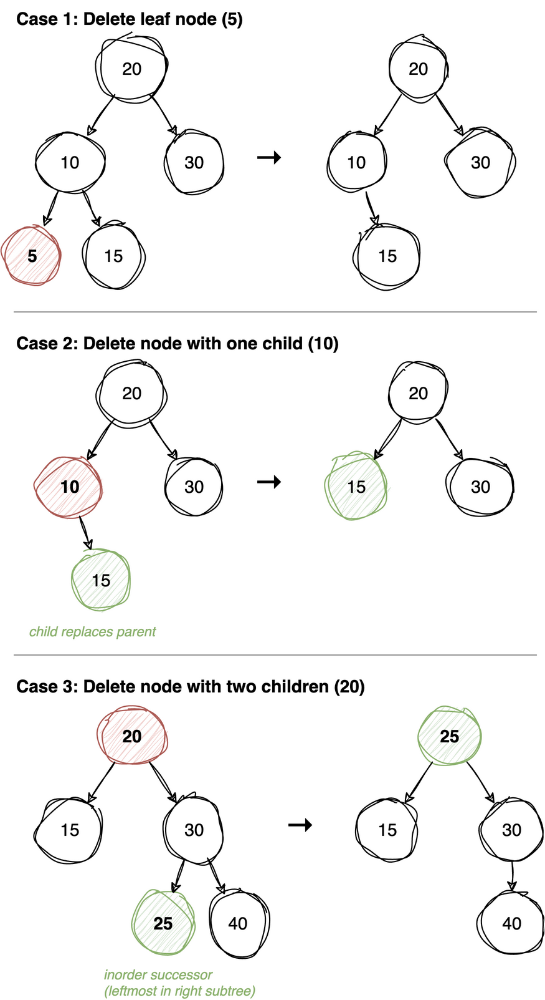

---
jupyter:
  jupytext:
    cell_metadata_filter: -all
    text_representation:
      extension: .md
      format_name: markdown
      format_version: '1.3'
      jupytext_version: 1.19.5
  kernelspec:
    display_name: Python 3 (ipykernel)
    language: python
    name: python3
---

<!-- #region -->
# Binary search tree

* For every node, **every** key in its whole left subtree is smaller and **every** key
  in its whole right subtree is greater - not just the two children.
* All data is distinct.
```sh
      50
     /  \
    30  70
   / \   / \
  10 40 60 80
 ```
* Time complexity of search in BST: `O(h)` where `h` is the height of tree.
* Inorder traversal of BST always results in sorted data.
* Smallest data is always leftmost leaf and largest the rightmost leaf.
* If keys are in sorted increasing order BST turns into a linked list. Ex: `5, 10, 20, 30` (right-skewed)<br>
* If keys are sorted in decreasing order the tree turns into left-skewed tree.
  ```sh
    5
     \
     10
      \
      20
       \
       40
  ```
  Ideally, we want balanced BST that allow all operations in `O(log n)` time. Examples - AVL tree, Red-black tree. See the [AVL tree notebook](avl-tree.md) for a self-balancing BST with rotations.

> **Mental model.** Every key has exactly one legal place in the tree, and a single
> comparison tells you which way that place lies. So every function below is the same
> descent: compare with the node you are standing on, commit to one side, and throw the
> other side away forever. Search, insert, delete, floor and ceil differ only in what
> they do when the descent ends.
>
> **Load-bearing:** the ordering rule covers whole subtrees, not just a node's two
> children - that is what the word *invariant* is doing here. Weaken it to "the left
> child is smaller" and discarding a side stops being safe, because the key you want
> could be sitting anywhere in the half you just dropped. The invariant also sets the
> price: the work is one root-to-leaf path, so a skewed tree costs O(n) and every
> operation degrades together.
<!-- #endregion -->

```python
class Node:
    def __init__(self, data):
        self.data = data
        self.left = None
        self.right = None

def create_test_bst():
        """
              10
             /  \
            5   30
           /    / \
          2    25 40
        """
        root = Node(10)
        root.left = Node(5)
        root.left.left = Node(2)
        root.right = Node(30)
        root.right.left = Node(25)
        root.right.right = Node(40)

        return root
```

### Inorder traversal

Identical to the plain binary tree version, but on a BST it gains a property:
`left < root < right` at every node means inorder emits the keys in **sorted
order**.

That makes it the cheapest validity check available - if inorder is not sorted, the
tree is not a BST.

**Time:** Θ(n) &nbsp; **Space:** Θ(h)

**Recipe**

1. Structurally identical to the binary-tree version: recurse left, append,
   recurse right.
2. **What changes is the guarantee, not the code.** In a BST everything left of a
   node is smaller and everything right is larger, so visiting left-then-node-
   then-right emits the keys in sorted order.
3. This makes `inorder` the cheapest correctness check available: run it and
   assert the output is sorted. Every other operation here has to preserve that.

```python
def inorder(root, acc):
    if root:
        inorder(root.left, acc)
        acc.append(root.data)
        inorder(root.right, acc)

def test_inorder():
        root = create_test_bst()
        res = []
        inorder(root, res)
        assert res == [2, 5, 10, 25, 30, 40]

test_inorder()

```

### Search

The whole point of a BST: one comparison *discards half* the remaining tree. Node
bigger than the target → the answer can only be to the left; smaller → only to the
right.

Dropping that half is the irreversible move, and it is safe only because the invariant
covers whole subtrees. If the node holds 50 and you want 30, nothing anywhere under its
right child is below 50 - not one level down, not ten - so 30 cannot be hiding there. A
rule about immediate children would not license that.

Binary search with pointers instead of indices, so the cost is the length of one
root-to-leaf path rather than the node count.

**Time:** O(h) - O(log n) balanced, O(n) if the tree has degenerated into a list
&nbsp; **Space:** O(h)

**Recipe**

1. Empty, `False`. Match, `True`.
2. `root.data > data`: recurse **only** left. Otherwise recurse **only** right.
3. **One branch, not two.** The binary tree's `search` had to try both sides and
   ended up O(n); here the ordering tells you which half cannot contain the key,
   so half the tree is discarded at every step and it costs O(h).
4. That O(h) is only O(log n) when the tree is balanced. Insert sorted data and
   the tree degenerates into a linked list, which is what AVL trees exist to
   prevent.

```python
def search(root, data):
    """
    Time complexity: O(h) where h is height of BST
    Aux space: O(h)
    """
    if root is None:
        return False
    if root.data == data:
        return True
    if root.data > data:
        return search(root.left, data)
    return search(root.right, data)

def test_search():
    root = create_test_bst()
    assert search(root, 30)
    assert not (search(root, 50))

test_search()
```

### Search, iteratively

The recursion is tail-recursive - nothing happens after the recursive call - so it
collapses into a `while` loop that reassigns `root`. Identical comparisons and
identical path, but O(1) space instead of a frame per level.

This is the form to prefer in practice; the recursive one just reads better as an
explanation.

**Time:** O(h) &nbsp; **Space:** O(1)

**Recipe**

1. The recursion is tail recursion, so it turns into a loop with no stack at all.
2. Reassign `root` itself as the cursor rather than keeping a separate variable.
3. Loop while `root is not None`, returning `True` on a match and stepping into
   the correct child otherwise.
4. Fell out of the loop, `False`.
5. **Space drops from O(h) to O(1).** Nothing has to happen on the way back up,
   which is exactly the condition for a recursion to flatten like this.

```python
def search_iter(root, data):
    """
    Time complexity: O(h) where h is height of BST
    Aux space: O(1)
    """
    while root is not None:
        if root.data == data:
            return True
        elif root.data > data:
            root = root.left
        else:
            root = root.right
    return False

def test_search_iter():
    root = create_test_bst()
    assert search_iter(root, 25)
    assert not (search_iter(root, 50))

test_search_iter()
```

### Insert

Walk exactly as `search` would. Where the search *would have failed* is precisely
where the key belongs, so insertion always creates a **leaf** and never rearranges
existing nodes.

`root.left = insert(root.left, data)` then `return root` is the standard shape for
recursive tree mutation: each call returns its (possibly new) subtree root and the
parent reattaches it. An equal key returns early, keeping all keys distinct.

**Time:** O(h) &nbsp; **Space:** O(h)

**Recipe**

1. Empty subtree: **return a new `Node`**. That returned node is how the parent
   learns what to attach.
2. Duplicate: return `root` unchanged, so the tree holds a set.
3. Otherwise recurse into the correct side and **assign the result back**:
   `root.left = insert(root.left, data)`.
4. **That assign-back is the whole mechanism, and it is the thing you cannot
   recover from the idea alone.** Every call hands its caller the subtree root to
   use; on the way down nothing is linked, and on the way up each parent re-adopts
   its child. Most calls assign the same node back to itself and only the one at
   the bottom actually changes anything.
5. Return `root` at the end, for the caller one level up.
6. New nodes always land as leaves, so the existing structure is never disturbed.

```python
def insert(root, data):
    """
    Time complexity: O(h) where h is height of BST
    Aux space: O(h)
    Insertion always happens at leaf level for non-empty BST.
    """
    if root is None:
        return Node(data)
    if root.data == data:
        return root
    if root.data > data:
        root.left = insert(root.left, data)
    else:
        root.right = insert(root.right, data)
    return root

def test_insert():
    root = insert(None, 40)
    root = insert(root, 20)
    root = insert(root, 30)
    root = insert(root, 100)
    root = insert(root, 70)
    root = insert(root, 60)
    root = insert(root, 200)
    res = []
    inorder(root, res)
    assert res == [20, 30, 40, 60, 70, 100, 200]

test_insert()
```

### Insert, iteratively

The same descent, except you must remember `parent`: once `curr` walks off the
bottom of the tree, the new node has to be attached to the node above it.

`parent is None` means the loop never ran - the tree was empty, so the new node
becomes the root.

**Time:** O(h) &nbsp; **Space:** O(1)

**Recipe**

1. Build the node first, then walk down keeping **`parent` one step behind
   `curr`**.
2. **That trailing pointer is what replaces the return-and-reassign above.** The
   loop exits when `curr` is `None`, and `None` cannot tell you where it came
   from, so the parent has to be remembered as you pass it.
3. Bail out returning `root` if the key is already present.
4. Loop ends with `parent` on the future parent. **`parent is None` means the
   tree was empty, so the new node is the root** and must be returned instead.
5. Otherwise compare against `parent.data` once more to pick the side, and attach.
6. Return `root`.

```python
def insert_iter(root, data):
    """
    Time complexity: O(h) where h is height of BST
    Aux space: O(1)
    """
    new = Node(data)
    parent, curr = None, root
    # traverse to find the parent for the new node
    while curr is not None:
        parent = curr
        if curr.data == data:
            return root
        elif curr.data > data:
            curr = curr.left
        else:
            curr = curr.right
    if parent is None:
        return new
    if parent.data > data:
        parent.left = new
    else:
        parent.right = new
    return root

def test_insert_iter():
    root = insert_iter(None, 40)
    root = insert_iter(root, 20)
    root = insert_iter(root, 30)
    root = insert_iter(root, 100)
    root = insert_iter(root, 70)
    root = insert_iter(root, 60)
    root = insert_iter(root, 200)
    res = []
    inorder(root, res)
    assert res == [20, 30, 40, 60, 70, 100, 200]

test_insert_iter()
```




### Delete

The one BST operation that has to restructure. Removing a node leaves a hole, and the
real question is not "how do I unlink this node" but "which key is allowed to stand
here instead". How hard that is depends only on how many children the node has - the
three cases in the diagram above:

1. **No child** - there is nothing to keep, so return `None` and the parent's pointer
   drops it.
2. **One child** - that child's whole subtree is already on the correct side of the
   parent, so it can move straight up. Return it and the parent adopts it.
3. **Two children** - both subtrees stay, so the hole still needs a separator between
   them. Copy in the **inorder successor** (leftmost node of the right subtree, i.e. the
   next key in sorted order), then delete the successor from the right subtree.

Only two keys can legally sit in that slot: the biggest one on the left, or the smallest
one on the right. Any other key has something on the wrong side of it. Case 3 takes the
smallest on the right.

That choice also caps the extra work. The leftmost node of a subtree has no left child,
by definition, so removing it lands in case 1 or case 2 - the recursion cannot hit
another two-child deletion.

One thing to know: case 3 moves the *value*, not the node. The node object stays put and
its key changes, so a reference a caller was holding now points at a different key.

**Time:** O(h) &nbsp; **Space:** O(h)

**Recipe**

1. Empty subtree: return `None`.
2. Target below this node: `root.left = delete(root.left, data)`. Above it: the
   same on the right. **Every call returns the new root of the subtree it was
   given, and the caller assigns it back. That assignment is how a node actually
   gets unlinked; nothing else touches pointers.**
3. Found it, and no left child: return `root.right`. No right child: return
   `root.left`. The leaf case falls out of these two, since both are `None`.
4. Two children: walk `root.right` left as far as it goes. That is the successor.
5. Copy `succ.data` into `root.data`, then `root.right = delete(root.right,
   succ.data)`. **Delete from the right subtree, not from the whole tree, or the
   search starts above the node you mean. That call cannot re-enter step 4, since
   a leftmost node has no left child.**
6. Return `root`, because the caller in step 2 is waiting to assign it.

```python
def delete(root, data):
    """
    Time complexity: O(h) where h is height of BST
    Aux space: O(h)

    Three cases:
    1. Leaf node - simply remove
    2. One child - replace node with its child
    3. Two children - replace with inorder successor
       (leftmost node in right subtree), then delete successor
    """
    if root is None:
        return None
    if root.data > data:
        root.left = delete(root.left, data)
    elif root.data < data:
        root.right = delete(root.right, data)
    else:
        if root.left is None:
            return root.right
        if root.right is None:
            return root.left
        # find inorder successor (leftmost in right subtree)
        succ = root.right
        while succ.left is not None:
            succ = succ.left
        root.data = succ.data
        root.right = delete(root.right, succ.data)
    return root

def test_delete():
    """
           20
          /  \\
        10     30
        / \\    / \\
       5  15  25 40
    """
    root = Node(20)
    root.left = Node(10)
    root.left.left = Node(5)
    root.left.right = Node(15)
    root.right = Node(30)
    root.right.left = Node(25)
    root.right.right = Node(40)

    # delete leaf node (5)
    root = delete(root, 5)
    res = []
    inorder(root, res)
    assert res == [10, 15, 20, 25, 30, 40]

    # delete node with one child (10)
    root = delete(root, 10)
    res = []
    inorder(root, res)
    assert res == [15, 20, 25, 30, 40]

    # delete node with two children (20)
    root = delete(root, 20)
    res = []
    inorder(root, res)
    assert res == [15, 25, 30, 40]

test_delete()
```

### Floor

Largest key ≤ `val`. The reframe: you are not hunting for one key, you are keeping the
best legal answer you have seen and letting the descent improve it.

So `res` is not "a node we walked past", it is **the best answer so far**. You step right
only when the current node is smaller than `val`, which makes that node a legal answer -
and it beats everything recorded earlier, because a right step moves into keys larger
than the node you just left. Each right step therefore overwrites `res`, and the last one
is the winner.

Stepping left means the current node is too big to be an answer, so nothing is recorded.
If the walk never goes right, nothing in the tree is ≤ `val` and the result is `None`.

**Time:** O(h) &nbsp; **Space:** O(1)

**Recipe**

1. `res = None`, meaning "no candidate yet".
2. Walk down. Exact match, return that node immediately; nothing beats it.
3. `root.data > val`: this node is too big to be the answer, so go left **without
   recording anything**.
4. `root.data < val`: **this node is a valid candidate, so record it in `res`, and
   only then go right** looking for something closer.
5. **The asymmetry between steps 3 and 4 is the whole algorithm.** You record on
   the side that is still legal and stay silent on the side that is not. Record on
   both and you get the last node visited rather than the floor.
6. Fell off the bottom, return `res`, which holds the closest legal value seen.

```python
def floor(root, val):
    """
    Find the largest value in tree that is <= val.
    Time complexity: O(h)
    Aux space: O(1)
    """
    res = None
    while root is not None:
        if root.data == val:
            return root
        elif root.data > val:
            root = root.left
        else:
            res = root
            root = root.right
    return res

def test_floor():
    root = create_test_bst()
    assert floor(root, 6).data == 5
    assert floor(root, 10).data == 10
    assert floor(root, 1) is None

test_floor()
```

### Ceil

The mirror image: smallest key ≥ `val`. Record a candidate every time you step
**left** (the node you leave behind is larger than `val`), and go right when the
current node is too small.

Floor and ceil together answer "nearest neighbours of a key that may not be in the
tree" - the BST counterpart of `bisect_right(a, x) - 1` and `bisect_left(a, x)`.

**Time:** O(h) &nbsp; **Space:** O(1)

**Recipe**

1. `floor` with every comparison and direction mirrored.
2. Too small (`root.data < val`): go right, record nothing.
3. Big enough: **record `res`, then go left** hunting for something tighter.
4. **Write it by mirroring, not from scratch.** The pair is one algorithm, and the
   only question is which side is the legal one to remember. Getting that backwards
   returns a value on the wrong side of `val`, which still looks like a plausible
   answer.

```python
def ceil(root, val):
    """
    Find the smallest value in tree that is >= val.
    Time complexity: O(h)
    Aux space: O(1)
    """
    res = None
    while root is not None:
        if root.data == val:
            return root
        elif root.data < val:
            root = root.right
        else:
            res = root
            root = root.left
    return res

def test_ceil():
    root = create_test_bst()
    assert ceil(root, 10).data == 10
    assert ceil(root, 26).data == 30
    assert ceil(root, 50) is None

test_ceil()
```

# Python Built-in Note

Python has **no built-in BST**. For sorted-container operations on a list, use the `bisect` module:

| BST Operation | `bisect` Equivalent | Time |
|---------------|--------------------|----- |
| Search | `bisect_left` + index check | O(log n) search, O(1) check |
| Insert (sorted) | `insort` | O(log n) search + O(n) shift |
| Floor | `bisect_right(a, x) - 1` | O(log n) |
| Ceil | `bisect_left(a, x)` | O(log n) |

The trade-off: `bisect` gives O(log n) search on a sorted list but O(n) insertion (due to array shifting). A BST gives O(h) for both. For a truly balanced BST with O(log n) everything, the third-party `sortedcontainers.SortedList` is the go-to.

See the binary-search notebook for `bisect` usage examples.
