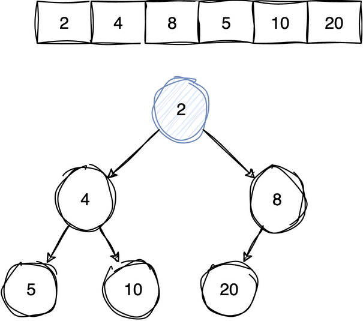
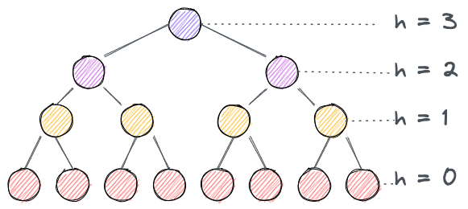

---
jupyter:
  jupytext:
    cell_metadata_filter: -all
    text_representation:
      extension: .md
      format_name: markdown
      format_version: '1.3'
      jupytext_version: 1.19.5
  kernelspec:
    display_name: Python 3 (ipykernel)
    language: python
    name: python3
---

# Binary Heap

A heap is a tree that is **only half sorted, on purpose**. It promises one thing: the
smallest value is at the root. It promises nothing else. The second smallest could be
under either child, and two values in different subtrees have no relationship at all.

That weak promise is the whole point. A fully sorted array hands you the minimum for
free too, but inserting into it costs O(n), because everything after the new value
has to shift up one slot. The heap keeps only the one fact you actually asked for, and
that is why inserting costs O(log n) instead.

Two flavours, mirror images of each other:

1. **Min heap** - the smallest value is at the root, so "highest priority" means lowest value
2. **Max heap** - the largest value is at the root

| Operation | Time |
|---|---|
| Find the min | O(1) - it is the root |
| Insert | O(log n) |
| Extract min | O(log n) |
| Decrease key | O(log n) |
| Delete | O(log n) |
| Build from an unordered array | O(n) |

**Space:** O(n), with no pointer overhead at all - a heap is a plain array.

Reach for one when you need the smallest item over and over while new items keep
arriving: a priority queue, the next-closest vertex in Dijkstra, heapsort, the k
smallest values of a stream.

Two separate rules define a heap, and keeping them apart is what makes the code
below obvious:

- **Shape.** Every level is full except the last, and the last one fills left to
  right, leaving no gaps. A tree like that is called *complete*.
- **Order.** Every node is smaller than both of its children, in a min heap. Siblings
  and cousins are not compared, ever.

The shape rule is what buys the array representation: with no gaps, a node's index
alone says where its family is, so no node needs to store a pointer.

- Left child of node at index i: `left(i) = 2i + 1`
- Right child of node at index i: `right(i) = 2i + 2`  
- Parent of node at index i: `parent(i) = floor((i - 1)/2)`

An array is also contiguous, which means random access and cache-friendly reads, and
a complete tree is the shortest a binary tree can be, so the height is log n.

> **Mental model.** Half sorted, deliberately. The root is the minimum, everything
> else is a mess, and that trade is what makes insert and extract cheap. Every
> operation is then the same two steps: put the value in the one slot the **shape**
> allows, which is always the end of the array, then let it walk until the **order**
> allows it as well - up towards the root, or down towards the leaves.
>
> **Load-bearing:** completeness. Index arithmetic is the only thing linking a node to
> its parent and children, and it is only correct while the tree has no gaps. Break
> that and there are no pointers to fall back on. It is also why nothing is ever
> pulled out of the middle: extract min overwrites the root with the last element and
> pops the end, and delete first sifts its victim up to the root, because the end is
> the only slot that can be given up without tearing a hole in the shape.





### Building the heap (constructor)

You have a pile of unordered values and want a heap out of them. Sorting works, since
a sorted array obeys the order rule, but it costs O(n log n) and buys ordering you
were never going to use.

The reframe: a heap is made of smaller heaps. One value on its own is already a valid
heap, so every leaf is finished before you start. Work upwards from there. Every time
you step to a lower index you land on a node whose two subtrees are already finished
heaps, so a single sift down settles that node and finishes its subtree too.

That is why the loop starts at the last node that has any children at all (the parent
of the last element, index `(n - 2) // 2`) and counts down to index 0. The direction
is the algorithm. It is what guarantees `heapify` is only ever handed one bad node
sitting on top of two good heaps, which is the only situation `heapify` can repair.

Top down would not work. Sifting the root first tells you nothing, because the
subtrees you are comparing it against are still unordered.

The whole build is O(n), not the O(n log n) you would expect from n sift downs. Why
that is true is worked out at the end of the notebook.

**Time:** O(n) &nbsp; **Space:** O(1) plus the recursion in `heapify`

**Recipe**

1. A heap is an **array**, not a linked structure. Index arithmetic replaces
   pointers: `parent(i) = (i - 1) // 2`, `lchild(i) = 2*i + 1`, `rchild(i) =
   2*i + 2`.
2. Those three come from numbering a complete tree level by level, left to right.
   **Derive them from a small drawing rather than memorising them; the `- 1` and
   `+ 1` are easy to misplace and the errors are silent.**
3. To build from an existing list: start at the **last non-leaf node** and
   `heapify` every index down to `0`, in reverse.
4. The last non-leaf is the parent of the last element, `((n - 1) - 1) // 2`.
   **Everything after it is a leaf, and a leaf is already a valid heap of one, so
   starting anywhere later than this wastes work and starting earlier is
   impossible.**
5. **Reverse order is what makes `heapify` legal at every step.** It needs both
   children to be valid heaps already, and going bottom-up is exactly what
   guarantees that.
6. This costs O(n), not O(n log n). Most nodes are near the bottom and sift down
   only a level or two.

```python
import math


class MinHeap:
    def __init__(self, ls=None):
        """
        When ls is provided, build a heap out of it.
        Naive approach: Sort the array and then build heap
        Time complexity: O(n log n)

        Efficient approach: find the position of the bottom-most, right-most
        non-leaf node and perform the heapify operation on each non-leaf node in
        reverse level order. The assumption for that node is the left and right
        children are already heapified.
        The last non-leaf node is the parent of the last node,
        i.e. the parent of the node at index (len(ls) - 1),
        i.e. the node at index ((len(ls) - 1) - 1) // 2.

        Time complexity: O(n)
        https://www.geeksforgeeks.org/building-heap-from-array/
        """
        self.arr = [] if ls is None else ls
        i = (len(self.arr) - 2) // 2
        while i >= 0:
            self.heapify(i)
            i -= 1

    def parent(self, i):
        return (i - 1) // 2

    def lchild(self, i):
        return (2 * i) + 1

    def rchild(self, i):
        return (2 * i) + 2


def is_min_heap(arr):
    """True if every node is <= both of its children."""
    n = len(arr)
    return all(
        arr[i] <= arr[child]
        for i in range(n)
        for child in (2 * i + 1, 2 * i + 2)
        if child < n
    )


def test_is_min_heap():
    assert is_min_heap([2, 4, 8, 5, 10, 20]) is True
    assert is_min_heap([]) is True
    assert is_min_heap([1]) is True
    assert is_min_heap([10, 5, 20]) is False  # root larger than its child


test_is_min_heap()
```

### Heapify (sift down)

One node may be too big for the spot it is in. Both of its subtrees are already valid
heaps. Where does that node belong?

Of the three values in play - the node and its two children - only the smallest is
allowed on top. If that is already the node, nothing below it can be wrong either and
the work is finished. If it is a child, swap the two, and the node now faces the same
question one level lower, against a smaller subtree. It sinks until both of its
children are larger, or until it has no children left.

Swapping with the *smaller* child is not a detail. Promote the larger one and it
becomes the parent of the smaller one, which breaks the very rule you were repairing.

The precondition is the part to remember: `heapify` cannot sort out a scrambled array.
It fixes exactly one bad node standing on two good heaps. Every other operation here
is arranged to hand it that situation.

**Time:** O(log n) - one comparison pair per level of descent &nbsp;
**Space:** O(log n) recursion depth

**Recipe**

1. Precondition: both children already head valid heaps, and only `i` may be out
   of place. **Nothing here repairs a scrambled array. Every caller is arranged
   to hand `heapify` exactly this situation.**
2. `smallest = i`, so "the node is already in the right place" is the default
   answer.
3. Left child: if `lt < n` and `arr[lt] < arr[smallest]`, set `smallest = lt`.
   The bounds test comes first, since a leaf has no children to read.
4. Right child: the same test against `arr[smallest]`. **Against `arr[smallest]`,
   not `arr[i]`. That comparison is the whole reason `smallest` ends up holding
   the smaller of the two children rather than whichever one happened to beat
   the parent last.**
5. `smallest == i` means the node is where it belongs and everything under it was
   already valid, so stop. Otherwise swap and recurse on `smallest`, the slot the
   node just moved into.

```python
def heapify(self, i):
    """
    Fixes min heap whose root might be violating min heap property

    Time complexity: O(log n)
    Aux space: O(log n)
    """
    arr = self.arr
    lt = self.lchild(i)
    rt = self.rchild(i)
    smallest = i
    n = len(arr)
    if lt < n and arr[lt] < arr[smallest]:
        smallest = lt
    if rt < n and arr[rt] < arr[smallest]:
        smallest = rt
    if smallest != i:
        arr[smallest], arr[i] = arr[i], arr[smallest]
        self.heapify(smallest)


MinHeap.heapify = heapify


def test_create_heap():
    heap = MinHeap([10, 5, 20, 2, 4, 8])
    assert heap.arr == [2, 4, 8, 5, 10, 20]
    assert is_min_heap(heap.arr)
    # build heap only reorders - it never adds or drops elements
    assert sorted(heap.arr) == [2, 4, 5, 8, 10, 20]

    # empty and single-element heaps
    assert MinHeap().arr == []
    assert MinHeap([7]).arr == [7]

    # a default argument must not leak between instances
    assert MinHeap().arr is not MinHeap().arr

    # already a heap - unchanged
    assert MinHeap([1, 2, 3]).arr == [1, 2, 3]

    # reverse sorted is the worst case for build heap
    heap = MinHeap([9, 7, 5, 3, 1])
    assert is_min_heap(heap.arr)
    assert heap.arr[0] == 1


test_create_heap()
```

### Insert (sift up)

The shape rule picks the slot before you even look at the value. The only position
that keeps the tree complete is the next free one at the end, and appending to the end
of an array is O(1). The shape is now right and the order may well be wrong.

Which leaves one way to repair it: walk the value upwards. While it is smaller than
its parent, swap the two. It stops as soon as its parent is smaller, and reaches the
root only when it is the new minimum.

Sifting up compares with the parent and nothing else, and it does not need more. A
value that is smaller than its new parent is smaller than everything that parent
already sat above, including the child it just displaced.

**Time:** O(log n) &nbsp; **Space:** O(1)

**Recipe**

1. `arr.append(x)` and start at `i = len(arr) - 1`. **Appending is the only O(1)
   place to add, and the array must stay a complete tree, so the new element has
   exactly one legal position.**
2. Sift up: while `i > 0 and arr[parent(i)] > arr[i]`, swap with the parent and
   set `i = parent(i)`.
3. **`i > 0` has to be tested first.** At the root `parent(0)` is `-1`, and
   Python reads `arr[-1]` without error, so a missing guard compares against the
   last element of the array instead of raising.
4. Stop as soon as the parent is not larger. Everything above is already ordered,
   so one satisfied comparison ends it.
5. Only one path is touched, root to leaf, hence O(log n).

```python
def insert(self, x):
    """
    Time complexity: O(log n)

    The idea is to append x to the end of the array - O(1) operation.
    But if it is smaller than its parent, it will violate the min heap property.
    Therefore, we travel the height of the binary heap, and keep swapping x with
    its parent (and grandparent etc.) as needed till it's in its intended place.
    This operation is O(log n) since traveling across the height of a binary
    heap is a log of size operation.
    """
    arr = self.arr
    arr.append(x)
    i = len(arr) - 1
    while i > 0 and arr[self.parent(i)] > arr[i]:
        p = self.parent(i)
        arr[i], arr[p] = arr[p], arr[i]
        i = p


MinHeap.insert = insert


def test_insert():
    heap = MinHeap([2, 4, 8, 5, 10, 20])

    # new minimum bubbles all the way to the root
    heap.insert(1)
    assert heap.arr == [1, 4, 2, 5, 10, 20, 8]
    assert is_min_heap(heap.arr)

    # a large value stays at the bottom
    heap.insert(100)
    assert heap.arr[-1] == 100
    assert is_min_heap(heap.arr)

    # inserting into an empty heap
    heap = MinHeap()
    heap.insert(5)
    assert heap.arr == [5]

    # inserting in increasing order never swaps
    heap = MinHeap()
    for x in [1, 2, 3, 4, 5]:
        heap.insert(x)
    assert heap.arr == [1, 2, 3, 4, 5]

    # inserting in decreasing order swaps every time
    heap = MinHeap()
    for x in [5, 4, 3, 2, 1]:
        heap.insert(x)
    assert heap.arr[0] == 1
    assert is_min_heap(heap.arr)


test_insert()
```

### Extract min

The value you want is at index 0, and index 0 is the worst place to delete from in an
array: every remaining element shifts down a slot, O(n), which would throw away the
only reason the heap exists.

So do not remove index 0. Remove the *end*, because the end is the only slot the shape
can spare and popping it is free. Save the root value to hand back, then move the last
element into the root's slot. The shape is untouched and exactly one node is now in the
wrong place, standing on two heaps that were never disturbed. That is precisely what
`heapify` repairs, so sift it down.

The value promoted to the root came from the bottom row, so it is usually one of the
largest in the heap and normally sinks most of the way back down.

An empty heap returns `math.inf` as a sentinel rather than raising.

**Time:** O(log n) &nbsp; **Space:** O(log n)

**Recipe**

1. Empty heap, return `math.inf`, the value that loses every min comparison.
2. Save `arr[0]`, the answer.
3. **Move the last element into the root, then `pop` the end.** Removing from the
   front directly would shift every element, which is O(n); removing from the end
   is free. So the array is repaired by moving the hole rather than closing it.
4. Call `heapify(0)`. The new root is very likely wrong, but both its subtrees
   are untouched and still valid, which is exactly `heapify`'s precondition.
5. Return the saved value.
6. **Steps 3 and 4 together are the pattern: swap the element being removed to
   the end, shrink, then sift down.** `delete` and `heap_sort` are both built
   out of it.

```python
def extract_min(self):
    """
    Remove min from the heap and use heapify to make sure the min heap property
    holds true for the rest of the array

    Time complexity: O(log n)

    If we remove an element from anywhere other than the last position in an
    array, we'll need to move all other elements and it will be a linear
    operation. To achieve "log n" time, removing the last element is constant
    time, so that's what we do.
        1. swap min with last (constant)
        2. pop last (constant)
        3. then heapify (log n).
    """
    arr = self.arr
    if len(arr) == 0:
        return math.inf
    res = arr[0]
    arr[0] = arr[-1]
    arr.pop()
    self.heapify(0)
    return res


MinHeap.extract_min = extract_min


def test_extract_min():
    heap = MinHeap([10, 5, 20, 2, 4, 8])  # -> [2, 4, 8, 5, 10, 20]
    assert heap.extract_min() == 2
    assert heap.arr == [4, 5, 8, 20, 10]
    assert is_min_heap(heap.arr)

    # repeated extraction yields sorted order - this is heap sort
    heap = MinHeap([10, 5, 20, 2, 4, 8])
    assert [heap.extract_min() for _ in range(6)] == [2, 4, 5, 8, 10, 20]
    assert heap.arr == []

    # extracting from an empty heap returns infinity as a sentinel
    assert MinHeap().extract_min() == math.inf

    # single element
    heap = MinHeap([7])
    assert heap.extract_min() == 7
    assert heap.arr == []


test_extract_min()
```

### Decrease key

Making a value *smaller* can only break the rule in one direction: against its parent.
Its children were already larger than the old value, so they are larger than the new
one as well. So write the value in and reuse the sift-up walk from `insert`; the
children never need looking at.

This is the operation a priority queue needs when an item already in the queue turns
out to have a better priority. Python's `heapq` has no equivalent, which is why the
Dijkstra notebook pushes a duplicate entry and skips stale pops instead.

**Time:** O(log n) &nbsp; **Space:** O(1)

**Recipe**

1. Overwrite `arr[i] = x`, then sift up with the identical loop from `insert`.
2. **Only sifting up is needed, and only because the key got *smaller*.** A
   smaller key can violate the rule against its parent but never against its
   children, since they were already larger than the old, bigger value.
3. Increasing a key would need `heapify` instead. Calling this with a larger `x`
   silently corrupts the heap; nothing here checks.
4. `insert` is really `append` plus this loop, which is why the two bodies match
   line for line.

```python
def decrease_key(self, i, x):
    """
    Time complexity: O(log n)

    Replace the key at index i with x and then swap it with its parent
    (and grandparent etc.) as needed till it's in its intended place.
    """
    arr = self.arr
    arr[i] = x
    while i != 0 and arr[self.parent(i)] > arr[i]:
        p = self.parent(i)
        arr[p], arr[i] = arr[i], arr[p]
        i = p


MinHeap.decrease_key = decrease_key


def test_decrease_key():
    heap = MinHeap([2, 4, 8, 5, 10, 20])

    # 10 at index 4 becomes 1 and rises to the root
    heap.decrease_key(4, 1)
    assert heap.arr == [1, 2, 8, 5, 4, 20]
    assert is_min_heap(heap.arr)

    # decreasing a value that still exceeds its parent stays put
    heap = MinHeap([2, 4, 8, 5, 10, 20])
    heap.decrease_key(5, 9)  # 20 -> 9, parent is 8
    assert heap.arr == [2, 4, 8, 5, 10, 9]
    assert is_min_heap(heap.arr)

    # decreasing the root is a no-op structurally
    heap = MinHeap([2, 4, 8])
    heap.decrease_key(0, 0)
    assert heap.arr == [0, 4, 8]


test_decrease_key()
```

### Delete

Pulling a value out of the middle of the array is the one thing the shape forbids. But
there is a position you already know how to remove from: the root.

So move the victim there. Set it to `-inf` and it is now smaller than everything, which
means `decrease_key` walks it to the root by definition, not by luck. Then
`extract_min` throws that root away. No new machinery, just the two operations already
written, with `-inf` as the hinge between them.

Two O(log n) passes instead of one, in exchange for no extra code.

**Time:** O(log n) &nbsp; **Space:** O(log n)

**Recipe**

1. Guard `i >= len(arr)` and return.
2. `decrease_key(i, -math.inf)`. **`-inf` beats every real key, so the node sifts
   all the way to index 0 and nothing else has to be worked out.**
3. `extract_min()` then removes it, and repairs the heap on the way.
4. **This is composition, not a new algorithm.** Two operations you already have,
   picked so that the second one's precondition is arranged by the first.
5. O(log n) up plus O(log n) down.

```python
def delete(self, i):
    """
    Time complexity: O(log n)

    Delete the key at index i by decreasing it to -infinity so it rises to the
    root, then extracting the root.
    """
    if i >= len(self.arr):
        return
    self.decrease_key(i, -math.inf)
    self.extract_min()


MinHeap.delete = delete


def test_delete():
    heap = MinHeap([2, 4, 8, 5, 10, 20])
    heap.delete(2)  # remove the 8
    assert sorted(heap.arr) == [2, 4, 5, 10, 20]
    assert is_min_heap(heap.arr)

    # deleting the root removes the minimum
    heap = MinHeap([2, 4, 8, 5, 10, 20])
    heap.delete(0)
    assert 2 not in heap.arr
    assert heap.arr[0] == 4
    assert is_min_heap(heap.arr)

    # deleting the last element
    heap = MinHeap([2, 4, 8])
    heap.delete(2)
    assert heap.arr == [2, 4]

    # out of range index is ignored
    heap = MinHeap([2, 4, 8])
    heap.delete(10)
    assert heap.arr == [2, 4, 8]

    # deleting every element one by one
    heap = MinHeap([5, 3, 9, 1])
    for _ in range(4):
        heap.delete(0)
    assert heap.arr == []


test_delete()
```

# Time complexity of build heap operation

n nodes, each sifted down at O(log n), so build heap should be O(n log n). It is O(n).
The error is in what a sift down actually costs.

`heapify` does not cost the height of the tree. It costs the height *below the node it
was called on*, since that is as far as the value can possibly sink. And a complete tree
is heavily bottom weighted: about half of all nodes are leaves, which cost nothing at
all, a quarter sit one level up and can sink one level, and so on upwards. Only the root
can sink log n levels, and there is one root.

So the total is not n copies of log n. It is, for each height, the number of nodes at
that height multiplied by that height - and the counts halve faster than the heights
grow. The diagram shows the heights the sum runs over.



Maximum nodes at height $h$ can be computed using the following formula:
$n_h = \bigg\lceil \frac {n}{2^{h+1}} \bigg\rceil$

The time required by `heapify` when called on a node with height $h$ is $O(h)$.
Letting $c$ be the constant implicit in asymptotic notation, the total cost can be expressed in the following:
$$= \sum_{h=0}^{\log{n}} \bigg\lceil \frac {n}{2^{h+1}} \bigg\rceil ch$$
Dropping the ceiling gives an upper bound:
$$\leqslant \sum_{h=0}^{\log{n}} \frac {n}{2^{h+1}} \cdot ch$$
Factor out $cn$:
$$= cn \sum_{h=0}^{\log{n}} \frac {h}{2^{h+1}}$$
Rewrite $2^{h+1} = 2 \cdot 2^h$:
$$= cn \sum_{h=0}^{\log{n}} \frac {h}{2 \cdot 2^{h}} = \frac{cn}{2} \sum_{h=0}^{\log{n}} \frac {h}{2^{h}}$$
Since $\frac{1}{2}$ is a constant, this simplifies to:
$$= O\!\left(cn \sum_{h=0}^{\log{n}} \frac {h}{2^{h}}\right)$$
Upperbounding to `∞`, the above can be rewritten as:
$$\leqslant cn \sum_{h=0}^{\infty} \frac {h}{2^{h}}$$
Now it's clear it's an arithmetico-geometric series (derivable by differentiating the geometric series $\sum x^k = \frac{1}{1-x}$ with respect to $x$) with $x = 1/2$, $\sum_{k=0}^{\infty} kx^k = \frac {x}{(1 - x)^2}$
Using the above formula:
$$\leqslant cn * \frac {1/2}{(1 - 1/2)^2} \\\\ = O(n)$$

The series settles on 2 - a fixed number that does not grow with n - so the whole build
is a constant multiple of n. The log factor never appears, because the nodes that could
have paid it are outnumbered.

>
> *Sources*
> Introduction to algorithms 4ed (Cormen et all) - section 6.3
> <https://stackoverflow.com/questions/9755721/how-can-building-a-heap-be-on-time-complexity/62177336#62177336>


# Heap Sort

Heap sort is selection sort with the slow part swapped out.

Selection sort finds the largest remaining value with a linear scan and moves it to the
end, over and over. The scan is the entire cost: n scans of O(n) each is O(n^2). But
"give me the largest, repeatedly" is exactly what a heap is for, so hold the remaining
values in a max heap instead. The maximum is at the root, so finding it costs nothing,
and repairing the heap once it is removed costs O(log n) instead of another O(n) scan.

A **max** heap, not a min heap, and that is what lets it sort in place with no second
array. The largest remaining value sits at index 0 and its final home is the last
unsorted slot, so a single swap puts it there for good and drops the displaced value
onto the root, where one sift down settles it. Shrink the heap by one and the array now
holds two regions that never overlap: an unordered heap at the front, and a finished
sorted tail at the back that grows by one slot each round.

That boundary is what the explicit `n` argument to `max_heapify` is for. It stops the
heap from reaching back into the sorted tail it is already done with.

**Time complexity:** O(n log n)  
**Aux space:** O(1) (or O(log n) if we use recursion)

## Notes:

- It's not stable
- Heapsort is 2-3 times slower than quicksort because quicksort has better locality of reference than heapsort
- Used in hybrid sorting algorithms like IntroSort

**Recipe**

Max-heap versions of the same code, plus the sort they enable.

1. `max_heapify(arr, n, i)` is `heapify` with the comparisons flipped and one new
   argument: **`n`, how much of the array is still the heap.** The tail beyond
   `n` is finished output and must not be looked at.
2. `build_heap` runs `max_heapify` from `(n - 2) // 2` down to `0`, the same
   bottom-up sweep as the constructor.
3. `heap_sort`: build a max heap, then for `i` from `n - 1` down to `1`, swap
   `arr[0]` with `arr[i]` and call `max_heapify(arr, i, 0)`.
4. **A max heap for an ascending sort.** The largest element is at the root, and
   the swap moves it to the last unsorted index, which is its final position, so
   the sorted region grows backwards from the right.
5. **Pass `i`, not `n`, to `max_heapify` after the swap.** `i` is the new,
   shorter heap length, and it excludes the element just placed. Pass `n` and
   sifting pulls already-placed elements back into the heap.
6. Stop at `i = 1`; a heap of one is already sorted.
7. In place, so O(1) extra space, which is what heapsort buys over merge sort.

```python
def build_heap(arr):
    """Turn arr into a max heap in place. Time: O(n)"""
    n = len(arr)
    for i in range((n - 2) // 2, -1, -1):
        max_heapify(arr, n, i)


def max_heapify(arr, n, i):
    """Sift arr[i] down within the first n elements of arr. Time: O(log n)"""
    largest = i
    left = 2 * i + 1
    right = 2 * i + 2
    if left < n and arr[left] > arr[largest]:
        largest = left
    if right < n and arr[right] > arr[largest]:
        largest = right
    if largest != i:
        arr[i], arr[largest] = arr[largest], arr[i]
        max_heapify(arr, n, largest)


def heap_sort(arr):
    """Sort arr in place, ascending. Time: O(n log n), aux space: O(log n)"""
    n = len(arr)
    build_heap(arr)
    for i in range(n - 1, 0, -1):
        arr[i], arr[0] = arr[0], arr[i]  # largest goes to its final position
        max_heapify(arr, i, 0)  # restore the heap over the shrinking prefix


def is_max_heap(arr, n=None):
    """True if the first n elements of arr satisfy the max heap property."""
    n = len(arr) if n is None else n
    return all(
        arr[i] >= arr[child]
        for i in range(n)
        for child in (2 * i + 1, 2 * i + 2)
        if child < n
    )


def test_build_heap():
    arr = [10, 5, 20, 2, 4, 8]
    build_heap(arr)
    assert is_max_heap(arr)
    assert arr[0] == 20  # the maximum ends up at the root
    assert sorted(arr) == [2, 4, 5, 8, 10, 20]


def test_heap_sort():
    arr = [10, 5, 20, 2, 4, 8]
    heap_sort(arr)
    assert arr == [2, 4, 5, 8, 10, 20]

    # duplicates, already sorted, reverse sorted
    arr = [3, 1, 4, 1, 5, 9, 2, 6, 5]
    heap_sort(arr)
    assert arr == [1, 1, 2, 3, 4, 5, 5, 6, 9]

    arr = [1, 2, 3, 4]
    heap_sort(arr)
    assert arr == [1, 2, 3, 4]

    arr = [4, 3, 2, 1]
    heap_sort(arr)
    assert arr == [1, 2, 3, 4]

    # edge cases
    arr = []
    heap_sort(arr)
    assert arr == []

    arr = [1]
    heap_sort(arr)
    assert arr == [1]

    # matches sorted() on random input
    import random

    data = [random.randint(0, 100) for _ in range(50)]
    arr = list(data)
    heap_sort(arr)
    assert arr == sorted(data)


test_build_heap()
test_heap_sort()
```

# Python Built-in: `heapq` module

Python's `heapq` implements a **min-heap** on a regular `list`.

| Operation | Function | Time |
|-----------|----------|------|
| Push | `heapq.heappush(h, x)` | O(log n) |
| Pop min | `heapq.heappop(h)` | O(log n) |
| Peek min | `h[0]` | O(1) |
| Build heap | `heapq.heapify(h)` | O(n) |
| Push + pop | `heapq.heappushpop(h, x)` | O(log n) |
| N smallest | `heapq.nsmallest(k, iterable)` | O(n log k) |

**No built-in max-heap** - use the negation trick.

```python
import heapq

# min-heap operations
h = [10, 5, 20, 2, 4, 8]
heapq.heapify(h)           # O(n) - [2, 4, 8, 5, 10, 20]
print(h)

heapq.heappush(h, 1)       # O(log n)
print(heapq.heappop(h))    # 1 - smallest element
print(h[0])                # 2 - peek without removing

# max-heap via negation trick
nums = [3, 1, 4, 1, 5]
max_h = [-x for x in nums]
heapq.heapify(max_h)
print(-heapq.heappop(max_h))  # 5 - largest element

# k smallest / k largest
data = [10, 5, 20, 2, 4, 8]
print(heapq.nsmallest(3, data))  # [2, 4, 5]
print(heapq.nlargest(3, data))   # [20, 10, 8]
```
