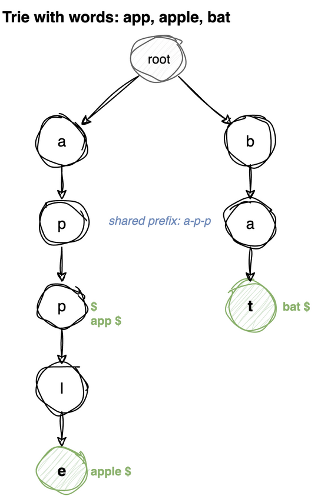

---
jupyter:
  jupytext:
    cell_metadata_filter: -all
    text_representation:
      extension: .md
      format_name: markdown
      format_version: '1.3'
      jupytext_version: 1.19.5
  kernelspec:
    display_name: Python 3 (ipykernel)
    language: python
    name: python3
---

# Trie (Prefix Tree)

A tree where each node represents a character. Paths from root to marked nodes form words.

**Why not a hash set of words?** A trie supports **prefix search** in O(prefix length) - try doing that efficiently with a set.

| Operation | Time | Hash Set |
|-----------|------|----------|
| Insert word | O(L) | O(L) |
| Search word | O(L) | O(L) |
| Prefix search | O(P) | O(N × L) |
| Autocomplete | O(P + matches) | O(N × L) |

L = word length, P = prefix length, N = number of words

**Applications:** Autocomplete, spell checkers, IP routing, word games.

> **Mental model.** The key *is* the path. No node stores a word - a word is just the sequence
> of edges you walked to reach a node, one character per edge. That is why prefix queries come
> for free: a prefix is a path you have already walked, and everything hanging below where it
> ends is a word starting with it. Cost depends on the length of the query, never on how many
> words are stored.
>
> **Load-bearing:** the end-of-word marker (`'$'` here). Reaching a node proves the path
> exists, not that the path is a word. Without the marker you cannot tell a word you stored
> from the front of a longer one - `'app'` sits on the way to `'apple'`, and only the marker
> says which of the two was actually inserted.

> **Procedural vs class-based:** The functions below operate on a simple dict-of-dicts trie structure - no wrapper class needed. Each node is just a dict where keys are characters and a special `'$'` key marks end of word.




# Core Operations

A node is just a dict mapping a character to a child node, so the trie is a dict of dicts.
Inserting a word walks that structure one character at a time, creating whatever is missing.

```
insert 'app', 'apple', 'bat'

{
  'a': {'p': {'p': {'$': True,
                    'l': {'e': {'$': True}}}}},
  'b': {'a': {'t': {'$': True}}}
}
```

Shared prefixes are stored once - `'app'` and `'apple'` walk the same three nodes, which is
where the space saving and the prefix queries both come from.

The marker's consequence is that all three lookups walk the characters identically and differ
only in what they ask at the end:

| Function | After walking the characters |
|---|---|
| `search` | is `'$'` in this node? - is the path a complete word |
| `starts_with` | reached it at all → `True` - some word continues from here |

Any character that cannot be found short-circuits to `False`, which is why the cost depends
on the query length and not on how many words the trie holds.

**Time:** O(L) insert and search, O(P) prefix check &nbsp; **Space:** O(total characters)

**Recipe**

1. A trie node is just a **dict**: keys are characters, values are child nodes.
   No class needed.
2. `insert`: walk the word, creating `node[ch] = {}` for any character not
   present, stepping down each time. At the end set `node['$'] = True`.
3. **`'$'` marks that a word ends here, and it is the load-bearing piece.**
   Without it there is no way to tell a complete word from a prefix of one, and
   `search` would return `True` for `'ap'` after inserting `'apple'`.
4. `search`: walk, failing on any missing character, and finish with **`'$' in
   node`**, not `True`.
5. `starts_with`: the identical walk finishing with plain `True`. **The one-line
   difference between the two is the entire distinction between a word and a
   prefix.**
6. `'$'` works as the marker only because it cannot appear in a word. Any
   sentinel outside the alphabet does.

```python
def create_trie():
    """A trie node is just a dict. Keys = child characters, '$' = end of word."""
    return {}

def insert(root, word):
    """Insert word into trie. Time: O(L)"""
    node = root
    for ch in word:
        if ch not in node:
            node[ch] = {}
        node = node[ch]
    node['$'] = True  # mark end of word

def search(root, word):
    """Return True if exact word exists. Time: O(L)"""
    node = root
    for ch in word:
        if ch not in node:
            return False
        node = node[ch]
    return '$' in node

def starts_with(root, prefix):
    """Return True if any word starts with prefix. Time: O(P)"""
    node = root
    for ch in prefix:
        if ch not in node:
            return False
        node = node[ch]
    return True

def test_core():
    t = create_trie()
    insert(t, 'apple')
    insert(t, 'app')
    insert(t, 'bat')
    assert search(t, 'apple')
    assert search(t, 'app')
    assert not (search(t, 'ap'))     # prefix but not a word
    assert starts_with(t, 'ap')
    assert not (starts_with(t, 'bx'))

test_core()
```

# Autocomplete (Words with Prefix)

Two phases. Walk down to the node the prefix ends at - O(P) - and everything below that
node is, by construction, a word starting with the prefix. Then DFS the subtree collecting
every node marked `'$'`.

```
trie holds: app, apple, application, bat, ball

autocomplete('app'):
  walk a → p → p                      lands on the shared 'app' node
  DFS from there:
    '$' present            → 'app'
    l → e → '$'            → 'apple'
    l → i → c → …→ '$'     → 'application'
```

`path` accumulates the characters below the prefix and is un-appended after each branch
(`path.pop()`), so the same list is reused for every walk - the standard backtracking
pattern.

Cost is O(P + total characters in the matches), i.e. proportional to the answer rather than
to the dictionary. A hash set would have to test all N words.

**Time:** O(P + output size) &nbsp; **Space:** O(output size)

**Recipe**

1. Walk down to the prefix's node, returning `[]` if the path breaks.
2. From there, DFS collecting every word beneath.
3. **The walk down is the search and the DFS is the enumeration.** They are two
   separate phases; the first costs O(len(prefix)) regardless of dictionary size,
   which is what a trie buys over scanning a word list.
4. In the DFS, emit `prefix + path` whenever `'$'` is in the node. **A node can
   both end a word and have children**, so this is not an early return: `app` is
   emitted and the walk continues into `apple`.
5. **Skip the `'$'` key when iterating children.** It maps to `True`, not a dict,
   so recursing into it raises.
6. `path.append(ch)` before the call and `path.pop()` after. **The list is shared
   across the whole traversal, so the pop is what stops a sibling branch
   inheriting characters from the branch just finished.**

```python
def autocomplete(root, prefix):
    """
    Return all words that start with prefix.
    Time: O(P + total characters in matching words)
    """
    node = root
    for ch in prefix:
        if ch not in node:
            return []
        node = node[ch]
    # DFS to collect all words from this node
    results = []
    def dfs(node, path):
        if '$' in node:
            results.append(prefix + ''.join(path))
        for ch, child in node.items():
            if ch != '$':
                path.append(ch)
                dfs(child, path)
                path.pop()
    dfs(node, [])
    return results

def test_autocomplete():
    t = create_trie()
    for w in ['apple', 'app', 'application', 'bat', 'ball']:
        insert(t, w)
    res = sorted(autocomplete(t, 'app'))
    assert res == ['app', 'apple', 'application']
    assert autocomplete(t, 'xyz') == []

test_autocomplete()
```

# Delete Word

The complication is shared prefixes: removing `'apple'` must not disturb `'app'`. So there
are two distinct steps - unmark the word, then prune only the nodes nothing else needs.

The recursion descends to the end of the word, deletes `'$'`, and returns **"I am now
useless, delete me"** upward. Each caller removes its child only if it got a `True`, then
passes on its own verdict. A node is useless only when it has no children left *and* it is
not itself the end of another word.

```
trie: app, apple      a → p → p($) → l → e($)

delete('apple')
  descend to the 'e' node, remove its '$'   → node is empty → return True
  at 'l': delete child 'e', 'l' now empty and not a word → return True
  at the second 'p': delete child 'l' - but this node has '$' (it is 'app')
                     → stop pruning, return False

result: a → p → p($)     'app' survives

delete('app')
  remove '$' from the second 'p' - no children left → return True
  every ancestor is then childless and unmarked → the whole branch is pruned
```

Returning `False` on a missing word is what keeps the pruning from cascading through
unrelated branches.

**Time:** O(L) &nbsp; **Space:** O(L) recursion

**Recipe**

The interesting part is not removing the word but deciding which nodes may go.

1. Recurse down with an index `i`. **Each call returns a boolean meaning "the
   child I just handled is now empty, so you may unlink it"**, which is how the
   decision travels back up.
2. At `i == len(word)`: no `'$'` means the word was never there, return `False`.
   Otherwise `del node['$']` and return `len(node) == 0`.
3. **That length test is the safety check.** The node is only removable if it
   has no remaining children. Delete `apple` while `app` exists and the `p`
   node still has children, so the chain stops there.
4. On the way back up, if the child reported removable, `del node[ch]`, then
   return `len(node) == 0 and '$' not in node`.
5. **Both halves of that condition are needed.** A node with no children may
   still terminate a shorter word, and unlinking it would silently delete that
   word too.
6. Nodes are removed only on the unwind, one level at a time, and the first
   `False` stops the pruning for everything above it.

```python
def delete(root, word):
    """
    Delete word from trie. Only removes nodes that aren't shared with other words.
    Returns True if word was found and deleted.
    Time: O(L)
    """
    def _delete(node, word, i):
        if i == len(word):
            if '$' not in node:
                return False
            del node['$']
            return len(node) == 0  # can delete this node if no children
        ch = word[i]
        if ch not in node:
            return False
        should_delete = _delete(node[ch], word, i + 1)
        if should_delete:
            del node[ch]
            return len(node) == 0 and '$' not in node
        return False
    _delete(root, word, 0)

def test_delete():
    t = create_trie()
    insert(t, 'apple')
    insert(t, 'app')
    delete(t, 'apple')
    assert not (search(t, 'apple'))
    assert search(t, 'app')  # 'app' still exists
    delete(t, 'app')
    assert not (search(t, 'app'))
    assert not (starts_with(t, 'a'))  # trie is empty

test_delete()
```
